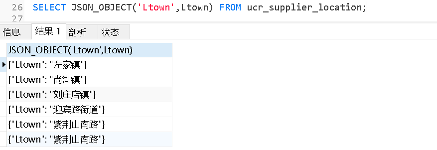

[TOC]

## MySQL 导入数据

### mysql 命令导入

- 使用 mysql 命令导入语法格式为：

    ```mysql
    mysql -u用户名    -p密码    <  要导入的数据库数据(runoob.sql)
    ```

- 实例：将将备份的整个数据库 runoob.sql 导入。

    ```
    # mysql -uroot -p123456 < runoob.sql
    ```

### source 命令导入

- source 命令导入数据库需要先登录到数库终端：

    ```mysql
    mysql> create database abc;      # 创建数据库
    mysql> use abc;                  # 使用已创建的数据库 
    mysql> set names utf8;           # 设置编码
    mysql> source /home/abc/abc.sql  # 导入备份数据库
    ```

### 使用 LOAD DATA 导入数据

> MySQL 中提供了LOAD DATA INFILE语句来插入数据。

-  以下实例中将从当前目录中读取文件 dump.txt ，将该文件中的数据插入到当前数据库的 mytbl 表中。

    ```mysql
    mysql> LOAD DATA LOCAL INFILE 'dump.txt' INTO TABLE mytbl;
    ```

> 如果指定LOCAL关键词，则表明从客户主机上按路径读取文件。如果没有指定，则文件在服务器上按路径读取文件。
>
> 你能明确地在LOAD DATA语句中指出列值的分隔符和行尾标记，但是默认标记是定位符和换行符。
>
> 两个命令的 FIELDS 和 LINES 子句的语法是一样的。两个子句都是可选的，但是如果两个同时被指定，FIELDS 子句必须出现在 LINES 子句之前。
>
> 如果用户指定一个 FIELDS 子句，它的子句 （TERMINATED BY、[OPTIONALLY] ENCLOSED BY 和 ESCAPED BY) 也是可选的，不过，用户必须至少指定它们中的一个。

```mysql
mysql> LOAD DATA LOCAL INFILE 'dump.txt' INTO TABLE mytbl
  -> FIELDS TERMINATED BY ':'
  -> LINES TERMINATED BY '\r\n';
```


## 普通函数


### 数学函数

---

|               函数名               |                    作用                    |                             举例                             |           结果           |
| :--------------------------------: | :----------------------------------------: | :----------------------------------------------------------: | :----------------------: |
|          SUM(expression)           |             返回指定字段的总和             | SELECT SUM(Quantity) AS TotalItemsOrdered FROM OrderDetails; |                          |
|              ceil(x)               |   返回大于或等于数值x的最小整数（取大）    |                      SELECT CEIL(2.3);                       |         返回：3          |
|             ceiling(x)             |        返回大于或等于 x 的最小整数         |                       SELECT CEIL(1.5)                       |          返回2           |
|              floor(x)              |   返回小于或等于数值x的最大整数（取小）    |                      SELECT FLOOR(2.8);                      |         返回：2          |
|              round(X)              |              四舍五入运算法则              |                     SELECT ROUND(-10.53)                     |        返回：-11         |
|               rand()               |            返回0-1之间的随机数             |                        SELECT RAND();                        | 返回：0.8652411800485488 |
|           truncate(x,d)            |         保留小数点后d位，直接截取          |                 SELECT TRUNCATE(10.05727,2)                  |       结果：10.05        |
|             round(x,d)             |         保留小数点后d位，四舍五入          |                   SELECT ROUND(10.05727,2)                   |       结果：10.06        |
|              sign(x)               | 返回x的符号（存在1，0[表示0或非数字]，-1） |                     SELECT SIGN(-10.53)                      |         结果：-1         |
|               ABS(x)               |              返回 x 的绝对值               |                        SELECT ABS(-1)                        |          返回1           |
|              SQRT(x)               |               返回x的平方根                |                       SELECT SQRT(25)                        |           -- 5           |
|              MOD(x,y)              |          返回 x 除以 y 以后的余数          |                       SELECT MOD(5,2)                        |           -- 1           |
|                PI()                |           返回圆周率(3.141593）            |                         SELECT PI()                          |        --3.141593        |
|              POW(x,y)              |              返回 x 的 y 次方              |                       SELECT POW(2,3)                        |           -- 8           |
|             POWER(x,y)             |              返回 x 的 y 次方              |                      SELECT POWER(2,3)                       |           -- 8           |
|             RADIANS(x)             |              将角度转换为弧度              |                     SELECT RADIANS(180)                      |    -- 3.1415926535898    |
|             DEGREES(x)             |              将弧度转换为角度              |               SELECT DEGREES(3.1415926535898)                |           180            |
|              n DIV m               |         整除，n 为被除数，m 为除数         |               计算 10 除于 5：SELECT 10 DIV 5;               |            2             |
|               EXP(x)               |              返回 e 的 x 次方              |                计算 e 的三次方：SELECT EXP(3)                |    -- 20.085536923188    |
| GREATEST(expr1, expr2, expr3, ...) |             返回列表中的最大值             | SELECT GREATEST(3, 12, 34, 8, 25);   /     SELECT GREATEST("Google", "Runoob", "Apple"); |   -- 34  /  -- Runoob    |
|  LEAST(expr1, expr2, expr3, ...)   |             返回列表中的最小值             | SELECT LEAST(3, 12, 34, 8, 25);    /  SELECT LEAST("Google", "Runoob", "Apple"); |    -- 3  /  -- Apple     |
|                 LN                 |             返回数字的自然对数             |                        SELECT LN(2);                         |  -- 0.6931471805599453|


### 字符串函数

---

|                函数名                 |                             作用                             |                             举例                             |       返回结果        |
| :-----------------------------------: | :----------------------------------------------------------: | :----------------------------------------------------------: | :-------------------: |
|          concat(str1,str2…)           |                          字符串连接                          |                 SELECT CONCAT(‘my’,’s’,ql’);                 |      返回：mysql      |
|       CONCAT_WS(x, s1,s2...sn)        | 同 CONCAT(s1,s2,...) 函数，但是每个字符串之间要加上 x，x 可以是分隔符 | SELECT CONCAT_WS("-", "SQL", "Tutorial", "is", "fun!")AS ConcatenatedString; |                       |
|      insert(str,pos,len,newstr)       |                          字符串替换                          |     SELECT INSERT(‘这是SQL Server数据库’,3,10,’MySQL’);      | 返回：这是MySQL数据库 |
|              lower(str)               |                       将字符串转为小写                       |                     SELECT LOWER(MySQL);                     |      返回：mysql      |
|              upper(str)               |                       将字符串转为大写                       |                     SELECT UPPER(MySQL);                     |      返回：MYSQL      |
|               UCASE(s)                |                       将字符串转为大写                       |              SELECT UCASE("runoob"); -- RUNOOB               |                       |
|        substring(str,num,len)         |                          字符串截取                          |           SELECT SUBSTRING(‘JavaMySQLOracle’,5,5);           |      返回：MySQL      |
|    substr(str FROM start FOR len)     |                          字符串截取                          |        SELECT SUBSTR(“JavaMySQLOracle” FROM 5 FOR 5);        |      返回：MySQL      |
|            CHAR_LENGTH(s)             |                    返回字符串 s 的字符数                     |       SELECT CHAR_LENGTH("RUNOOB") AS LengthOfString;        |                       |
|          CHARACTER_LENGTH(s)          |                    返回字符串 s 的字符数                     |     SELECT CHARACTER_LENGTH("RUNOOB") AS LengthOfString;     |                       |
|           FIELD(s,s1,s2...)           |      返回第一个字符串 s 在字符串列表(s1,s2...)中的位置       |         SELECT FIELD("c", "a", "b", "c", "d", "e");          |                       |
|          FIND_IN_SET(s1,s2)           |            返回在字符串s2中与s1匹配的字符串的位置            |            SELECT FIND_IN_SET("c", "a,b,c,d,e");             |                       |
|             LOCATE(s1,s)              |               从字符串 s 中获取 s1 的开始位置                | SELECT LOCATE('st','myteststring');  /  SELECT LOCATE('b', 'abc') |     -- 5  /  -- 2     |
|               LEFT(s,n)               |                  返回字符串 s 的前 n 个字符                  |                   SELECT LEFT('runoob',2)                    |         -- ru         |
|            LPAD(s1,len,s2)            |   在字符串 s1 的开始处填充字符串 s2，使字符串长度达到 len    |              SELECT LPAD('abc',5,'xx') -- xxabc              |                       |
|               LTRIM(s)                |                  去掉字符串 s 开始处的空格                   |  SELECT LTRIM("    RUNOOB") AS LeftTrimmedString;-- RUNOOB   |                       |
|             MID(s,n,len)              | 从字符串 s 的 n 位置截取长度为 len 的子字符串，同 SUBSTRING(s,n,len) |     SELECT MID("RUNOOB", 2, 3) AS ExtractString; -- UNO      |                       |
|           POSITION(s1 IN s)           |               从字符串 s 中获取 s1 的开始位置                |              SELECT POSITION('b' in 'abc') -- 2              |                       |
|              REPEAT(s,n)              |                     将字符串 s 重复 n 次                     |       SELECT REPEAT('runoob',3) -- runoobrunoobrunoob        |                       |
|           REPLACE(s,s1,s2)            |            将字符串 s2 替代字符串 s 中的字符串 s1            |             SELECT REPLACE('abc','a','x') --xbc              |                       |
|              REVERSE(s)               |                    将字符串s的顺序反过来                     |                 SELECT REVERSE('abc') -- cba                 |                       |
|              RIGHT(s,n)               |                  返回字符串 s 的后 n 个字符                  |                SELECT RIGHT('runoob',2) -- ob                |                       |
|            RPAD(s1,len,s2)            |  在字符串 s1 的结尾处添加字符串 s2，使字符串的长度达到 len   |              SELECT RPAD('abc',5,'xx') -- abcxx              |                       |
|               RTRIM(s)                |                  去掉字符串 s 结尾处的空格                   | SELECT RTRIM("RUNOOB     ") AS RightTrimmedString;   -- RUNOOB |                       |
|               SPACE(n)                |                        返回 n 个空格                         |                      SELECT SPACE(10);                       |                       |
|             STRCMP(s1,s2)             | 比较字符串 s1 和 s2，如果 s1 与 s2 相等返回 0 ，如果 s1>s2 返回 1，如果 s1<s2 返回 -1 |           SELECT STRCMP("runoob", "runoob");  -- 0           |                       |
|       SUBSTR(s, start, length)        |     从字符串 s 的 start 位置截取长度为 length 的子字符串     |    SELECT SUBSTR("RUNOOB", 2, 3) AS ExtractString; -- UNO    |                       |
|      SUBSTRING(s, start, length)      |     从字符串 s 的 start 位置截取长度为 length 的子字符串     |  SELECT SUBSTRING("RUNOOB", 2, 3) AS ExtractString; -- UNO   |                       |
| SUBSTRING_INDEX(s, delimiter, number) | 返回从字符串 s 的第 number 个出现的分隔符 delimiter 之后的子串。<br/>如果 number 是正数，返回第 number 个字符左边的字符串。<br/>如果 number 是负数，返回第(number 的绝对值(从右边数))个字符右边的字符串。 | SELECT SUBSTRING_INDEX('a*b','*',1) -- a SELECT SUBSTRING_INDEX('a*b','*',-1)    -- b SELECT SUBSTRING_INDEX(SUBSTRING_INDEX('a*b*c*d*e','*',3),'*',-1)    -- c |                       |
|                TRIM(s)                |               去掉字符串 s 开始和结尾处的空格                |       SELECT TRIM('    RUNOOB    ') AS TrimmedString;        |                       |


### 时间日期函数

---

|              函数名               |                             作用                             |                             举例                             |            结果            |
| :-------------------------------: | :----------------------------------------------------------: | :----------------------------------------------------------: | :------------------------: |
|             curdate()             |                         获取当前日期                         |                      SELECT CURDATE();                       |      返回：2018-08-03      |
|             curtime()             |                         获取当前时间                         |                      SELECT CURTIME();                       |       返回：10:38:49       |
|          CURRENT_TIME()           |                         返回当前时间                         |                    SELECT CURRENT_TIME();                    |        -> 19:59:02         |
|        CURRENT_TIMESTAMP()        |                      返回当前日期和时间                      |                  SELECT CURRENT_TIMESTAMP()                  |   -> 2018-09-19 20:57:43   |
|               now()               |                      获取当前日期和时间                      |                        SELECT NOW();                         | 返回：2018-08-03 10:38:49  |
|            week(date)             |                      返回日期date为一年                      |                     SELECT WEEK(NOW());                      |          返回：30          |
|            year(date)             |                      返回日期date的年份                      |                     SELECT YEAR(NOW());                      |         返回：2018         |
|              DATE()               |              从日期或日期时间表达式中提取日期值              |         SELECT DATE("2017-06-15");     -> 2017-06-15         |                            |
|            hour(time)             |                      返回时间time的小时                      |                     SELECT HOUR(NOW());                      |          返回：10          |
|           minute(time)            |                      返回时间time的分钟                      |                    SELECT MINUTE(NOW());                     |          返回：38          |
|       datediff(date1,date2)       |               返回日期参数date1和date2相差天数               |           SELECT DATEDIFF(CURDATE(),'2089-10-09');           |        返回：-26000        |
|          adddate(date,n)          |                计算起始日期 d 加上 n 天的日期                |        SELECT ADDDATE("2017-06-15", INTERVAL 10 DAY);        |        ->2017-06-25        |
|           ADDTIME(t,n)            |                    时间 t 加上 n 秒的时间                    |           SELECT ADDTIME('2011-11-11 11:11:11', 5)           | ->2011-11-11 11:11:16 (秒) |
|  DATE_ADD(d，INTERVAL expr type)  |            计算起始日期 d 加上一个时间段后的日期             | SELECT ADDDATE('2011-11-11 11:11:11',1) -> 2011-11-12 11:11:11    (默认是天)  SELECT ADDDATE('2011-11-11 11:11:11', INTERVAL 5 MINUTE) -> 2011-11-11 11:16:11 (TYPE的取值与上面那个列出来的函数类似) |                            |
|         DATE_FORMAT(d,f)          |                  按表达式 f的要求显示日期 d                  | SELECT DATE_FORMAT('2011-11-11 11:11:11','%Y-%m-%d %r') -> 2011-11-11 11:11:11 AM |                            |
| DATE_SUB(date,INTERVAL expr type) |                函数从日期减去指定的时间间隔。                | SELECT OrderId,DATE_SUB(OrderDate,INTERVAL 2 DAY) AS OrderPayDate FROM Orders |                            |
|              DAY(d)               |                   返回日期值 d 的日期部分                    |              SELECT DAY("2017-06-15");   -> 15               |                            |
|            DAYNAME(d)             |            返回日期 d 是星期几，如 Monday,Tuesday            |        SELECT DAYNAME('2011-11-11 11:11:11') ->Friday        |                            |
|           DAYOFMONTH(d)           |                  计算日期 d 是本月的第几天                   |        SELECT DAYOFMONTH('2011-11-11 11:11:11') ->11         |                            |
|           DAYOFWEEK(d)            |      日期 d 今天是星期几，1 星期日，2 星期一，以此类推       |         SELECT DAYOFWEEK('2011-11-11 11:11:11') ->6          |                            |
|           DAYOFYEAR(d)            |                  计算日期 d 是本年的第几天                   |        SELECT DAYOFYEAR('2011-11-11 11:11:11') ->315         |                            |
|       EXTRACT(type FROM d)        | 从日期 d 中获取指定的值，type 指定返回的值。 <br/>type可取值为： <br/>MICROSECOND<br/>SECOND<br/>MINUTE<br/>HOUR<br/>DAY<br/>WEEK<br/>MONTH<br/>QUARTER<br/>YEAR<br/>SECOND_MICROSECOND<br/>MINUTE_MICROSECOND<br/>MINUTE_SECOND<br/>HOUR_MICROSECOND<br/>HOUR_SECOND<br/>HOUR_MINUTE<br/>DAY_MICROSECOND<br/>DAY_SECOND<br/>DAY_MINUTE<br/>DAY_HOUR<br/>YEAR_MONTH |   SELECT EXTRACT(MINUTE FROM '2011-11-11 11:11:11')  -> 11   |                            |
|           FROM_DAYS(n)            |          计算从 0000 年 1 月 1 日开始 n 天后的日期           |             SELECT FROM_DAYS(1111) -> 0003-01-16             |                            |
|              HOUR(t)              |                      返回 t 中的小时值                       |                  SELECT HOUR('1:2:3') -> 1                   |                            |
|            LAST_DAY(d)            |              返回给给定日期的那一月份的最后一天              |         SELECT LAST_DAY("2017-06-20"); -> 2017-06-30         |                            |
|            LOCALTIME()            |                      返回当前日期和时间                      |          SELECT LOCALTIME() -> 2018-09-19 20:57:43           |                            |
|         LOCALTIMESTAMP()          |                      返回当前日期和时间                      |        SELECT LOCALTIMESTAMP() -> 2018-09-19 20:57:43        |                            |
|    MAKEDATE(year, day-of-year)    | 基于给定参数年份 year 和所在年中的天数序号 day-of-year 返回一个日期 |           SELECT MAKEDATE(2017, 3); -> 2017-01-03            |                            |
|  MAKETIME(hour, minute, second)   |              组合时间，参数分别为小时、分钟、秒              |           SELECT MAKETIME(11, 35, 4); -> 11:35:04            |                            |
|         MICROSECOND(date)         |                  返回日期参数所对应的微秒数                  |   SELECT MICROSECOND("2017-06-20 09:34:00.000023"); -> 23    |                            |
|             MINUTE(t)             |                      返回 t 中的分钟值                       |                 SELECT MINUTE('1:2:3') -> 2                  |                            |
|           MONTHNAME(d)            |             返回日期当中的月份名称，如 November              |     SELECT MONTHNAME('2011-11-11 11:11:11') -> November      |                            |
|             MONTH(d)              |                 返回日期d中的月份值，1 到 12                 |           SELECT MONTH('2011-11-11 11:11:11') ->11           |                            |
|    PERIOD_ADD(period, number)     |                为 年-月 组合日期添加一个时段                 |          SELECT PERIOD_ADD(201703, 5);    -> 201708          |                            |
|   PERIOD_DIFF(period1, period2)   |                  返回两个时段之间的月份差值                  |           SELECT PERIOD_DIFF(201710, 201703); -> 7           |                            |
|            QUARTER(d)             |               返回日期d是第几季节，返回 1 到 4               |          SELECT QUARTER('2011-11-11 11:11:11') -> 4          |                            |
|             SECOND(t)             |                      返回 t 中的秒钟值                       |                 SELECT SECOND('1:2:3') -> 3                  |                            |
|          SEC_TO_TIME(s)           |           将以秒为单位的时间 s 转换为时分秒的格式            |             SELECT SEC_TO_TIME(4320) -> 01:12:00             |                            |
| STR_TO_DATE(string, format_mask)  |                      将字符串转变为日期                      | SELECT STR_TO_DATE("August 10 2017", "%M %d %Y"); -> 2017-08-10 |                            |
|           SUBDATE(d,n)            |                   日期 d 减去 n 天后的日期                   | SELECT SUBDATE('2011-11-11 11:11:11', 1) ->2011-11-10 11:11:11 (默认是天) |                            |
|           SUBTIME(t,n)            |                    时间 t 减去 n 秒的时间                    | SELECT SUBTIME('2011-11-11 11:11:11', 5) ->2011-11-11 11:11:06 (秒) |                            |
|             SYSDATE()             |                      返回当前日期和时间                      |           SELECT SYSDATE() -> 2018-09-19 20:57:43            |                            |
|         TIME(expression)          |                   提取传入表达式的时间部分                   |             SELECT TIME("19:30:10"); -> 19:30:10             |                            |
|         TIME_FORMAT(t,f)          |                 按表达式 f 的要求显示时间 t                  |       SELECT TIME_FORMAT('11:11:11','%r') 11:11:11 AM        |                            |
|          TIME_TO_SEC(t)           |                      将时间 t 转换为秒                       |            SELECT TIME_TO_SEC('1:12:00') -> 4320             |                            |
|      TIMEDIFF(time1, time2)       |                         计算时间差值                         |     SELECT TIMEDIFF("13:10:11", "13:10:10"); -> 00:00:01     |                            |
|  TIMESTAMP(expression, interval)  | 单个参数时，函数返回日期或日期时间表达式；有2个参数时，将参数加和 | SELECT TIMESTAMP("2017-07-23",  "13:10:11"); -> 2017-07-23 13:10:11 |                            |
|            TO_DAYS(d)             |           计算日期 d 距离 0000 年 1 月 1 日的天数            |         SELECT TO_DAYS('0001-01-01 01:01:01') -> 366         |                            |
|              WEEK(d)              |        计算日期 d 是本年的第几个星期，范围是 0 到 53         |           SELECT WEEK('2011-11-11 11:11:11') -> 45           |                            |
|            WEEKDAY(d)             |         日期 d 是星期几，0 表示星期一，1 表示星期二          |              SELECT WEEKDAY("2017-06-15"); -> 3              |                            |
|           WEEKOFYEAR(d)           |        计算日期 d 是本年的第几个星期，范围是 0 到 53         |        SELECT WEEKOFYEAR('2011-11-11 11:11:11') -> 45        |                            |
|              YEAR(d)              |                           返回年份                           |              SELECT YEAR("2017-06-15"); -> 2017              |                            |
|       YEARWEEK(date, mode)        | 返回年份及第几周（0到53），mode 中 0 表示周天，1表示周一，以此类推 |           SELECT YEARWEEK("2017-06-15"); -> 201724           |                            |


### MySQL高级函数

---

|                            函数名                            |                             描述                             |                             实例                             |   结果    |
| :----------------------------------------------------------: | :----------------------------------------------------------: | :----------------------------------------------------------: | :-------: |
|                            BIN(x)                            |                     返回 x 的二进制编码                      |                       SELECT BIN(15);                        |  -- 1111  |
|                          BINARY(s)                           |                将字符串 s 转换为二进制字符串                 |                   SELECT BINARY "RUNOOB";                    | -> RUNOOB |
| CASE expression     WHEN condition1 THEN result1     WHEN condition2 THEN result2    ...     WHEN conditionN THEN resultN     ELSE result END | CASE 表示函数开始，END 表示函数结束。如果 condition1 成立，则返回 result1, 如果 condition2 成立，则返回 result2，当全部不成立则返回 result，而当有一个成立之后，后面的就不执行了。 | SELECT CASE  　　WHEN 1 > 0 　　THEN '1 > 0' 　　WHEN 2 > 0 　　THEN '2 > 0' 　　ELSE '3 > 0' 　　END ->1 > 0 |           |
|                       CAST(x AS type)                        |                         转换数据类型                         |       SELECT CAST("2017-08-29" AS DATE); -> 2017-08-29       |           |
|             COALESCE(expr1, expr2, ...., expr_n)             |           返回参数中的第一个非空表达式（从左向右）           | SELECT COALESCE(NULL, NULL, NULL, 'runoob.com', NULL, 'google.com'); -> runoob.com |           |
|                       CONNECTION_ID()                        |                      返回服务器的连接数                      |              SELECT CONNECTION_ID(); -> 4292835              |           |
|                        CONV(x,f1,f2)                         |                 返回 f1 进制数变成 f2 进制数                 |               SELECT CONV(15, 10, 2); -> 1111                |           |
|                     CONVERT(s USING cs)                      |                函数将字符串 s 的字符集变成 cs                | SELECT CHARSET('ABC') ->utf-8      SELECT CHARSET(CONVERT('ABC' USING gbk)) ->gbk |           |
|                        CURRENT_USER()                        |                         返回当前用户                         |              SELECT CURRENT_USER(); -> guest@%               |           |
|                          DATABASE()                          |                       返回当前数据库名                       |               SELECT DATABASE();    -> runoob                |           |
|                        IF(expr,v1,v2)                        |    如果表达式 expr 成立，返回结果 v1；否则，返回结果 v2。    |          SELECT IF(1 > 0,'正确','错误')     ->正确           |           |
|                        IFNULL(v1,v2)                         |       如果 v1 的值不为 NULL，则返回 v1，否则返回 v2。        |        SELECT IFNULL(null,'Hello Word') ->Hello Word         |           |
|                      ISNULL(expression)                      |                    判断表达式是否为 NULL                     |                   SELECT ISNULL(NULL); ->1                   |           |
|                       LAST_INSERT_ID()                       |               返回最近生成的 AUTO_INCREMENT 值               |                 SELECT LAST_INSERT_ID(); ->6                 |           |
|                     NULLIF(expr1, expr2)                     | 比较两个字符串，如果字符串 expr1 与 expr2 相等 返回 NULL，否则返回 expr1 |                  SELECT NULLIF(25, 25); ->                   |           |
|                        SESSION_USER()                        |                         返回当前用户                         |              SELECT SESSION_USER(); -> guest@%               |           |
|                        SYSTEM_USER()                         |                         返回当前用户                         |               SELECT SYSTEM_USER(); -> guest@%               |           |
|                            USER()                            |                         返回当前用户                         |                  SELECT USER(); -> guest@%                   |           |
|                          VERSION()                           |                      返回数据库的版本号                      |                  SELECT VERSION() -> 5.6.34                  |           |


## MYSQL5.6及以前版本聚合函数

> 聚合函数的特点
>
> 　1.每个组函数接收一个参数（字段名或者表达式） 统计结果中默认忽略字段为NULL的记录
> 　2.要想列值为NULL的行也参与组函数的计算，必须使用`IFNULL`函数对`NULL`值做转换。
> 　3.不允许出现嵌套 比如 `sum(max(xx))`

### 1、`group_concat()`

> - 这个函数把来自同一个组的某一列（或者多列）的数据连接起来成为一个字符串。
>- 如果没有非NULL值，返回NULL。
> - 分组后获得当个字段的所有值。

- 语法：

    ```mysql
    GROUP_CONCAT([DISTINCT] expr [,expr ...]
                 [ORDER BY {unsigned_integer | col_name | expr}
                     [ASC | DESC] [,col_name ...]]
                 [SEPARATOR str_val])
    ```

- SQL举例

    - 举例1：

    ```mysql
    SELECT group_concat(Lcity),group_concat(Ltown separator '@@@'),group_concat(locationID ORDER BY locationID DESC) FROM ucr_supplier_location GROUP BY Lcity;
    ```

    

    

    - 举例2

    ```mysql
    SELECT group_concat(Lcity,' ',Ltown SEPARATOR '///') FROM ucr_supplier_location GROUP BY Lcity;
    ```

    


---

### 2、`count()`

> 求数据表的行数

- 语法

```mysql
COUNT(expr)
```

> 返回SELECT语句检索的行中expr的非NULL值的计数。
>
> 返回结果是BIGINT值。
>
> 如果没有匹配的行，count()返回0.

```mysql
select count(*/字段名) from 数据表
```

> 　count(*)有些不同，它返回取回的行的行数的计数，无论它们是否包含NULL值。
>
> 　　对于诸如InnoDB之类的事务存储引擎，存储精确的行数是有问题的。多个事务可能同时发生，每个事务都可能影响计数。
>
> 　　所以InnoDB不在内部保留表的行数，因为并发事务可能同时“看到”不同数量的行。因此，SELECT COUNT(*)语句只计算当前事务可见的行。
>
> 　　在MySQL 5.7.18之前，InnoDB通过扫描聚集索引（clustered index）来处理SELECT COUNT(*)语句。从MySQL 5.7.18开始，InnoDB通过遍历最小的可用二级索引来处理SELECT COUNT(*)语句，除非索引或优化器提示指示优化器使用不同的索引。如果不存在辅助索引，则扫描聚集索引。
>
> 　　如果索引记录不完全在缓冲池中，那么处理select count(*)语句需要一些时间。为了更快地计算，可以创建一个计数表，让应用程序根据插入和删除操作更新它。但是，在数千个并发事务正在启动对同一计数器表的更新的情况下，此方法可能无法很好地扩展。因此，如果大概的行数可以满足需求，请使用SHOW TABLE STATUS。
>
> 　　对于MyISAM表，如果SELECT从一个表没有检索到其他列，并且没有WHERE子句，而只返回COUNT(*)的结果，则COUNT(*)会被优化，可以快速返回。例如：

```mysql
SELECT COUNT(*) FROM student;
```

> 此优化仅适用于MyISAM表，因为为此存储引擎存储了精确的行数，并且可以非常快速地访问。COUNT(1)则仅在第一列定义为NULL时，受到相同额度优化。

`COUNT(DISTINCT ...)`

- 语法

```mysql
COUNT(DISTINCT expr,[expr...])
```

> 函数返回返回不相同且非NULL的expr值的行数。
> 　　如果没有匹配的行，则COUNT(DISTINCT)返回0。
> 　　在MySQL中，您可以通过提供表达式列表，来获取不包含NULL的不同表达式组合的数量。而在标准表达式中，必须在COUNT(DISTINCT ...)中对所有表达式进行连接。


---

### 3、`max()`

> - 求某列的最大数值
> - 参数可匹配数组、字符串、日期

- 语法

```mysql
select max(字段名）from 数据表
```


---

### 4、`min()`

> - 求某列的最小值
>
> - 参数可匹配数组、字符串、日期

```mysql
select min(字段名） from 数据表
```


---

### 5、`sum()`

> - 对数据表的某列进行求和操作
> - 当参数为为数组时，返回0。

```mysql
select sum(字段名) from 数据表
```


---

### 6、`avg()`

> - 对数据表的某列进行求平均值操作。
>
> - 当参数为为数组时，返回0。

- 语法

```
AVG([DISTINCT] expr)
```

> - 函数返回expr的平均值。
>
> - DISTINCT则用于返回expr的不同值的平均值。
>
> - 如果没有匹配的行，AVG()返回null。

```mysql
select avg(字段名） from 数据表
```


## MySQL5.7新增聚合函数

> 将单列数据转化为数组

### 1、`JSON_ARRAY()`

```mysql
SELECT JSON_ARRAY(Ltown) FROM ucr_supplier_location;
```


---

### 2、`JSON_OBJECT()`

> 将单列数据转化为对象

```mysql
SELECT JSON_OBJECT('Ltown',Ltown) FROM ucr_supplier_location;
```




---

### 3、`JSON_ARRAYAGG()`

> - 将结果集聚合为单个JSON数组，其元素由参数列的值组成。此数组中元素的顺序未定义。该函数作用于计算为单个值的列或表达式。
>
> - 异常返回NULL。

- 例：

```mysql
SELECT JSON_ARRAYAGG(Ltown) FROM ucr_supplier_location GROUP BY Lcity;
```


---

- `JSON_ARRAYAGG()`与``JSON_OBJECT`配合使用，返回对象数组


---

### 4、`JSON_OBJECTAGG()`

> - 将结果集聚合为单个JSON对象
> - 两个列名或表达式作为参数，第一个用作键，第二个用作值，并返回包含键值对的JSON对象。
>
> - 如果结果不包含任何行，或者出现错误，则返回NULL。如果任何键名称为NULL或参数数量不等于2，则会发生错误。

- 例：

```mysql
SELECT JSON_OBJECTAGG(Lcounty,Ltown) FROM ucr_supplier_location GROUP BY Lcity;
```

