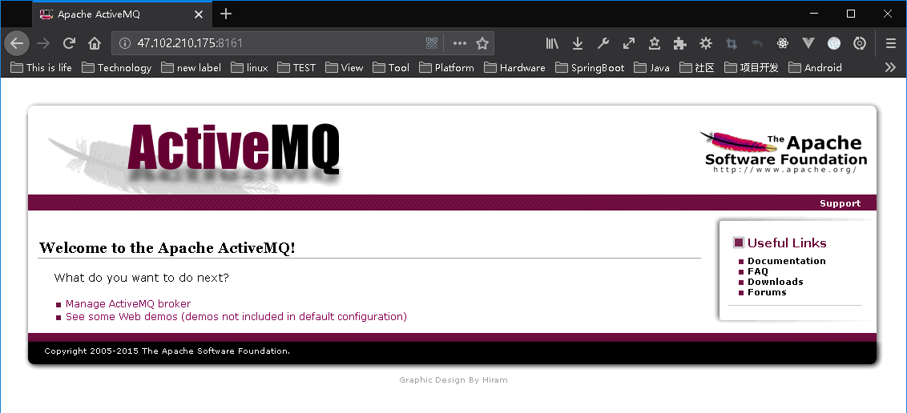
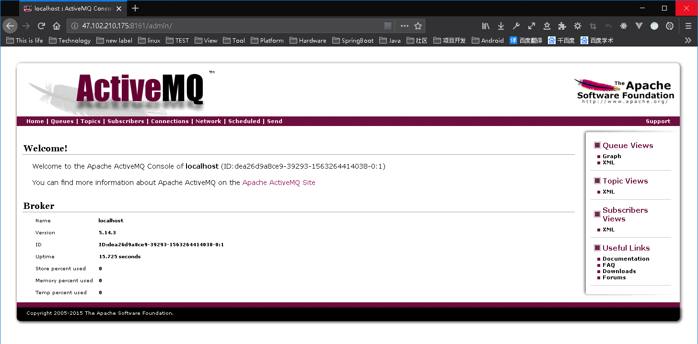
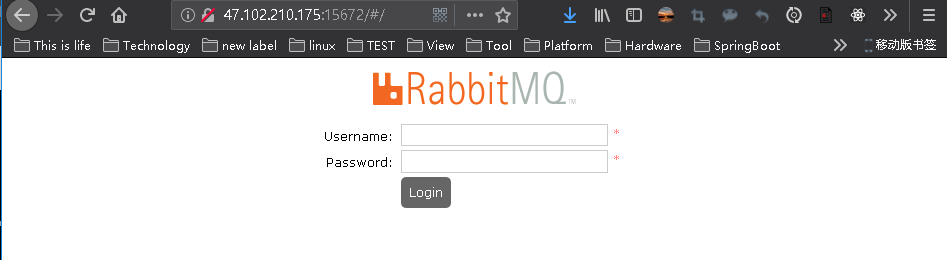
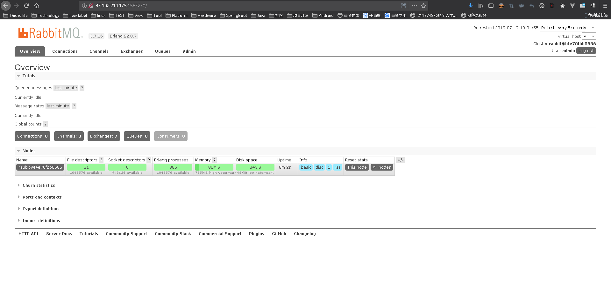

[TOC]

# 软件安装

## Mysql

1. 拉取

    ```
    docker pull mysql:5.7
    ```

2. 运行

    ```
    docker run --name mysql56-sfow -v /ysw/app/mysql/data:/var/lib/mysql -p 3306:3306 -e MYSQL_ROOT_PASSWORD=234 -d mysql:5.6 --character-set-server=utf8 --collation-server=utf8_general_ci
    docker exec -it mysql56-sfow bash
    ```

---


## Redis

1. 拉取

    ```
    docker pull redis:5.0
    ```

2. 运行

    ```
    docker run -d --privileged=true --name redis01-sfow -v /ysw/app/redis/data:/data  -p 6379:6379 redis:4.0 --requirepass "root@234" --appendonly yes
    docker exec -it redis01-sfow redis-cli -h 127.0.0.1 -p 6379 -a root@234　
    ```


## Activemq

1. 拉取

    ```
    docker pull docker.io/webcenter/
    ```

2. 运行

    ```
    docker run -d --name activemq01 -p 61616:61616 -p 8161:8161 -e ACTIVEMQ_ADMIN_LOGIN=admin -e ACTIVEMQ_ADMIN_PASSWORD=234 --restart=always docker.io/webcenter/activemq
    ```

3. 查看

    ```
    docker ps
    ```

4. 运行（http://47.102.210.175:8161/）

    

5. 管理（http://47.102.210.175:8161/admin/）

    

## RabbitMQ

1. 拉取镜像

    ```
    docker pull rabbitmq:management
    ```

2. 运行镜像

    ```
    docker run -d -p 5672:5672 -p 15672:15672 --name rabbitmq01 -e RABBITMQ_DEFAULT_USER=admin -e RABBITMQ_DEFAULT_PASS=234 rabbitmq:management
    ```

3. 运行（http://47.102.210.175:15672/）

    

4. 管理（http://47.102.210.175:15672/）

    