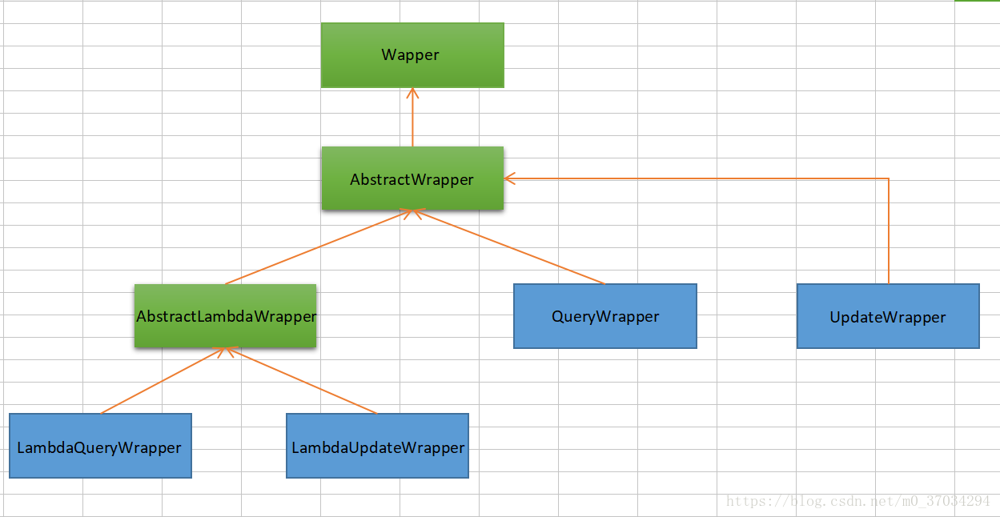

[TOC]

# MybatisPlus

> 全新的 `MyBatis-Plus` 3.0 版本基于 JDK8，提供了 `lambda` 形式的调用，所以安装集成 MP3.0 要求如下：

## 基本配置

### 1、添加依赖

1. Spring Boot

    ```xml
    <dependency>
        <groupId>com.baomidou</groupId>
        <artifactId>mybatis-plus-boot-starter</artifactId>
        <version>3.1.2</version>
    </dependency>
    ```

2. Spring MVC

    ```xml
    <dependency>
        <groupId>com.baomidou</groupId>
        <artifactId>mybatis-plus</artifactId>
        <version>3.1.2</version>
    </dependency>
    ```

    

### 2、配置MapperScan

1. Spring Boot

    ```java
    @SpringBootApplication
    @MapperScan("cn.wsyjjly.mapper")
    public class Application {
        public static void main(String[] args) {
            SpringApplication.run(Application.class, args);
        }
    
    }
    
    ```

2. Spring MVC

    - 配置 MapperScan

        ```xml
        <bean class="org.mybatis.spring.mapper.MapperScannerConfigurer">
            <property name="basePackage" value="com.baomidou.mybatisplus.samples.quickstart.mapper"/>
        </bean>
        ```

    - 调整 SqlSessionFactory 为 MyBatis-Plus 的 SqlSessionFactory

        ```xml
        <bean id="sqlSessionFactory" class="com.baomidou.mybatisplus.extension.spring.MybatisSqlSessionFactoryBean">
            <property name="dataSource" ref="dataSource"/>
        </bean>
        ```

### 3、注解

1. @TableName

    > 描述：表名注解

    | 属性             |  类型   |   必须指定   | 默认值 | 描述                                                         |
    | :--------------- | :-----: | :------------------: | :----: | --------- |
    | value            | String  |    否    |   ""   | 表名                                                         |
    | resultMap        | String  |    否    |   ""   | xml 中 resultMap 的 id                                       |
    | schema           | String  |    否    |   ""   | schema(@since 3.1.1)                                         |
    | keepGlobalPrefix | boolean |    否    | false  | 是否保持使用全局的 tablePrefix 的值(如果设置了全局 tablePrefix 且自行设置了 value 的值)(@since 3.1.1) |

2. @TableId

    > 描述：主键注解

    | 属性  |  类型  | 必须指定 |   默认值    |    描述    |
    | :---: | :----: | :------: | :---------: | :--------: |
    | value | String |    否    |     ""      | 主键字段名 |
    | type  |  Enum  |    否    | IdType.NONE |  主键类型  |

    **idType**

    |      值       |            描述             |
    | :-----------: | :-------------------------: |
    |     AUTO      |         数据库自增          |
    |     INPUT     |          自行输入           |
    |   ID_WORKER   | 分布式全局唯一ID 长整型类型 |
    |     UUID      |       32位UUID字符串        |
    |     NONE      |           无状态            |
    | ID_WORKER_STR | 分布式全局唯一ID 字符串类型 |

3. @TableField

    > 描述：字段注解(非主键)
    
    |   属性    |  类型   | 必须指定 | 默认值 |                             描述                             |
    | :-------: | :-----: | :------: | :----: | :----------------------------------------------------------: |
    |   value   | String  |    否    |   ""   |                            字段名                            |
    |    el     | String  |    否    |   ""   | 映射为原生 `#{ ... }` 逻辑,相当于写在 xml 里的 `#{ ... }` 部分 |
    |   exist   | boolean |    否    |  true  |                      是否为数据库表字段                      |
    | condition | String  |    否    |   ""   | 字段 `where` 实体查询比较条件,有值设置则按设置的值为准,没有则为默认全局的 `%s=#{%s}` |
    | update           | String  | 否   | ""                    | 字段 `update set` 部分注入, 例如：update="%s+1"：表示更新时会set version=version+1(该属性优先级高于 `el` 属性) |
    | strategy         | Enum    | 否   | FieldStrategy.DEFAULT | 字段验证策略 3.1.2+使用下面3个替代                           |
    | insertStrategy   | Enum    | N    | DEFAULT               | 举例：NOT_NULL: `insert  into table_a(<if test="columnProperty != null">column</if>)  values (<if test="columnProperty !=  null">#{columnProperty}</if>)` (since v_3.1.2) |
    | updateStrategy   | Enum    | N    | DEFAULT               | 举例：IGNORED: `update table_a set column=#{columnProperty}` (since v_3.1.2) |
    | whereStrategy    | Enum    | N    | DEFAULT               | 举例：NOT_EMPTY: `where <if test="columnProperty != null and columnProperty!=''">column=#{columnProperty}</if>` (since v_3.1.2) |
    | fill             | Enum    | 否   | FieldFill.DEFAULT     | 字段自动填充策略                                             |
    | select           | boolean | 否   | true                  | 是否进行 select 查询                                         |
    | keepGlobalFormat | boolean | 否   | false                 | 是否保持使用全局的 format 进行处理(@since 3.1.1)             |
    
    **FieldStrategy**
    
    |    值     |                           描述                            |
    | :-------: | :-------------------------------------------------------: |
    |  IGNORED  |                         忽略判断                          |
    | NOT_NULL  |                        非NULL判断                         |
    | NOT_EMPTY | 非空判断(只对字符串类型字段,其他类型字段依然为非NULL判断) |
    |  DEFAULT  |                       追随全局配置                        |
    
    **FieldFill**
    
    |      值       |         描述         |
    | :-----------: | :------------------: |
    |    DEFAULT    |      默认不处理      |
    |    INSERT     |    插入时填充字段    |
    |    UPDATE     |    更新时填充字段    |
    | INSERT_UPDATE | 插入和更新时填充字段 |
    
4. @Version

    > 描述：乐观锁注解、标记 `@Verison` 在字段上

5. @EnumValue

    > 描述：通枚举类注解(注解在枚举字段上)

6. @TableLogic

    > 描述：表字段逻辑处理注解（逻辑删除）

    |  属性  |  类型  | 必须指定 | 默认值 |     描述     |
    | :----: | :----: | :------: | :----: | :----------: |
    | value  | String |    否    |   ""   | 逻辑未删除值 |
    | delval | String |    否    |   ""   |  逻辑删除值  |

7. @SqlParser

    > 描述：租户注解 目前只支持注解在 mapper 的方法上(3.1.1开始支持注解在mapper上)

    |  属性  |  类型   | 必须指定 | 默认值 |                             描述                             |
    | :----: | :-----: | :------: | :----: | :----------------------------------------------------------: |
    | filter | boolean |    否    | false  | true: 表示过滤SQL解析，即不会进入ISqlParser解析链，否则会进解析链并追加例如tenant_id等条件 |

8. @KeySequence

    > 描述：序列主键策略 `oracle`
    >
    > 属性：value、resultMap
    
    | 属性  |  类型  | 必须指定 |   默认值   |                             描述                             |
    | :---: | :----: | :------: | :--------: | :----------------------------------------------------------: |
    | value | String |    否    |     ""     |                            序列名                            |
    | clazz | Class  |    否    | Long.class | id的类型, 可以指定String.class，这样返回的Sequence值是字符串"1" |
    

### 4、配置驼峰转下划线

 - propertis

    ```properties
    mybatis-plus.configuration.map-underscore-to-camel-case=true
    ```

- yaml

    ```yml
    mybatis-plus:
      configuration:
        map-underscore-to-camel-case: true
    ```

    

## Mapper CRUD接口

### 增加（1）

#### `insert`

```java
/**
 * <p>
 * 插入一条记录
 * </p>
 *
 * @param entity 实体对象
 * @return 插入成功记录数
 */
int insert(T entity);
```

### 删除（4）

#### `deleteById`

```java
/**
 * <p>
 * 根据 ID 删除
 * </p>
 *
 * @param id 主键ID
 * @return 删除成功记录数
 */
int deleteById(Serializable id);
```

#### `deleteByMap`

```java
/**
 * <p>
 * 根据 columnMap 条件，删除记录
 * </p>
 *
 * @param columnMap 表字段 map 对象
 * @return 删除成功记录数
 */
int deleteByMap(@Param(Constants.COLUMN_MAP) Map<String, Object> columnMap);
```

#### `delete`

```java
/**
 * <p>
 * 根据 entity 条件，删除记录
 * </p>
 *
 * @param wrapper 实体对象封装操作类（可以为 null）
 * @return 删除成功记录数
 */
int delete(@Param(Constants.WRAPPER) Wrapper<T> wrapper);
```

#### `deleteBatchIds`

```java
/**
 * <p>
 * 删除（根据ID 批量删除）
 * </p>
 *
 * @param idList 主键ID列表(不能为 null 以及 empty)
 * @return 删除成功记录数
 */
int deleteBatchIds(@Param(Constants.COLLECTION) Collection<? extends Serializable> idList);
```

### 更新（2）

#### `updateById`

```java
/**
 * <p>
 * 根据 ID 修改
 * </p>
 *
 * @param entity 实体对象
 * @return 修改成功记录数
 */
int updateById(@Param(Constants.ENTITY) T entity);
```

#### `update`

```java
/**
 * <p>
 * 根据 whereEntity 条件，更新记录
 * </p>
 *
 * @param entity        实体对象 (set 条件值,可为 null)
 * @param updateWrapper 实体对象封装操作类（可以为 null,里面的 entity 用于生成 where 语句）
 * @return 修改成功记录数
 */
int update(@Param(Constants.ENTITY) T entity, @Param(Constants.WRAPPER) Wrapper<T> updateWrapper);
```

### 查询（10）

#### `selectById`

```java
/**
 * <p>
 * 根据 ID 查询
 * </p>
 *
 * @param id 主键ID
 * @return 实体
 */
T selectById(Serializable id);
```

#### `selectBatchIds`

```java
/**
 * <p>
 * 查询（根据ID 批量查询）
 * </p>
 *
 * @param idList 主键ID列表(不能为 null 以及 empty)
 * @return 实体集合
 */
List<T> selectBatchIds(@Param(Constants.COLLECTION) Collection<? extends Serializable> idList);
```

#### `selectByMap`

```java
/**
 * <p>
 * 查询（根据 columnMap 条件）
 * </p>
 *
 * @param columnMap 表字段 map 对象
 * @return 实体集合
 */
List<T> selectByMap(@Param(Constants.COLUMN_MAP) Map<String, Object> columnMap);
```

#### `selectOne`

```java
/**
 * <p>
 * 根据 entity 条件，查询一条记录
 * </p>
 *
 * @param queryWrapper 实体对象
 * @return 实体
 */
T selectOne(@Param(Constants.WRAPPER) Wrapper<T> queryWrapper);
```

#### `selectCount`

```java
/**
 * <p>
 * 根据 Wrapper 条件，查询总记录数
 * </p>
 *
 * @param queryWrapper 实体对象
 * @return 满足条件记录数
 */
Integer selectCount(@Param(Constants.WRAPPER) Wrapper<T> queryWrapper);
```

#### `selectList`

```java
/**
 * <p>
 * 根据 entity 条件，查询全部记录
 * </p>
 *
 * @param queryWrapper 实体对象封装操作类（可以为 null）
 * @return 实体集合
 */
List<T> selectList(@Param(Constants.WRAPPER) Wrapper<T> queryWrapper);
```

#### `selectMaps`

```java
/**
 * <p>
 * 根据 Wrapper 条件，查询全部记录
 * </p>
 *
 * @param queryWrapper 实体对象封装操作类（可以为 null）
 * @return 字段映射对象 Map 集合
 */
List<Map<String, Object>> selectMaps(@Param(Constants.WRAPPER) Wrapper<T> queryWrapper);
```

#### `selectObjs`

```java
/**
 * <p>
 * 根据 Wrapper 条件，查询全部记录
 * 注意： 只返回第一个字段的值
 * </p>
 *
 * @param queryWrapper 实体对象封装操作类（可以为 null）
 * @return 字段映射对象集合
 */
List<Object> selectObjs(@Param(Constants.WRAPPER) Wrapper<T> queryWrapper);
```

#### `selectPage`

```java
/**
 * <p>
 * 根据 entity 条件，查询全部记录（并翻页）
 * </p>
 *
 * @param page         分页查询条件（可以为 RowBounds.DEFAULT）
 * @param queryWrapper 实体对象封装操作类（可以为 null）
 * @return 实体分页对象
 */
IPage<T> selectPage(IPage<T> page, @Param(Constants.WRAPPER) Wrapper<T> queryWrapper);
```

#### `selectMapsPage`

```java
/**
 * <p>
 * 根据 Wrapper 条件，查询全部记录（并翻页）
 * </p>
 *
 * @param page         分页查询条件
 * @param queryWrapper 实体对象封装操作类
 * @return 字段映射对象 Map 分页对象
 */
IPage<Map<String, Object>> selectMapsPage(IPage<T> page, @Param(Constants.WRAPPER) Wrapper<T> queryWrapper);
```

代码示例：

- 涉及数据库表

```sql
Create Table
CREATE TABLE `user` (
  `id` bigint(20) NOT NULL AUTO_INCREMENT,
  `username` varchar(32) DEFAULT NULL,
  `password` varchar(255) DEFAULT NULL,
  `enable` tinyint(1) DEFAULT NULL,
  `locked` tinyint(1) DEFAULT NULL,
  `role` varchar(30) DEFAULT NULL,
  PRIMARY KEY (`id`)
) ENGINE=InnoDB AUTO_INCREMENT=26 DEFAULT CHARSET=utf8
```

- CRUD测试

```java
package cn.wsyjlly.config;

import cn.wsyjlly.entity.User;
import cn.wsyjlly.mapper.UserMapper;
import com.baomidou.mybatisplus.core.conditions.query.QueryWrapper;
import com.baomidou.mybatisplus.core.metadata.IPage;
import com.baomidou.mybatisplus.extension.plugins.pagination.Page;
import org.slf4j.Logger;
import org.slf4j.LoggerFactory;
import org.springframework.beans.factory.annotation.Autowired;
import org.springframework.boot.ApplicationArguments;
import org.springframework.boot.ApplicationRunner;
import org.springframework.core.annotation.Order;
import org.springframework.stereotype.Component;

import java.util.Arrays;
import java.util.HashMap;
import java.util.List;
import java.util.Map;

/**
 * @author wsyjlly
 * @create 2019.06.14 - 19:39
 * 配置启动系统参数
 * 测试Mybatis-plus CRUD 及 分页
 **/
@Component
@Order(2)
public class MybatisPlusCRUD implements ApplicationRunner {
    @Autowired
    private UserMapper userMapper;
    @Override
    public void run(ApplicationArguments args) throws Exception {
        Logger logger = LoggerFactory.getLogger(getClass());
        QueryWrapper<User> queryWrapper = new QueryWrapper<>();
        List<User> users;
        logger.info("------------------------------------------------------------------------");

        /*
        * 查找操作(10)
        * */

        //根据ID查找一条结果
        User user = userMapper.selectById((long)1);
        System.out.println(user);

        //根据ID数组查找
        List<User> userList = userMapper.selectBatchIds(Arrays.asList(1, 2, 3));
        System.out.println(userList);

        //根据多个字段及其值组成的Map查找
        HashMap<String, Object> map = new HashMap<>();
        map.put("id",2);
        map.put("username","yan");
        userList = userMapper.selectByMap(map);
        System.out.println(userList);

        //根据QueryWrapper筛选对象查看选中记录条数
        Integer selectCount = userMapper.selectCount(queryWrapper.eq("username", "ysw"));
        System.out.println(selectCount);

        //根据QueryWrapper筛选对象选中一条数据
        queryWrapper = new QueryWrapper<>();
        user =userMapper.selectOne(queryWrapper.eq("id",1));
        System.out.println(user);

        //根据QueryWrapper筛选对象查看返回任意对象
        queryWrapper = new QueryWrapper<>();
        List<Object> objectList = userMapper.selectObjs(queryWrapper.select("*").eq("username", "ysw"));
        System.out.println(objectList);

        //根据QueryWrapper筛选对象查看返回User对象列表
        queryWrapper = new QueryWrapper<>();
        List<User> userList1 = userMapper.selectList(queryWrapper.select("*").eq("username", "ysw"));
        System.out.println(userList1);

        //根据QueryWrapper筛选对象查看返回JSON对象列表
        queryWrapper = new QueryWrapper<User>();
        List<Map<String, Object>> maps = userMapper.selectMaps(queryWrapper.select("*").eq("username", "ysw"));
        System.out.println(maps);

        //根据Page对象和QueryWrapper筛选对象进行分页，赶回IPage<T>对象,通过getRecords方法获取当前页对象，该分页需要配置分页过滤器
        queryWrapper = new QueryWrapper<>();
        System.out.println("--------------------分页----------------------");
        IPage<User> userIPage = userMapper.selectPage(new Page<>(2,3), queryWrapper.select("*"));
        List<User> records = userIPage.getRecords();
        System.out.println(records);
        
        queryWrapper = new QueryWrapper<>();
        IPage<Map<String, Object>> mapIPage = userMapper.selectMapsPage(new Page<>(), queryWrapper.select("*"));
        List<Map<String, Object>> mapIPageRecords = mapIPage.getRecords();
        System.out.println(mapIPageRecords);


        /*
         * 添加操作(1)
         * */
//        int result = userMapper.insert(new User().setUsername("ysw").setPassword("222333"));
//        logger.debug(String.valueOf(result));

        /*
        * 删除操作(4)
        * */
//        userMapper.delete(queryWrapper.eq("id",10));
//        userMapper.deleteById((long) 8);
//        ArrayList<Integer> list = new ArrayList<>();
//        list.add(11);
//        list.add(12);
//        map = new HashMap<>();
//        map.put("id",2);
//        map.put("username","yan");
//        userMapper.deleteByMap(map);
//        userMapper.deleteBatchIds(list);
//        userMapper.deleteBatchIds(Arrays.asList(1,2,3,4));

        /*
         * 更新操作(2)
         * */
//        userMapper.updateById(new User().setId((long) 8).setUsername("ysw").setPassword("222333"));
//        userMapper.update(new User().setId((long) 8).setUsername("ysw").setPassword("222333"),queryWrapper.eq("id",9));
    }
}
```


## Service  CRUD接口

### 增加（5）

#### `save`

```java
/**
 * <p>
 * 插入一条记录（选择字段，策略插入）
 * </p>
 *
 * @param entity 实体对象
 */
boolean save(T entity);
```

#### `saveBatch`

```java
/**
 * 插入（批量）
 *
 * @param entityList 实体对象集合
 * @param batchSize  插入批次数量
 */
boolean saveBatch(Collection<T> entityList);
```

#### `saveBatch`

```java
/**
 * 插入（批量）
 * 
 * @param entityList 实体对象集合
 * @param batchSize  插入批次数量
 */
boolean saveBatch(Collection<T> entityList, int batchSize);
```

#### `saveOrUpdateBatch`

```java
/**
 * <p>
 * 批量修改插入
 * </p>
 *
 * @param entityList 实体对象集合
 */
boolean saveOrUpdateBatch(Collection<T> entityList);
```

#### `saveOrUpdateBatch`

```java
/**
 * <p>
 * 批量修改插入
 * </p>
 *
 * @param entityList 实体对象集合
 * @param batchSize  每次的数量
 */
boolean saveOrUpdateBatch(Collection<T> entityList, int batchSize);
```

### 删除（4）

#### `removeById`

```java
/**
 * <p>
 * 根据 ID 删除
 * </p>
 *
 * @param id 主键ID
 */
boolean removeById(Serializable id);
```

#### `removeByMap`

```java
/**
 * <p>
 * 根据 columnMap 条件，删除记录
 * </p>
 *
 * @param columnMap 表字段 map 对象
 */
boolean removeByMap(Map<String, Object> columnMap);
```

#### `remove`

```java
/**
 * <p>
 * 根据 entity 条件，删除记录
 * </p>
 *
 * @param queryWrapper 实体包装类 {@link com.baomidou.mybatisplus.core.conditions.query.QueryWrapper}
 */
boolean remove(Wrapper<T> queryWrapper);
```

#### `removeByIds`

```java
/**
 * <p>
 * 删除（根据ID 批量删除）
 * </p>
 *
 * @param idList 主键ID列表
 */
boolean removeByIds(Collection<? extends Serializable> idList);
```

### 更新（4）

#### `updateById`

```java
/**
 * <p>
 * 根据 ID 选择修改
 * </p>
 *
 * @param entity 实体对象
 */
boolean updateById(T entity);
```

#### `update`

```java
/**
 * <p>
 * 根据 whereEntity 条件，更新记录
 * </p>
 *
 * @param entity        实体对象
 * @param updateWrapper 实体对象封装操作类 {@link com.baomidou.mybatisplus.core.conditions.update.UpdateWrapper}
 */
boolean update(T entity, Wrapper<T> updateWrapper);
```

#### `updateBatchById`

```java
/**
 * <p>
 * 根据ID 批量更新
 * </p>
 *
 * @param entityList 实体对象集合
 * @param batchSize  更新批次数量
 */
boolean updateBatchById(Collection<T> entityList, int batchSize);
```

#### `saveOrUpdate`

```java
/**
 * <p>
 * TableId 注解存在更新记录，否插入一条记录
 * </p>
 *
 * @param entity 实体对象
 */
boolean saveOrUpdate(T entity);
```

### 查找（12）

#### `getById`

```java
/**
 * <p>
 * 根据 ID 查询
 * </p>
 *
 * @param id 主键ID
 */
T getById(Serializable id);
```

#### `listByIds`

```java
/**
 * <p>
 * 查询（根据ID 批量查询）
 * </p>
 *
 * @param idList 主键ID列表
 */
Collection<T> listByIds(Collection<? extends Serializable> idList);
```

#### `listByMap`

```java
/**
 * <p>
 * 查询（根据 columnMap 条件）
 * </p>
 *
 * @param columnMap 表字段 map 对象
 */
Collection<T> listByMap(Map<String, Object> columnMap);
```

#### `getOne`

```java
/**
 * <p>
 * 根据 Wrapper，查询一条记录
 * </p>
 *
 * @param queryWrapper 实体对象封装操作类 {@link com.baomidou.mybatisplus.core.conditions.query.QueryWrapper}
 * @param throwEx      有多个 result 是否抛出异常
 */
T getOne(Wrapper<T> queryWrapper, boolean throwEx);
```

#### `getMap`

```java
/**
 * <p>
 * 根据 Wrapper，查询一条记录
 * </p>
 *
 * @param queryWrapper 实体对象封装操作类 {@link com.baomidou.mybatisplus.core.conditions.query.QueryWrapper}
 */
Map<String, Object> getMap(Wrapper<T> queryWrapper);
```

#### `getObj`

```java
/**
 * <p>
 * 根据 Wrapper，查询一条记录
 * </p>
 *
 * @param queryWrapper 实体对象封装操作类 {@link com.baomidou.mybatisplus.core.conditions.query.QueryWrapper}
 */
Object getObj(Wrapper<T> queryWrapper);
```

#### `count`

```java
/**
 * <p>
 * 根据 Wrapper 条件，查询总记录数
 * </p>
 *
 * @param queryWrapper 实体对象封装操作类 {@link com.baomidou.mybatisplus.core.conditions.query.QueryWrapper}
 */
int count(Wrapper<T> queryWrapper);
```

#### `list`

```java
/**
 * <p>
 * 查询列表
 * </p>
 *
 * @param queryWrapper 实体对象封装操作类 {@link com.baomidou.mybatisplus.core.conditions.query.QueryWrapper}
 */
List<T> list(Wrapper<T> queryWrapper);
```

#### `page`

```java
/**
 * <p>
 * 翻页查询
 * </p>
 *
 * @param page         翻页对象
 * @param queryWrapper 实体对象封装操作类 {@link com.baomidou.mybatisplus.core.conditions.query.QueryWrapper}
 */
IPage<T> page(IPage<T> page, Wrapper<T> queryWrapper);
```

#### `listMaps`

```java
/**
 * <p>
 * 查询列表
 * </p>
 *
 * @param queryWrapper 实体对象封装操作类 {@link com.baomidou.mybatisplus.core.conditions.query.QueryWrapper}
 */
List<Map<String, Object>> listMaps(Wrapper<T> queryWrapper);
```

#### `listObjs`

```java
/**
 * <p>
 * 根据 Wrapper 条件，查询全部记录
 * </p>
 *
 * @param queryWrapper 实体对象封装操作类 {@link com.baomidou.mybatisplus.core.conditions.query.QueryWrapper}
 */
List<Object> listObjs(Wrapper<T> queryWrapper);
```

#### `pageMaps`

```java
/**
 * <p>
 * 翻页查询
 * </p>
 *
 * @param page         翻页对象
 * @param queryWrapper 实体对象封装操作类 {@link com.baomidou.mybatisplus.core.conditions.query.QueryWrapper}
 */
IPage<Map<String, Object>> pageMaps(IPage<T> page, Wrapper<T> queryWrapper);
```

## 条件构造器（36）

`条件构造器关系介绍`:



`介绍` ：

> 上图绿色框为抽象类abstract
> 蓝色框为正常class类，可new对象
> 黄色箭头指向为父子类关系，箭头指向为父类

`wapper介绍 `：

> Wrapper ： 条件构造抽象类，最顶端父类，抽象类中提供4个方法西面贴源码展示
> AbstractWrapper ： 用于查询条件封装，生成 sql 的 where 条件
> AbstractLambdaWrapper ： Lambda 语法使用 Wrapper统一处理解析 lambda 获取 column。
> LambdaQueryWrapper ：看名称也能明白就是用于Lambda语法使用的查询Wrapper
> LambdaUpdateWrapper ： Lambda 更新封装Wrapper
> QueryWrapper ： Entity 对象封装操作类，不是用lambda语法
> UpdateWrapper ： Update 条件封装，用于Entity对象更新操作

---------------------
版权声明：本文为CSDN博主「青蛙与大鹅」的原创文章，遵循CC 4.0 by-sa版权协议，转载请附上原文出处链接及本声明。
原文链接：https://blog.csdn.net/m0_37034294/article/details/82917234

说明:

- 以下出现的第一个入参`boolean condition`表示该条件**是否**加入最后生成的sql中
- 以下代码块内的多个方法均为从上往下补全个别`boolean`类型的入参,默认为`true`
- 以下出现的泛型`Param`均为`Wrapper`的子类实例(均具有`AbstractWrapper`的所有方法)
- 以下方法在入参中出现的`R`为泛型,在普通wrapper中是`String`,在LambdaWrapper中是**函数**(例:`Entity::getId`,`Entity`为实体类,`getId`为字段`id`的**getMethod**)
- 以下方法入参中的`R column`均表示数据库字段,当`R`具体类型为`String`时则为数据库字段名(**字段名是数据库关键字的自己用转义符包裹!**)!而不是实体类数据字段名!!!,另当`R`具体类型为`SFunction`时项目runtime不支持eclipse自家的编译器!!!
- 以下举例均为使用普通wrapper,入参为`Map`和`List`的均以`json`形式表现!
- 使用中如果入参的`Map`或者`List`为**空**,则不会加入最后生成的sql中!!!

### AbstractWrapper（31）

#### `allEq`

```java
allEq(Map<R, V> params)
allEq(Map<R, V> params, boolean null2IsNull)
allEq(boolean condition, Map<R, V> params, boolean null2IsNull)
```

- 全部[eq](https://mybatis.plus/guide/wrapper.html#eq)(或个别[isNull](https://mybatis.plus/guide/wrapper.html#isnull))

个别参数说明:

`params` : `key`为数据库字段名,`value`为字段值
 `null2IsNull` : 为`true`则在`map`的`value`为`null`时调用 [isNull](https://mybatis.plus/guide/wrapper.html#isnull) 方法,为`false`时则忽略`value`为`null`的

- 例1: `allEq({id:1,name:"老王",age:null})`--->`id = 1 and name = '老王' and age is null`
- 例2: `allEq({id:1,name:"老王",age:null}, false)`--->`id = 1 and name = '老王'`

```java
allEq(BiPredicate<R, V> filter, Map<R, V> params)
allEq(BiPredicate<R, V> filter, Map<R, V> params, boolean null2IsNull)
allEq(boolean condition, BiPredicate<R, V> filter, Map<R, V> params, boolean null2IsNull) 
```

个别参数说明:

`filter` : 过滤函数,是否允许字段传入比对条件中
 `params` 与 `null2IsNull` : 同上

- 例1: `allEq((k,v) -> k.indexOf("a") > 0, {id:1,name:"老王",age:null})`--->`name = '老王' and age is null`
- 例2: `allEq((k,v) -> k.indexOf("a") > 0, {id:1,name:"老王",age:null}, false)`--->`name = '老王'`

#### `eq`

```java
eq(R column, Object val)
eq(boolean condition, R column, Object val)
```

- 等于 =
- 例: `eq("name", "老王")`--->`name = '老王'`

#### `ne`

```java
ne(R column, Object val)
ne(boolean condition, R column, Object val)
```

- 不等于 <>
- 例: `ne("name", "老王")`--->`name <> '老王'`

#### `gt`

```java
gt(R column, Object val)
gt(boolean condition, R column, Object val)
```

- 大于 >
- 例: `gt("age", 18)`--->`age > 18`

#### `ge`

```java
ge(R column, Object val)
ge(boolean condition, R column, Object val)
```

- 大于等于 >=
- 例: `ge("age", 18)`--->`age >= 18`

#### `lt`

```java
lt(R column, Object val)
lt(boolean condition, R column, Object val)
```

- 小于 <
- 例: `lt("age", 18)`--->`age < 18`

#### `le`

```java
le(R column, Object val)
le(boolean condition, R column, Object val)
```

- 小于等于 <=
- 例: `le("age", 18)`--->`age <= 18`

#### `between`

```java
between(R column, Object val1, Object val2)
between(boolean condition, R column, Object val1, Object val2)
```

- BETWEEN 值1 AND 值2
- 例: `between("age", 18, 30)`--->`age between 18 and 30`

#### `notBetween`

```java
notBetween(R column, Object val1, Object val2)
notBetween(boolean condition, R column, Object val1, Object val2)
```

- NOT BETWEEN 值1 AND 值2
- 例: `notBetween("age", 18, 30)`--->`age not between 18 and 30`

#### `like`

```java
like(R column, Object val)
like(boolean condition, R column, Object val)
```

- LIKE '%值%'
- 例: `like("name", "王")`--->`name like '%王%'`

#### `notLike`

```java
notLike(R column, Object val)
notLike(boolean condition, R column, Object val)
```

- NOT LIKE '%值%'
- 例: `notLike("name", "王")`--->`name not like '%王%'`

#### `likeLeft`

```java
likeLeft(R column, Object val)
likeLeft(boolean condition, R column, Object val)
```

- LIKE '%值'
- 例: `likeLeft("name", "王")`--->`name like '%王'`

#### `likeRight`

```java
likeRight(R column, Object val)
likeRight(boolean condition, R column, Object val)
```

- LIKE '值%'
- 例: `likeRight("name", "王")`--->`name like '王%'`

#### `isNull`

```java
isNull(R column)
isNull(boolean condition, R column)
```

- 字段 IS NULL
- 例: `isNull("name")`--->`name is null`

#### `isNotNull`

```java
isNotNull(R column)
isNotNull(boolean condition, R column)
```

- 字段 IS NOT NULL
- 例: `isNotNull("name")`--->`name is not null`

#### `in`

```java
in(R column, Collection<?> value)
in(boolean condition, R column, Collection<?> value)
```

- 字段 IN (value.get(0), value.get(1), ...)
- 例: `in("age",{1,2,3})`--->`age in (1,2,3)`


```java
in(R column, Object... values)
in(boolean condition, R column, Object... values)
```

- 字段 IN (v0, v1, ...)
- 例: `in("age", 1, 2, 3)`--->`age in (1,2,3)`

#### `notIn`

```java
notIn(R column, Collection<?> value)
notIn(boolean condition, R column, Collection<?> value)
```

- 字段 IN (value.get(0), value.get(1), ...)
- 例: `notIn("age",{1,2,3})`--->`age not in (1,2,3)`


```java
notIn(R column, Object... values)
notIn(boolean condition, R column, Object... values)
```

- 字段 NOT IN (v0, v1, ...)
- 例: `notIn("age", 1, 2, 3)`--->`age not in (1,2,3)`

#### `inSql`

```java
inSql(R column, String inValue)
inSql(boolean condition, R column, String inValue)
```

- 字段 IN ( sql语句 )
- 例: `inSql("age", "1,2,3,4,5,6")`--->`age in (1,2,3,4,5,6)`
- 例: `inSql("id", "select id from table where id < 3")`--->`id in (select id from table where id < 3)`

#### `notInSql`

```java
notInSql(R column, String inValue)
notInSql(boolean condition, R column, String inValue)
```

- 字段 NOT IN ( sql语句 )
- 例: `notInSql("age", "1,2,3,4,5,6")`--->`age not in (1,2,3,4,5,6)`
- 例: `notInSql("id", "select id from table where id < 3")`--->`age not in (select id from table where id < 3)`

#### `groupBy`

```java
groupBy(R... columns)
groupBy(boolean condition, R... columns)
```

- 分组：GROUP BY 字段, ...
- 例: `groupBy("id", "name")`--->`group by id,name`

#### `orderByAsc`

```java
orderByAsc(R... columns)
orderByAsc(boolean condition, R... columns)
```

- 排序：ORDER BY 字段, ... ASC
- 例: `orderByAsc("id", "name")`--->`order by id ASC,name ASC`

#### `orderByDesc`

```java
orderByDesc(R... columns)
orderByDesc(boolean condition, R... columns)
```

- 排序：ORDER BY 字段, ... DESC
- 例: `orderByDesc("id", "name")`--->`order by id DESC,name DESC`

#### `orderBy`

```java
orderBy(boolean condition, boolean isAsc, R... columns)
```

- 排序：ORDER BY 字段, ...
- 例: `orderBy(true, true, "id", "name")`--->`order by id ASC,name ASC`

#### `having`

```java
having(String sqlHaving, Object... params)
having(boolean condition, String sqlHaving, Object... params)
```

- HAVING ( sql语句 )
- 例: `having("sum(age) > 10")`--->`having sum(age) > 10`
- 例: `having("sum(age) > {0}", 11)`--->`having sum(age) > 11`

#### `or`

```java
or()
or(boolean condition)
```

- 拼接 OR

注意事项:

主动调用`or`表示紧接着下一个**方法**不是用`and`连接!(不调用`or`则默认为使用`and`连接)

- 例: `eq("id",1).or().eq("name","老王")`--->`id = 1 or name = '老王'`


```java
or(Function<Param, Param> func)
or(boolean condition, Function<Param, Param> func)
```

- OR 嵌套
- 例: `or(i -> i.eq("name", "李白").ne("status", "活着"))`--->`or (name = '李白' and status <> '活着')`

#### `and`

```java
and(Function<Param, Param> func)
and(boolean condition, Function<Param, Param> func)
```

- AND 嵌套
- 例: `and(i -> i.eq("name", "李白").ne("status", "活着"))`--->`and (name = '李白' and status <> '活着')`

#### `nested`

```java
nested(Function<Param, Param> func)
nested(boolean condition, Function<Param, Param> func)
```

- 正常嵌套 不带 AND 或者 OR
- 例: `nested(i -> i.eq("name", "李白").ne("status", "活着"))`--->`(name = '李白' and status <> '活着')`

#### `apply`

- 拼接 sql

> 注意事项:
>
> 该方法可用于数据库**函数** 动态入参的`params`对应前面`applySql`内部的`{index}`部分.这样是不会有sql注入风险的,反之会有!

- 例: `apply("id = 1")`--->`id = 1`
- 例: `apply("date_format(dateColumn,'%Y-%m-%d') = '2008-08-08'")`--->`date_format(dateColumn,'%Y-%m-%d') = '2008-08-08'")`
- 例: `apply("date_format(dateColumn,'%Y-%m-%d') = {0}", "2008-08-08")`--->`date_format(dateColumn,'%Y-%m-%d') = '2008-08-08'")`

#### `last`

```java
last(String lastSql)
last(boolean condition, String lastSql)
```

- 无视优化规则直接拼接到 sql 的最后

注意事项:

只能调用一次,多次调用以最后一次为准 有sql注入的风险,请谨慎使用

- 例: `last("limit 1")`

#### `exists`

```java
exists(String existsSql)
exists(boolean condition, String existsSql)
```

- 拼接 EXISTS ( sql语句 )
- 例: `exists("select id from table where age = 1")`--->`exists (select id from table where age = 1)`

#### `notExists`

```java
notExists(String notExistsSql)
notExists(boolean condition, String notExistsSql)
```

- 拼接 NOT EXISTS ( sql语句 )
- 例: `notExists("select id from table where age = 1")`--->`not exists (select id from table where age = 1)`

### QueryWrapper（2）

#### `select`

```java
select(String... sqlSelect)
select(Predicate<TableFieldInfo> predicate)
select(Class<T> entityClass, Predicate<TableFieldInfo> predicate)
```

- 设置查询字段

说明:

以上方分法为两类.
 第二类方法为:过滤查询字段(主键除外),入参不包含 class 的调用前需要`wrapper`内的`entity`属性有值! 这两类方法重复调用以最后一次为准

- 例: `select("id", "name", "age")`
- 例: `select(i -> i.getProperty().startsWith("test"))`

#### `excludeColumns`

- 排除查询字段

>  已从`3.0.5`版本上移除此方法!

### UpdateWrapper（3）

> 说明:
>
> 继承自 `AbstractWrapper` ,自身的内部属性 `entity` 也用于生成 where 条件
>  及 `LambdaUpdateWrapper`, 可以通过 `new UpdateWrapper().lambda()` 方法获取!

#### `set`

```java
set(String column, Object val)
set(boolean condition, String column, Object val)
```

- SQL SET 字段
- 例: `set("name", "晏沈威")`
- 例: `set("name", "")`--->数据库字段值变为**空字符串**
- 例: `set("name", null)`--->数据库字段值变为`null`

#### `setSql`

```java
setSql(String sql)
```

- 设置 SET 部分 SQL
- 例: `setSql("name = '晏沈威')`

#### `lambda`

- 获取 `LambdaWrapper`
     在`QueryWrapper`中是获取`LambdaQueryWrapper`
     在`UpdateWrapper`中是获取`LambdaUpdateWrapper`

### 使用 Wrapper 自定义SQL

> 需求来源:
>
> 在使用了`mybatis-plus`之后, 自定义SQL的同时也想使用`Wrapper`的便利应该怎么办？ 在`mybatis-plus`版本`3.0.7`得到了完美解决 版本需要大于或等于`3.0.7`, 以下两种方案取其一即可

#### Service.java

```java
mysqlMapper.getAll(Wrappers.<MysqlData>lambdaQuery().eq(MysqlData::getGroup, 1));
```

#### 方案一 注解方式 Mapper.java

```java
@Select("select * from mysql_data ${ew.customSqlSegment}")
List<MysqlData> getAll(@Param(Constants.WRAPPER) Wrapper wrapper);
```

#### 方案二 XML形式 Mapper.xml

```xml
<select id="getAll" resultType="MysqlData">
	SELECT * FROM mysql_data ${ew.customSqlSegment}
</select>
```


## 分页插件

```xml
<!-- spring xml 方式 -->
<plugins>
    <plugin interceptor="com.baomidou.mybatisplus.extension.plugins.PaginationInterceptor">
        <property name="sqlParser" ref="自定义解析类、可以没有" />
        <property name="dialectClazz" value="自定义方言类、可以没有" />
    </plugin>
</plugins>
```

```java
//Spring boot方式
@EnableTransactionManagement
@Configuration
@MapperScan("com.baomidou.cloud.service.*.mapper*")
public class MybatisPlusConfig {

    /**
     * 分页插件
     */
    @Bean
    public PaginationInterceptor paginationInterceptor() {
        PaginationInterceptor paginationInterceptor = new PaginationInterceptor();
        // paginationInterceptor.setLimit(你的最大单页限制数量，默认 500 条，小于 0 如 -1 不受限制);
        return paginationInterceptor;
    }
}
```

### XML 自定义分页

- UserMapper.java 方法内容

```java
public interface UserMapper{//可以继承或者不继承BaseMapper
    /**
     * <p>
     * 查询 : 根据state状态查询用户列表，分页显示
     * 注意!!: 如果入参是有多个,需要加注解指定参数名才能在xml中取值
     * </p>
     *
     * @param page 分页对象,xml中可以从里面进行取值,传递参数 Page 即自动分页,必须放在第一位(你可以继承Page实现自己的分页对象)
     * @param state 状态
     * @return 分页对象
     */
    IPage<User> selectPageVo(Page page, @Param("state") Integer state);
}
```

- UserMapper.xml 等同于编写一个普通 list 查询，mybatis-plus 自动替你分页

```xml
<select id="selectPageVo" resultType="com.baomidou.cloud.entity.UserVo">
    SELECT id,name FROM user WHERE state=#{state}
</select>
```

- UserServiceImpl.java 调用分页方法

```java
public IPage<User> selectUserPage(Page<User> page, Integer state) {
    // 不进行 count sql 优化，解决 MP 无法自动优化 SQL 问题，这时候你需要自己查询 count 部分
    // page.setOptimizeCountSql(false);
    // 当 total 为小于 0 或者设置 setSearchCount(false) 分页插件不会进行 count 查询
    // 要点!! 分页返回的对象与传入的对象是同一个
    return userMapper.selectPageVo(page, state);
}
```

## Sequence主键

实体主键支持Sequence

- oracle等数据库主键策略配置Sequence

- GlobalConfiguration配置KeyGenerator

```java
  GlobalConfiguration gc = new GlobalConfiguration();
  gc.setKeyGenerator(new OracleKeyGenerator());
```

- mybatis-plus-boot-starter[配置参考](https://mybatis.plus/config)

```java
@Bean
public OracleKeyGenerator oracleKeyGenerator(){
  return new OracleKeyGenerator();
}
```

- 实体类配置主键Sequence,指定主键@TableId(type=IdType.INPUT)//不能使用AUTO

```java
@TableName("TEST_SEQUSER")
@KeySequence("SEQ_TEST")//类注解
public class TestSequser{
  @TableId(value = "ID", type = IdType.INPUT)
  private Long id;

}
```

- 支持父类定义@KeySequence, 子类使用，这样就可以几个表共用一个Sequence

```java
@KeySequence("SEQ_TEST")
public abstract class Parent{

}

public class Child extends Parent{

}
```

以上步骤就可以使用Sequence当主键了。

### 如何使用Sequence作为主键，但是实体主键类型是String

也就是说，表的主键是varchar2, 但是需要从sequence中取值

- 1.实体定义@KeySequence 注解clazz指定类型String.class
- 2.实体定义主键的类型String

```java
@KeySequence(value = "SEQ_ORACLE_STRING_KEY", clazz = String.class)
public class YourEntity{
    
    @TableId(value = "ID_STR", type = IdType.INPUT)
    private String idStr;
    ...
}
```

- 3.正常配置GlobalConfiguration.keyGenerator

```java
@Bean
public GlobalConfiguration globalConfiguration() {
    GlobalConfiguration conf = new GlobalConfiguration();
    conf.setKeyGenerator(new OracleKeyGenerator());
    return conf;
}
```

## 插件扩展

### 热加载

SpringBoot 配置方式：

- application.yml 加入配置(如果你的默认值和mp默认的一样,该配置可无):

    ```yaml
    mybatis-plus:
      global-config:
        db-config:
          logic-delete-value: 1 # 逻辑已删除值(默认为 1)
          logic-not-delete-value: 0 # 逻辑未删除值(默认为 0)
    ```

- 注册 Bean(3.1.1开始不再需要这一步)：

    ```java
    import com.baomidou.mybatisplus.core.injector.ISqlInjector;
    import com.baomidou.mybatisplus.extension.injector.LogicSqlInjector;
    import org.springframework.context.annotation.Bean;
    import org.springframework.context.annotation.Configuration;
    
    @Configuration
    public class MyBatisPlusConfiguration {
    
        @Bean
        public ISqlInjector sqlInjector() {
            return new LogicSqlInjector();
        }
    }
    ```

- 实体类字段上加上`@TableLogic`注解

    ```java
    @TableLogic
    private Integer deleted;
    ```

- 效果: 使用mp自带方法删除和查找都会附带逻辑删除功能 (自己写的xml不会)

    ```sql
    example
    删除时 update user set deleted=1 where id =1 and deleted=0
    查找时 select * from user where deleted=0
    ```

> 附件说明
>
> - 逻辑删除是为了方便数据恢复和保护数据本身价值等等的一种方案，但实际就是删除。
> - 如果你需要再查出来就不应使用逻辑删除，而是以一个状态去表示。
>
> 如： 员工离职，账号被锁定等都应该是一个状态字段，此种场景不应使用逻辑删除。
>
> - 若确需查找删除数据，如老板需要查看历史所有数据的统计汇总信息，请单独手写sql。

### 逻辑删除


### 通用枚举

解决了繁琐的配置，让 mybatis 优雅的使用枚举属性！

> 自`3.1.0`开始,可配置默认枚举处理类来省略扫描通用枚举配置 [默认枚举配置](https://mybatis.plus/config/#defaultEnumTypeHandler)
>
> - 升级说明:
>
>     `3.1.0` 以下版本改变了原生默认行为,升级时请将默认枚举设置为`EnumOrdinalTypeHandler`
>
> - 影响用户:
>
>     实体中使用原生枚举
>
> - 其他说明:
>
>     配置枚举包扫描的时候能提前注册使用注解枚举的缓存
>
> - 推荐配置:
>
>     - 使用实现
>
>         ```
>         IEnum
>         ```
>
>         接口 
>
>         - 推荐配置`defaultEnumTypeHandler`
>
>     - 使用注解枚举处理 
>
>         - 推荐配置`typeEnumsPackage`
>
>     - 注解枚举处理与
>
>         ```
>         IEnum
>         ```
>
>         接口 
>
>         - 推荐配置`typeEnumsPackage`
>
>     - 与原生枚举混用 
>
>         - 需配置`defaultEnumTypeHandler`与 `typeEnumsPackage`

#### 1. 申明通用枚举属性

> 方式一： 使用 @EnumValue 注解枚举属性

```java
public enum GradeEnum {

    PRIMARY(1, "小学"),  SECONDORY(2, "中学"),  HIGH(3, "高中");

    GradeEnum(int code, String descp) {
        this.code = code;
        this.descp = descp;
    }

    @EnumValue//标记数据库存的值是code
    private final int code;
    //。。。
}
```

> 方式二： 枚举属性，实现 IEnum 接口如下：

```java
public enum AgeEnum implements IEnum<Integer> {
    ONE(1, "一岁"),
    TWO(2, "二岁"),
    THREE(3, "三岁");
    
    private int value;
    private String desc;
    
    @Override
    public Integer getValue() {
        return this.value;
    }
}
```

> 实体属性使用枚举类型

```java
public class User{
    /**
     * 名字
     * 数据库字段: name varchar(20)
     */
    private String name;
    
    /**
     * 年龄，IEnum接口的枚举处理
     * 数据库字段：age INT(3)
     */
    private AgeEnum age;
        
        
    /**
     * 年级，原生枚举（带{@link com.baomidou.mybatisplus.annotation.EnumValue}):
     * 数据库字段：grade INT(2)
     */
    private GradeEnum grade;
}
```

#### 2. 配置扫描通用枚举

- 注意!! spring mvc 配置参考，安装集成 MybatisSqlSessionFactoryBean 枚举包扫描，spring boot 例子配置如下：

👉 示例工程：

> 配置文件 resources/application.yml

```yml
mybatis-plus:
    # 支持统配符 * 或者 ; 分割
    typeEnumsPackage: com.baomidou.springboot.entity.enums
  ....
```

#### 3. JSON序列化处理

##### 一、Jackson

```
1.在需要响应描述字段的get方法上添加@JsonValue注解即可
```

##### 二、Fastjson

1.全局处理方式

```java
    FastJsonConfig config = new FastJsonConfig();
    //设置WriteEnumUsingToString
    config.setSerializerFeatures(SerializerFeature.WriteEnumUsingToString);
    converter.setFastJsonConfig(config);
```

2.局部处理方式

```java
    @JSONField(serialzeFeatures= SerializerFeature.WriteEnumUsingToString)
    private UserStatus status;
```

以上两种方式任选其一,然后在枚举中复写toString方法即可.

3.JavaBean方式序列化枚举 ,无需重写toString方法

```java
    @JSONType(serializeEnumAsJavaBean = true)
    public enum GradeEnum {
```


### 自动填充功能

- 实现元对象处理器接口：com.baomidou.mybatisplus.core.handlers.MetaObjectHandler
- 注解填充字段 `@TableField(.. fill = FieldFill.INSERT)` 生成器策略部分也可以配置！

```java
public class User {

    // 注意！这里需要标记为填充字段
    @TableField(.. fill = FieldFill.INSERT)
    private String fillField;

    ....
}
```

- 自定义实现类 MyMetaObjectHandler

```java
@Component
public class MyMetaObjectHandler implements MetaObjectHandler {

    private static final Logger LOGGER = LoggerFactory.getLogger(MyMetaObjectHandler.class);

    @Override
    public void insertFill(MetaObject metaObject) {
        LOGGER.info("start insert fill ....");
        this.setFieldValByName("operator", "Jerry", metaObject);//版本号3.0.6以及之前的版本
        //this.setInsertFieldValByName("operator", "Jerry", metaObject);//@since 快照：3.0.7.2-SNAPSHOT， @since 正式版暂未发布3.0.7
    }

    @Override
    public void updateFill(MetaObject metaObject) {
        LOGGER.info("start update fill ....");
        this.setFieldValByName("operator", "Tom", metaObject);
        //this.setUpdateFieldValByName("operator", "Tom", metaObject);//@since 快照：3.0.7.2-SNAPSHOT， @since 正式版暂未发布3.0.7
    }
}
```

注意事项：

- 字段必须声明`TableField`注解，属性`fill`选择对应策略，该申明告知 `Mybatis-Plus` 需要预留注入 `SQL` 字段
- 填充处理器`MyMetaObjectHandler` 在 Spring Boot 中需要声明`@Component` 注入
- 必须使用父类的setFieldValByName()或者setInsertFieldValByName/setUpdateFieldValByName方法，否则不会根据注解FieldFill.xxx来区分

```java
public enum FieldFill {
    /**
     * 默认不处理
     */
    DEFAULT,
    /**
     * 插入填充字段
     */
    INSERT,
    /**
     * 更新填充字段
     */
    UPDATE,
    /**
     * 插入和更新填充字段
     */
    INSERT_UPDATE
}
```

### SQL注入器

> 注入器配置
>
> 全局配置 `sqlInjector` 用于注入 `ISqlInjector` 接口的子类，实现自定义方法注入。
>
> 参考默认注入器 DefaultSqlInjector

```java
public interface ISqlInjector {

    /**
     * <p>
     * 检查SQL是否注入(已经注入过不再注入)
     * </p>
     *
     * @param builderAssistant mapper 信息
     * @param mapperClass      mapper 接口的 class 对象
     */
    void inspectInject(MapperBuilderAssistant builderAssistant, Class<?> mapperClass);
}
```

自定义自己的通用方法可以实现接口 `ISqlInjector` 也可以继承抽象类  `AbstractSqlInjector` 注入通用方法 `SQL 语句` 然后继承 `BaseMapper` 添加自定义方法，全局配置 `sqlInjector` 注入 MP 会自动将类所有方法注入到 `mybatis` 容器中。

### 攻击 SQL 阻断解析器

> 作用！阻止恶意的全表更新删除

```java
@Bean
public PaginationInterceptor paginationInterceptor() {
    PaginationInterceptor paginationInterceptor = new PaginationInterceptor();

    ...

    List<ISqlParser> sqlParserList = new ArrayList<>();
    // 攻击 SQL 阻断解析器、加入解析链
    sqlParserList.add(new BlockAttackSqlParser());
    paginationInterceptor.setSqlParserList(sqlParserList);

    ...

    return paginationInterceptor;
}
```

### 性能分析插件

> 性能分析拦截器，用于输出每条 SQL 语句及其执行时间

> 如果对 SQL 的打印效果要求较高，请使用第三方扩展 `执行 SQL 分析打印` 功能

- 使用如下：

```xml
<plugins>
    ....

    <!-- SQL 执行性能分析，开发环境使用，线上不推荐。 maxTime 指的是 sql 最大执行时长 -->
    <plugin interceptor="com.baomidou.mybatisplus.extension.plugins.PerformanceInterceptor">
        <property name="maxTime" value="100" />
        <!--SQL是否格式化 默认false-->
        <property name="format" value="true" />
    </plugin>
</plugins>
//Spring boot方式
@EnableTransactionManagement
@Configuration
@MapperScan("com.baomidou.cloud.service.*.mapper*")
public class MybatisPlusConfig {

    /**
     * SQL执行效率插件
     */
    @Bean
    @Profile({"dev","test"})// 设置 dev test 环境开启
    public PerformanceInterceptor performanceInterceptor() {
        return new PerformanceInterceptor();
    }
}
```

> 注意！参数说明：
>
> - 参数：maxTime SQL 执行最大时长，超过自动停止运行，有助于发现问题。
> - 参数：format SQL SQL是否格式化，默认false。
> - 该插件只用于开发环境，不建议生产环境使用。

### 执行 SQL 分析打印

- p6spy 依赖引入

Maven：

```xml
<dependency>
  <groupId>p6spy</groupId>
  <artifactId>p6spy</artifactId>
  <version>3.8.0</version>
</dependency>
```

Gradle：

```groovy
compile group: 'p6spy', name: 'p6spy', version: '3.8.0'
```

- application.properties配置：

```properties
spring.datasource.driver-class-name=com.p6spy.engine.spy.P6SpyDriver
spring.datasource.url=jdbc:p6spy:mysql://127.0.0.1:3306/cloud-memo?useUnicode=true&characterEncoding=UTF-8&useSSL=false
spring.datasource.username=root
spring.datasource.password=234
```

- spy.properties 配置：

```xml
module.log=com.p6spy.engine.logging.P6LogFactory,com.p6spy.engine.outage.P6OutageFactory
# 自定义日志打印
logMessageFormat=com.baomidou.mybatisplus.extension.p6spy.P6SpyLogger
#日志输出到控制台
appender=com.baomidou.mybatisplus.extension.p6spy.StdoutLogger
# 使用日志系统记录 sql
#appender=com.p6spy.engine.spy.appender.Slf4JLogger
# 设置 p6spy driver 代理
deregisterdrivers=true
# 取消JDBC URL前缀
useprefix=true
# 配置记录 Log 例外,可去掉的结果集有error,info,batch,debug,statement,commit,rollback,result,resultset.
excludecategories=info,debug,result,batch,resultset
# 日期格式
dateformat=yyyy-MM-dd HH:mm:ss
# 实际驱动可多个
#driverlist=org.h2.Driver
# 是否开启慢SQL记录
outagedetection=true
# 慢SQL记录标准 2 秒
outagedetectioninterval=2


# 指定应用的日志拦截模块,默认为com.p6spy.engine.spy.P6SpyFactory 
#modulelist=com.p6spy.engine.spy.P6SpyFactory,com.p6spy.engine.logging.P6LogFactory,com.p6spy.engine.outage.P6OutageFactory

# 真实JDBC driver , 多个以 逗号 分割 默认为空
#driverlist=

# 是否自动刷新 默认 flase
#autoflush=false

# 配置SimpleDateFormat日期格式 默认为空
#dateformat=

# 打印堆栈跟踪信息 默认flase
#stacktrace=false

# 如果 stacktrace=true，则可以指定具体的类名来进行过滤。
#stacktraceclass=

# 监测属性配置文件是否进行重新加载
#reloadproperties=false

# 属性配置文件重新加载的时间间隔，单位:秒 默认60s
#reloadpropertiesinterval=60

# 指定 Log 的 appender，取值：
#appender=com.p6spy.engine.spy.appender.Slf4JLogger
#appender=com.p6spy.engine.spy.appender.StdoutLogger
#appender=com.p6spy.engine.spy.appender.FileLogger

# 指定 Log 的文件名 默认 spy.log
#logfile=spy.log

# 指定是否每次是增加 Log，设置为 false 则每次都会先进行清空 默认true
#append=true

# 指定日志输出样式  默认为com.p6spy.engine.spy.appender.SingleLineFormat , 单行输出 不格式化语句
#logMessageFormat=com.p6spy.engine.spy.appender.SingleLineFormat
# 也可以采用  com.p6spy.engine.spy.appender.CustomLineFormat 来自定义输出样式, 默认值是%(currentTime)|%(executionTime)|%(category)|connection%(connectionId)|%(sqlSingleLine)
# 可用的变量为:
#   %(connectionId)            connection id
#   %(currentTime)             当前时间
#   %(executionTime)           执行耗时
#   %(category)                执行分组
#   %(effectiveSql)            提交的SQL 换行
#   %(effectiveSqlSingleLine)  提交的SQL 不换行显示
#   %(sql)                     执行的真实SQL语句，已替换占位
#   %(sqlSingleLine)           执行的真实SQL语句，已替换占位 不换行显示
#customLogMessageFormat=%(currentTime)|%(executionTime)|%(category)|connection%(connectionId)|%(sqlSingleLine)

# date类型字段记录日志时使用的日期格式 默认dd-MMM-yy
#databaseDialectDateFormat=dd-MMM-yy

# boolean类型字段记录日志时使用的日期格式 默认boolean 可选值numeric
#databaseDialectBooleanFormat=boolean

# 是否通过jmx暴露属性 默认true
#jmx=true

# 如果jmx设置为true 指定通过jmx暴露属性时的前缀 默认为空
# com.p6spy(.<jmxPrefix>)?:name=<optionsClassName>
#jmxPrefix=

# 是否显示纳秒 默认false
#useNanoTime=false

# 实际数据源 JNDI
#realdatasource=/RealMySqlDS
# 实际数据源 datasource class
#realdatasourceclass=com.mysql.jdbc.jdbc2.optional.MysqlDataSource

# 实际数据源所携带的配置参数 以 k=v 方式指定 以 分号 分割
#realdatasourceproperties=port;3306,serverName;myhost,databaseName;jbossdb,foo;bar

# jndi数据源配置 
# 设置 JNDI 数据源的 NamingContextFactory。 
#jndicontextfactory=org.jnp.interfaces.NamingContextFactory
# 设置 JNDI 数据源的提供者的 URL。 
#jndicontextproviderurl=localhost:1099
# 设置 JNDI 数据源的一些定制信息，以分号分隔。 
#jndicontextcustom=java.naming.factory.url.pkgs;org.jboss.naming:org.jnp.interfaces

# 是否开启日志过滤 默认false， 这项配置是否生效前提是配置了 include/exclude/sqlexpression
#filter=false

# 过滤 Log 时所包含的表名列表，以逗号分隔 默认为空
#include=
# 过滤 Log 时所排除的表名列表，以逗号分隔 默认为空
#exclude=

# 过滤 Log 时的 SQL 正则表达式名称  默认为空
#sqlexpression=

#显示指定过滤 Log 时排队的分类列表，取值: error, info, batch, debug, statement,
#commit, rollback, result and resultset are valid values
# (默认 info,debug,result,resultset,batch)
#excludecategories=info,debug,result,resultset,batch

# 是否过滤二进制字段
# (default is false)
#excludebinary=false

# P6Log 模块执行时间设置，整数值 (以毫秒为单位)，只有当超过这个时间才进行记录 Log。 默认为0
#executionThreshold=

# P6Outage 模块是否记录较长时间运行的语句 默认false
# outagedetection=true|false
# P6Outage 模块执行时间设置，整数值 （以秒为单位)），只有当超过这个时间才进行记录 Log。 默认30s
# outagedetectioninterval=integer time (seconds)

```

> 注意！
>
> - driver-class-name 为 p6spy 提供的驱动类
> - url 前缀为 jdbc:p6spy 跟着冒号为对应数据库连接地址
> - 该插件有性能损耗，不建议生产环境使用。

### 乐观锁插件

> 主要适用场景
>
> 意图：
>
> 当要更新一条记录的时候，希望这条记录没有被别人更新
>
> 乐观锁实现方式：
>
> - 取出记录时，获取当前version
> - 更新时，带上这个version
> - 执行更新时， set version = newVersion where version = oldVersion
> - 如果version不对，就更新失败

#### 1.插件配置

spring xml:

```xml
<bean class="com.baomidou.mybatisplus.extension.plugins.OptimisticLockerInterceptor"/>
```

spring boot:

```java
@Bean
public OptimisticLockerInterceptor optimisticLockerInterceptor() {
    return new OptimisticLockerInterceptor();
}
```

#### 2.注解实体字段 `@Version` 必须要!

```java
@Version
private Integer version;
```

特别说明:

- **支持的数据类型只有:int,Integer,long,Long,Date,Timestamp,LocalDateTime**
- 整数类型下 `newVersion = oldVersion + 1`
- `newVersion` 会回写到 `entity` 中
- 仅支持 `updateById(id)` 与 `update(entity, wrapper)` 方法
- **在 update(entity, wrapper) 方法下, wrapper 不能复用!!!**

示例Java代码

```java
int id = 100;
int version = 2;

User u = new User();
u.setId(id);
u.setVersion(version);
u.setXXX(xxx);

if(userService.updateById(u)){
    System.out.println("Update successfully");
}else{
    System.out.println("Update failed due to modified by others");
}
```

示例SQL原理

```sql
update tbl_user set name = 'update',version = 3 where id = 100 and version = 2
```

### 动态数据源

dynamic-datasource-spring-boot-starter 是一个基于springboot的快速集成多数据源的启动器。

其支持 **Jdk 1.7+,    SpringBoot 1.4.x  1.5.x   2.0.x**。最新版为

#### 优势

> 网上关于动态数据源的切换的文档有很多，核心只有两种。
>
> 1. 构建多套环境，优势是方便控制也容易集成一些简单的分布式事务，缺点是非动态同时代码量较多,配置难度大。
> 2. 基于spring提供原生的 `AbstractRoutingDataSource` ，参考一些文档自己实现切换。
>
> 如果你的数据源较少，场景不复杂，选择以上任意一种都可以。如果你需要更多特性，请尝试本动态数据源。
>
> 1. 数据源分组，适用于多种场景 纯粹多库  读写分离  一主多从  混合模式。
> 2. 简单集成Druid数据源监控多数据源，简单集成Mybatis-Plus简化单表，简单集成P6sy格式化sql，简单集成Jndi数据源。
> 3. 简化Druid和HikariCp配置，提供全局参数配置。
> 4. 提供自定义数据源来源(默认使用yml或properties配置)。
> 5. 项目启动后能动态增减数据源。
> 6. 使用spel动态参数解析数据源，如从session，header和参数中获取数据源。（多租户架构神器）
> 7. 多层数据源嵌套切换。（一个业务ServiceA调用ServiceB，ServiceB调用ServiceC，每个Service都是不同的数据源）
> 8. 使用正则匹配或spel表达式来切换数据源（实验性功能）。

#### 劣势

> 不能使用多数据源事务（同一个数据源下能使用事务），网上其他方案也都不能提供。
>
> 如果你需要使用到分布式事务，那么你的架构应该到了微服务化的时候了。
>
> 如果呼声强烈，项目达到800 star，作者考虑集成分布式事务。
>
> PS: 如果您只是几个数据库但是有强烈的需求分布式事务，建议还是使用传统方式自己构建多套环境集成atomic这类，网上百度很多。

#### 约定

> 1. 本框架只做 **切换数据源** 这件核心的事情，并**不限制你的具体操作**，切换了数据源可以做任何CRUD。
> 2. 配置文件所有以下划线 `_` 分割的数据源 **首部** 即为组的名称，相同组名称的数据源会放在一个组下。
> 3. 切换数据源即可是组名，也可是具体数据源名称，切换时默认采用负载均衡机制切换。
> 4. 默认的数据源名称为  **master** ，你可以通过spring.datasource.dynamic.primary修改。
> 5. 方法上的注解优先于类上注解。

#### 建议

>强烈建议在 **主从模式** 下遵循普遍的规则，以便他人能更轻易理解你的代码。
>
>主数据库  **建议**   只执行 `INSERT` `UPDATE` `DELETE` 操作。
>
>从数据库  **建议**   只执行 `SELECT` 操作。

#### 使用

1. 引入dynamic-datasource-spring-boot-starter。

```xml
<dependency>
  <groupId>com.baomidou</groupId>
  <artifactId>dynamic-datasource-spring-boot-starter</artifactId>
  <version>${version}</version>
</dependency>
```

2. 配置数据源。

```yaml
spring:
  datasource:
    dynamic:
      primary: master #设置默认的数据源或者数据源组,默认值即为master
      datasource:
        master:
          username: root
          password: 123456
          driver-class-name: com.mysql.jdbc.Driver
          url: jdbc:mysql://xx.xx.xx.xx:3306/dynamic
        slave_1:
          username: root
          password: 123456
          driver-class-name: com.mysql.jdbc.Driver
          url: jdbc:mysql://xx.xx.xx.xx:3307/dynamic
        slave_2:
          username: root
          password: 123456
          driver-class-name: com.mysql.jdbc.Driver
          url: jdbc:mysql://xx.xx.xx.xx:3308/dynamic
       #......省略
       #以上会配置一个默认库master，一个组slave下有两个子库slave_1,slave_2
# 多主多从                      纯粹多库（记得设置primary）                   混合配置
spring:                               spring:                               spring:
  datasource:                           datasource:                           datasource:
    dynamic:                              dynamic:                              dynamic:
      datasource:                           datasource:                           datasource:
        master_1:                             mysql:                                master:
        master_2:                             oracle:                               slave_1:
        slave_1:                              sqlserver:                            slave_2:
        slave_2:                              postgresql:                           oracle_1:
        slave_3:                              h2:                                   oracle_2:
```

3. 使用  **@DS**  切换数据源。

**@DS** 可以注解在方法上和类上，**同时存在方法注解优先于类上注解**。

注解在service实现或mapper接口方法上，但强烈不建议同时在service和mapper注解。 (可能会有问题)

|     注解      |                   结果                   |
| :-----------: | :--------------------------------------: |
|    没有@DS    |                默认数据源                |
| @DS("dsName") | dsName可以为组名也可以为具体某个库的名称 |

```java
@Service
@DS("slave")
public class UserServiceImpl implements UserService {

  @Autowired
  private JdbcTemplate jdbcTemplate;

  public List<Map<String, Object>> selectAll() {
    return  jdbcTemplate.queryForList("select * from user");
  }
  
  @Override
  @DS("slave_1")
  public List<Map<String, Object>> selectByCondition() {
    return  jdbcTemplate.queryForList("select * from user where age >10");
  }
}
```

在mybatis环境下也可注解在mapper接口层。

```java
@DS("slave")
public interface UserMapper {

  @Insert("INSERT INTO user (name,age) values (#{name},#{age})")
  boolean addUser(@Param("name") String name, @Param("age") Integer age);

  @Update("UPDATE user set name=#{name}, age=#{age} where id =#{id}")
  boolean updateUser(@Param("id") Integer id, @Param("name") String name, @Param("age") Integer age);

  @Delete("DELETE from user where id =#{id}")
  boolean deleteUser(@Param("id") Integer id);

  @Select("SELECT * FROM user")
  @DS("slave_1")
  List<User> selectAll();
}
```

### 分布式事务


### 多租户 SQL 解析器


### 动态表名 SQL 解析器


### MybatisX 快速开发插件