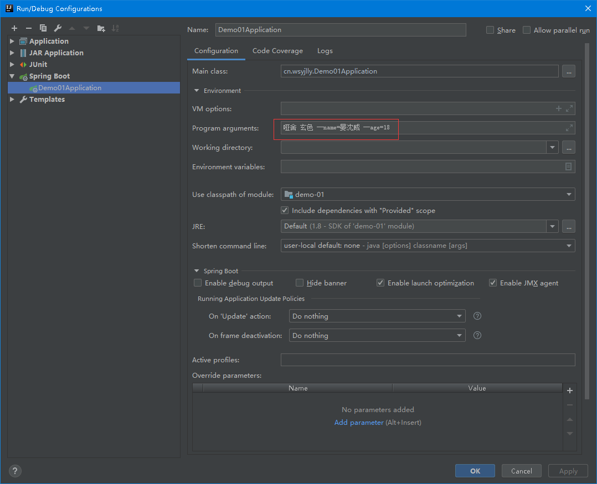
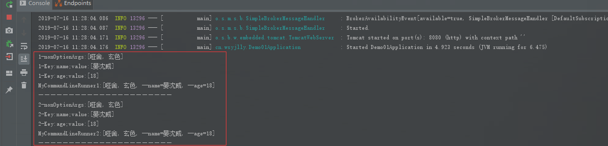
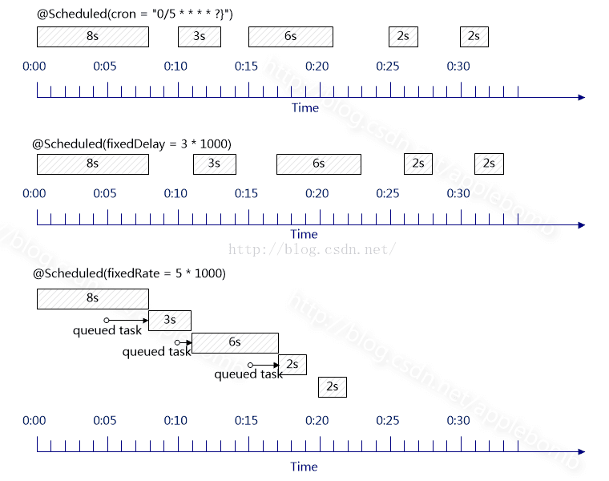
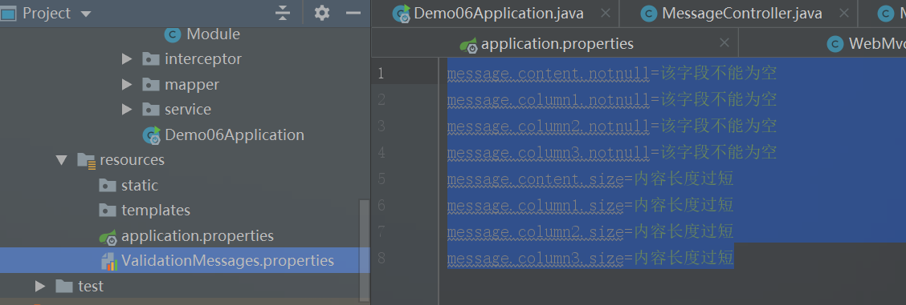
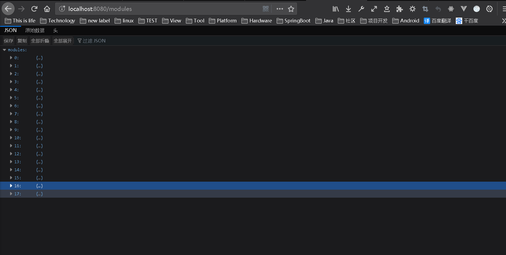
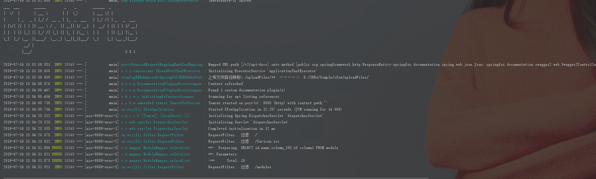
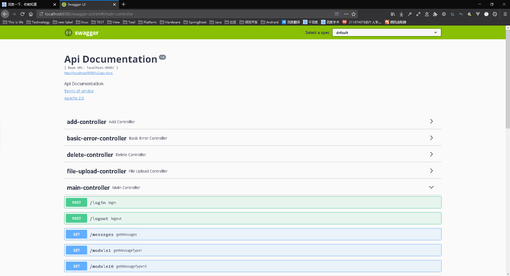
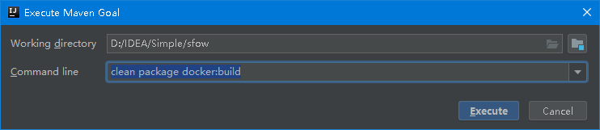
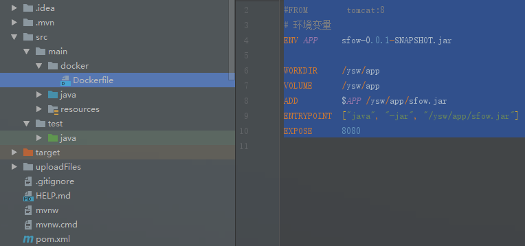

[TOC]

# SpringBoot开发笔记

## 1、文件上传

> SpringBoot中对文件上传做了简化，使文件上传变得非常方便

1. 依赖添加（pom.xml）（基本依赖）
    ```xml
    <dependency>
        <groupId>org.springframework.boot</groupId>
        <artifactId>spring-boot-starter-web</artifactId>
    </dependency>
    ```

2. 配置

    > ​		Java中文件上传涉及2个组件，其一是基于commons-fileupload的CommonsMutipartResolver来处理multipart请求，其二是基于Servlet 3.0的StandardServletMultipartResolver来处理multipart请求。Tomcat7开始支持Servlet 3.0，所以SpringBoot内嵌了Tomcat，SpringBoot提供的文件上传自动化配置类MultipartAutoConfiguration，如果开发者未提供MultipartResolver，默认也采用StandardServletMultipartResolver组件，所以SpringBoot文件上传可以做到零配置。

    1. application.properties配置（非必需）
    
        ```properties
        #配置文件上传
        #是否开启文件上传支持，默认true
        spring.servlet.multipart.enabled=true	
        #文件写入磁盘的阈值，默认为0
        spring.servlet.multipart.file-size-threshold=0
        #上传文件的临时保存位置
        spring.servlet.multipart.location=D:\\data
        #上传的单个文件的最大大小，默认1MB
        spring.servlet.multipart.max-file-size=100MB
        #多文件上传时，文件的总大小，默认10MB
        spring.servlet.multipart.max-request-size=100MB
        #表示文件是否延迟解析，默认为false
        spring.servlet.multipart.resolve-lazily=false
        ```
    
3. Controller

    ```java
    package cn.wsyjlly.controller;
    
    import org.slf4j.Logger;
    import org.slf4j.LoggerFactory;
    import org.springframework.ui.ModelMap;
    import org.springframework.web.bind.annotation.PostMapping;
    import org.springframework.web.bind.annotation.RestController;
    import org.springframework.web.multipart.MultipartFile;
    
    import javax.servlet.http.HttpServletRequest;
    import java.io.File;
    import java.io.IOException;
    import java.text.SimpleDateFormat;
    import java.util.Date;
    import java.util.HashMap;
    import java.util.Map;
    import java.util.UUID;
    
    /**
     * @author wsyjlly
     * @create 2019.06.13 - 17:23
     **/
    @RestController
    public class FileUploadController {
        private String fomartDate = new SimpleDateFormat("yyyy-MM-dd").format(new Date());
        private final String UPLOAD_PATH = "/uploadFiles/";
        private final Integer SUCCESS = 1;
        private final Integer FAILURE = 0;
        private Logger logger = LoggerFactory.getLogger(getClass());
    
        /*
         * 单文件上传
         * */
        @PostMapping("/upload")
        public ModelMap upload(MultipartFile uploadFile, HttpServletRequest request) {
            ModelMap map = new ModelMap();
            if (uploadFile == null){
                map.addAttribute("status",FAILURE);
                map.addAttribute("message","未选择文件");
                return map;
            }
            File folder = getRootPath();
            logger.debug("文件夹路径:"+folder.getAbsolutePath());
            String originalFilename = uploadFile.getOriginalFilename();
            logger.debug("文件原名："+originalFilename);
            String newName = UUID.randomUUID().toString() + originalFilename.substring(originalFilename.lastIndexOf("."), originalFilename.length());
            try {
                uploadFile.transferTo(new File(folder,newName));
                String filePath = request.getScheme() + "://" + request.getServerName() + ":" + request.getServerPort() + UPLOAD_PATH + fomartDate+"/" + newName;
                logger.debug("文件访问路径："+filePath);
                map.addAttribute("filePath",filePath);
                map.addAttribute("status",SUCCESS);
                return map;
            } catch (IOException e) {
                e.printStackTrace();
            }
            map.addAttribute("status",FAILURE);
            return map;
        }
    
        
        /*
         * 多文件上传
         * */
        @PostMapping("/uploads")
        public ModelMap uploads(MultipartFile[] uploadFiles, HttpServletRequest request) {
            ModelMap map = new ModelMap();
            logger.debug("文件个数："+uploadFiles.length);
    
            //String realPath = ResourceUtils.getURL("classpath:").getPath()+UPLOAD_PATH;
            File folder = getRootPath();
            HashMap<String, Map> fileListUploadStatus = new HashMap<>();
            for (MultipartFile file:uploadFiles){
                HashMap<String, Object> item = new HashMap<>();
                String originalFilename = file.getOriginalFilename();
                System.out.println("————————————————————————————————");
    
                logger.debug("————————————————————————————————");
                logger.debug("文件原名："+originalFilename);
                logger.debug("文件大小："+file.getSize());
                logger.debug("文件类型："+file.getContentType());
                String newName = UUID.randomUUID().toString() + originalFilename.substring(originalFilename.lastIndexOf("."), originalFilename.length());
                try {
                    file.transferTo(new File(folder,newName));
                    String filePath = request.getScheme() + "://" + request.getServerName() + ":" + request.getServerPort() + UPLOAD_PATH + fomartDate+"/" + newName;
                    logger.debug("访问地址："+filePath);
                    logger.debug("地址文件名："+newName);
                    item.put("isUpload",true);
                    item.put("url",filePath);
                    fileListUploadStatus.put(originalFilename,item);
                } catch (IOException e) {
                    item.put("isUpload",false);
                    item.put("url","");
                    fileListUploadStatus.put(originalFilename,item);
                    e.printStackTrace();
                }
            }
            map.addAttribute("resultList",fileListUploadStatus);
            return map;
        }
        private File getRootPath(){
            File file = new File(System.getProperty("user.dir")+UPLOAD_PATH);
            if(!file.exists()){//如果文件夹不存在
                file.mkdirs();//创建文件夹
            }
            String rootPath = file.getAbsolutePath();
            File folder = new File(rootPath+'/' + fomartDate);
            if (!folder.isDirectory()){
                folder.mkdirs();
            }
            return folder;
        }
    }
    ```
    

    
4. 静态资源访问路径配置

    > 如果上传资源需要被访问，则须配置上传文件路径添加静态资源访问路径。
    >
    > 注意：在Linux系统和window系统中相对于当前运行位置的盘的根路径都可表示为   ‘/’
    >
    > 静态资源文件路径分为两种：
    >
    > - 相对路径（相对于classes的路径）即：'classpath:'
    > - 绝对路径：文件系统路径，配置文件系统静态资源路径时须添加前缀：'file:'
    
    ```java
    /**
     * @author wsyjlly
     * @create 2019.06.12 - 16:17
     **/
    @Configuration
    public class WebMvcConfig implements WebMvcConfigurer {
        private Logger logger = LoggerFactory.getLogger(getClass());
        /*
        * 配置静态资源过滤策略
        * 将静态资源路径映射为访问路径
        * */
        @Override
        public void addResourceHandlers(ResourceHandlerRegistry registry) {
            registry.addResourceHandler("/static/**")
        .addResourceLocations("classpath:/");
            String uploadPath = new File(System.getProperty("user.dir"),"uploadFiles")
            .getAbsolutePath().replaceAll("\\\\","/")+"/";
            registry.addResourceHandler("/uploadFiles/**").
            addResourceLocations("file:"+uploadPath);
            logger.info("上传文件路径映射：/uploadFiles/**  ————>>  "+uploadPath);
        }
    }
    ```
    
    

---


## 2、同源策略配置

> ​		CROS(Cross-Origin Resource Sharing)是由W3C制定的一种跨域资源共享技术标准，其目的就是为了解决前端的跨域请求。

SpringBoot配置跨域有2种方式，一是方法注解配置，二是全局配置

1. 注解配置

    ```java
    @RestController
    @RequestMapping("/cors")
    public class RestfulCorsController {
        @RequestMapping("/")
        @CrossOrigin(value = "http://localhost:5000",allowedHeaders = "*",maxAge = 1800)
        public Map<String,String> itemOperator(@RequestBody ModelMap params){
            Map<String,String> map = new HashMap<>();
            map.put("name", (String) params.get("name"));
            System.out.println(params);
            return map;
        }
    }
    ```

2. 全局配置

    ```java
    @Configuration
    public class WebMvcConfig implements WebMvcConfigurer {
        /*
        * 配置全局跨域请求
        * */
        @Override
        public void addCorsMappings(CorsRegistry registry) {
               registry.addMapping("/cors/**").
               allowedHeaders("*").
               allowedMethods("*").
               maxAge(1800).
               allowedOrigins("*");

               registry.addMapping("/**").
               allowedHeaders("*").
               allowedMethods("*").
               maxAge(1800).
               allowedOrigins("http://localhost:5000");
        }
    }
    ```

---


## 3、Restful请求风格

> - 在RESTful架构中，每个网址代表一种资源（resource），所以网址中不能有动词，只能有名词，而且所用的名词往往与数据库的表格名对应。一般来说，数据库中的表都是同种记录的"集合"（collection），所以API中的名词也应该使用复数。

> - 对于资源的具体操作类型，由HTTP动词表示。
>   - 常用的HTTP动词有下面五个（括号里是对应的SQL命令）。
>     - GET（SELECT）：从服务器取出资源（一项或多项）。
>     - POST（CREATE）：在服务器新建一个资源。
>     - PUT（UPDATE）：在服务器更新资源（客户端提供改变后的完整资源）。
>     - PATCH（UPDATE）：在服务器更新资源（客户端提供改变的属性）。
>     - DELETE（DELETE）：从服务器删除资源。
>   - 还有两个不常用的HTTP动词。
>     - HEAD：获取资源的元数据。
>     - OPTIONS：获取信息，关于资源的哪些属性是客户端可以改变的。

> - 举例如下：
>   - GET /zoos：列出所有动物园
>   - POST /zoos：新建一个动物园
>   - GET /zoos/ID：获取某个指定动物园的信息
>   - PUT /zoos/ID：更新某个指定动物园的信息（提供该动物园的全部信息）
>   - PATCH /zoos/ID：更新某个指定动物园的信息（提供该动物园的部分信息）
>   - DELETE /zoos/ID：删除某个动物园
>   - GET /zoos/ID/animals：列出某个指定动物园的所有动物
>   - DELETE /zoos/ID/animals/ID：删除某个指定动物园的指定动物

> - 状态码
>   - 200 OK - [GET]：服务器成功返回用户请求的数据，该操作是幂等的（Idempotent）。
>   - 201 CREATED - [POST/PUT/PATCH]：用户新建或修改数据成功。
>   - 202 Accepted - [*]：表示一个请求已经进入后台排队（异步任务）
>   - 204 NO CONTENT - [DELETE]：用户删除数据成功。
>   - 400 INVALID REQUEST - [POST/PUT/PATCH]：用户发出的请求有错误，服务器没有进行新建或修改数据的操作，该操作是幂等的。
>   - 401 Unauthorized - [*]：表示用户没有权限（令牌、用户名、密码错误）。
>   - 403 Forbidden - [*] 表示用户得到授权（与401错误相对），但是访问是被禁止的。
>   - 404 NOT FOUND - [*]：用户发出的请求针对的是不存在的记录，服务器没有进行操作，该操作是幂等的。
>   - 406 Not Acceptable - [GET]：用户请求的格式不可得（比如用户请求JSON格式，但是只有XML格式）。
>   - 410 Gone -[GET]：用户请求的资源被永久删除，且不会再得到的。
>   - 422 Unprocesable entity - [POST/PUT/PATCH] 当创建一个对象时，发生一个验证错误。
>   - 500 INTERNAL SERVER ERROR - [*]：服务器发生错误，用户将无法判断发出的请求是否成功。

1. SpringBoot请求方法代码参考
    ```java
    /**
     * @author wsyjlly
     * @create 2019.06.10 - 19:00
     * GET（SELECT）：从服务器取出资源（一项或多项）。
     * POST（CREATE）：在服务器新建一个资源。
     * PUT（UPDATE）：在服务器更新资源（客户端提供改变后的完整资源）。
     * PATCH（UPDATE）：在服务器更新资源（客户端提供改变的属性）。
     * DELETE（DELETE）：从服务器删除资源。
     **/
    @RestController
    @RequestMapping("/cors")
    public class RestfulCorsController {
        @RequestMapping("/")
        public Map<String,String> itemOperator(@RequestBody ModelMap params){
            Map<String,String> map = new HashMap<>();
            map.put("name", (String) params.get("name"));
            System.out.println(params);
            return map;
        }
    
        @PostMapping("/add")
        public Map<String,String> addItem(@RequestBody ModelMap params){
            Map<String,String> map = new HashMap<>();
            map.put("name", (String) params.get("name"));
            System.out.println(params);
            return map;
        }
    
        @DeleteMapping("/{id}")
        public String deleteItem(@PathVariable Long id){
            System.out.println(id);
            return String.valueOf(id);
        }
    
        @PutMapping("/{id}")
        public String updateItem(@PathVariable Long id){
            System.out.println(id);
            return String.valueOf(id);
        }
    
        @PatchMapping("/patch")
        public String updateItem(@RequestBody ModelMap entity){
            System.out.println(entity);
            return "STATUS";
        }
    
        @GetMapping("/{id}")
        @CrossOrigin(value = "*",allowedHeaders = "*",maxAge = 1800)
        public String getItem(@RequestParam(value = "id", required = false, defaultValue = "1601141019") @PathVariable Long id){
            System.out.println(id);
            return String.valueOf(id);
        }
    }
    ```

---


## 4、拦截器

1.  创建拦截器

    ```java
    /**
     * @author wsyjlly
     * @create 2019.06.13 - 16:52
     **/
    public class FileUploadInterceptor implements HandlerInterceptor {
        private Logger logger = LoggerFactory.getLogger(getClass());
        @Override
        public boolean preHandle(HttpServletRequest request, HttpServletResponse response, Object handler) throws Exception {
            logger.debug("FileUploadInterceptor...preHandle");
            return true;
        }
    
        @Override
        public void postHandle(HttpServletRequest request, HttpServletResponse response, Object handler, ModelAndView modelAndView) throws Exception {
            logger.debug("FileUploadInterceptor...postHandle");
        }
    
        @Override
        public void afterCompletion(HttpServletRequest request, HttpServletResponse response, Object handler, Exception ex) throws Exception {
            logger.debug("FileUploadInterceptor...afterCompletion");
        }
    }
    
    ```

2. 注册拦截器

    1. 注册方式一：一般注册方式

        ```java
        /**
         * @author wsyjlly
         * @create 2019.06.12 - 16:17
         **/
        @Configuration
        public class WebMvcConfig implements WebMvcConfigurer {
            /*
            * 配置拦截器
            * */
            @Override
            public void addInterceptors(InterceptorRegistry registry) {
                  registry.addInterceptor(new FileUploadInterceptor()).
                  addPathPatterns("/upload").order(1);
            }
        }
        ```
    
    2. 注册方式二：当拦截器中需要注入变量时须提前加载该拦截器
        ```java
        /**
         * @author wsyjlly
         * @create 2019.06.12 - 16:17
         **/
        @Configuration
        public class WebMvcConfig implements WebMvcConfigurer {
            /*
            * 配置拦截器
            * */
            @Override
            public void addInterceptors(InterceptorRegistry registry) {
                  registry.addInterceptor(getFileUploadInterceptor()).
                  addPathPatterns("/upload").order(1);
            }
            
            @Bean
            public FileUploadInterceptor getFileUploadInterceptor(){
            	return new FileUploadInterceptor();
            }
        }
        ```
    
---


## 5、过滤器、监听器、Servlet

> ​		SpringBoot为整合过滤器、监听器、Servlet，定义了3个基本的组件，分别使用@WebServlet、@WebFilter、@WebListener进行标记

1.  项目入口类添加@ServletComponentScan实现对Filter、Listener、Servlet的扫描

    ```java
    @SpringBootApplication
    @ServletComponentScan
    public class Demo01Application {
    
        public static void main(String[] args) {
            SpringApplication.run(Demo01Application.class, args);
        }
    }
    ```

    

2. 编写过滤器、监听器、Servlet

    - 过滤器

        ```java
        /**
         * @author wsyjlly
         * @create 2019.06.14 - 18:02
         **/
        @WebFilter("/upload")
        public class FileUploadFilter implements Filter {
            private Logger logger = LoggerFactory.getLogger(getClass());
            @Override
            public void init(FilterConfig filterConfig) throws ServletException {
                logger.debug("FileUploadFilter...init...");
            }
        
            @Override
            public void doFilter(ServletRequest servletRequest, ServletResponse servletResponse, FilterChain filterChain) throws IOException, ServletException {
                filterChain.doFilter(servletRequest,servletResponse);
            }
        
            @Override
            public void destroy() {
        
            }
        }
        ```

    - 监听器

        ```java
        /**
         * @author wsyjlly
         * @create 2019.06.14 - 18:27
         **/
        @WebListener
        public class MyServletRequestListener implements ServletRequestListener {
            private Logger logger = LoggerFactory.getLogger(getClass());
            @Override
            public void requestInitialized(ServletRequestEvent sre) {
                logger.debug("MyServletRequestListener...init...");
            }
        
            @Override
            public void requestDestroyed(ServletRequestEvent sre) {
                logger.debug("MyServletRequestListener...destroyed...");
            }
        
        }
        
        ```

    - Servlet

        ```java
        /**
         * @author wsyjlly
         * @create 2019.06.14 - 18:32
         **/
        @WebServlet(urlPatterns = "/servlet")
        public class MyServlet extends HttpServlet {
            @Override
            protected void doGet(HttpServletRequest req, HttpServletResponse resp) throws ServletException, IOException {
                System.out.println("servlet...in");
                super.doGet(req, resp);
            }
        
            @Override
            protected void doPost(HttpServletRequest req, HttpServletResponse resp) throws ServletException, IOException {
                super.doPost(req, resp);
            }
        }
        ```

---

## 6、AOP切面编程

1. 添加pom依赖

    ```xml
    <dependency>
        <groupId>org.springframework.boot</groupId>
        <artifactId>spring-boot-starter-aop</artifactId>
    </dependency>
    ```

2. 编写切面类

    ```java
    /**
     * @author wsyjlly
     * @create 2019.06.14 - 17:23
     **/
    @Aspect
    public class LogAspect {
        @Pointcut("execution(* cn.wsyjlly.controller.*.*(..))")
        public void pc(){}
    
        @Before(value="pc()")
        public void before(JoinPoint jp){
            String name = jp.getSignature().getName();
            System.out.println(name+"方法开始执行...");
            System.out.println(name+"——————————————————————————————");
        }
    
        @After(value = "pc()")
        public void after(JoinPoint jp){
            String name = jp.getSignature().getName();
            System.out.println(name+"——————————————————————————————");
            System.out.println(name+"方法执行结束...");
        }
    
        @AfterReturning(value = "pc()" , returning = "result")
        public void afterReturning(JoinPoint jp,Object result){
            String name = jp.getSignature().getName();
            System.out.println(name+"方法返回值为："+result);
        }
    
        @AfterThrowing(value = "pc()" , throwing = "e")
        public void afterThrowing(JoinPoint jp,Exception e){
            String name = jp.getSignature().getName();
            System.out.println(name+"方法抛出异常："+e.getClass().getName());
        }
    
        @Around("pc()")
        public Object around(ProceedingJoinPoint pjp) throws Throwable{
            return pjp.proceed();
        }
    }
    ```


## 7、启动系统任务

> ​		SpringBoot对于系统启动时执行的任务，例如配置文件加载，数据库初始化等操作提供了两种解决方案：CommandLineRunner和ApplicationRunner，两者差别主要在于参数。
> ​		SpringBoot项目启动时会遍历所有的CommandLineRunner和ApplicationRunner的实现类并调用其中的run方法@Order注解可对于这些实现类调用顺序进行排序

1. CommandLineRunner的实现类Demo

    ```java
    /**
     * @author wsyjlly
     * @create 2019.06.14 - 19:36
     * 配置启动系统参数
     **/
    @Component
    @Order(1)
    public class MyCommandLineRunner1 implements CommandLineRunner {
        @Override
        public void run(String... args) throws Exception {
            System.out.println("MyCommandLineRunner1:"+Arrays.toString(args));
            System.out.println("——————————————————————");
        }
    }
    ```

    ```java
    /**
     * @author wsyjlly
     * @create 2019.06.14 - 19:36
     * 配置启动系统参数
     **/
    @Component
    @Order(2)
    public class MyCommandLineRunner2 implements CommandLineRunner {
        @Override
        public void run(String... args) throws Exception {
            System.out.println("MyCommandLineRunner2:"+Arrays.toString(args));
            System.out.println("——————————————————————");
        }
    }
    
    ```

    

2. ApplicationRunner的实现类Demo

    ```java
    /**
     * @author wsyjlly
     * @create 2019.06.14 - 19:39
     * 配置启动系统参数
     **/
    @Component
    @Order(1)
    public class MyApplicationRunner1 implements ApplicationRunner {
    
        @Override
        public void run(ApplicationArguments args) throws Exception {
            List<String> nonOptionArgs = args.getNonOptionArgs();
            System.out.println("1-nonOptionArgs:"+nonOptionArgs);
            Set<String> optionNames = args.getOptionNames();
            for (String item:optionNames){
                System.out.println("1-Key:"+item+";value:"+args.getOptionValues(item));
            }
        }
    }
    ```

    ```java
    /**
     * @author wsyjlly
     * @create 2019.06.14 - 19:39
     * 配置启动系统参数
     **/
    @Component
    @Order(2)
    public class MyApplicationRunner2 implements ApplicationRunner {
        @Override
        public void run(ApplicationArguments args) throws Exception {
            List<String> nonOptionArgs = args.getNonOptionArgs();
            System.out.println("2-nonOptionArgs:"+nonOptionArgs);
            Set<String> optionNames = args.getOptionNames();
            for (String item:optionNames){
                System.out.println("2-Key:"+item+";value:"+args.getOptionValues(item));
            }
        }
    }
    ```

3. 测试

    - 测试参数

    

    - 打印结果

    

---


## 8、SpringBoot定时任务@Scheduled

> 定时任务是企业级开发常见的任务，例如定时统计订单数，数据库备份，定时发送短信和邮件，定时统计博客访客等。简单定时任务通过Spring中的@Schedule注解实现，复杂定时任务可以通过集成Quartz来实现。

1. 注解说明

    ```java
    @Scheduled(
        initialDelay = 5000,        //第一次执行前延迟的毫秒数
        initialDelayString = "5000",//同上面作用一样，只是String类型                        
        fixedDelay = 50000,         //在最后一次调用结束和下一次调用开始之间以固定周期（以毫秒为单位）执行带注释的方法。（要等待上次任务完成后）
        fixedDelayString = "50000", //同上面作用一样，只是String类型
        fixedRate = 5000,           //在调用之间以固定的周期（以毫秒为单位）执行带注释的方法。（不需要等待上次任务完成）
        fixedRateString = "5000",   //同上面作用一样，只是String类型
        cron = "",                  //一个类似cron的表达式，扩展了通常的UN * X定义，包括秒，分，时，星期，月，年的触发器。
        zone = ""                   //指明解析cron表达式的时区
    )
    ```

    > 注意：定时任务同步执行时，cron、fixedDelay、fixedRate三者区别如图

    

2. cron表达式

    > 一个cron表达式可以有6个元素或者7个元素组成（“年”这个元素可以省略，省略之后就是默认“每一年”）

    cron表达式属性如下：
    
    ```
    second(秒)， minute(分)， hour(时),day of month(日),month(月),day of week(周几),year(1970－2099)
    ```

    字段与值表格如下：
    
    | 字段 |        允许值         | 允许的特殊符号 |
    | :--: | :-------------------: | :------------: |
    |  秒  |         0-59          |      ,-*/      |
    |  分  |         0-59          |      ,-*/      |
    | 小时 |         0-23          |      ,-*/      |
    | 日期 |         1-31          |    ,-*?/LWC    |
    | 月份 |         1-12          |      ,-*/      |
    | 星期 | 0-7或SUN-SAT 0 7是SUN |    ,-*?/LC#    |
    |  年  |     空, 1970-2099     |    , - * /     |
    
    特殊符号释义如下：
    
    | 特殊符号 |          代表含义          |
    | :------: | :------------------------: |
    |    ,     |            枚举            |
    |    -     |            区间            |
    |    *     |            任意            |
    |    /     |            步长            |
    |    ?     |      日/星期冲突匹配       |
    |    L     |            最后            |
    |    W     |           工作日           |
    |    C     | 和Calendar联系后计算过的值 |
    |    #     |    星期 4#2 第2个星期四    |
    
    字符解释
    
    - 其中每个元素可以是一个值(如6),一个连续区间(9-12),一个间隔时间(8-18/4)(/表示每隔4小时),一个列表(1,3,5),通配符。
    - 其中的“日”由于"月份中的日期"和"星期"这两个元素互斥的，必须要对其中一个设置“？”。
    - 有些子表达式能包含一些范围或列表 
        - 例如：子表达式（天（星期））可以为 “MON-FRI”，“MON，WED，FRI”，“MON-WED,SAT”
    - “*”字符代表所有可能的值
    - “/”字符用来指定数值的增量 
        - 例如：在子表达式（分钟）里的“0/15”表示从第0分钟开始，每15分钟
        - 在子表达式（分钟）里的“3/20”表示从第3分钟开始，每20分钟（它和“3，23，43”）的含义一样
    - “？”字符仅被用于天（月）和天（星期）两个子表达式，表示不指定值 
        - 当2个子表达式其中之一被指定了值以后，为了避免冲突，需要将另一个子表达式的值设为“？”
    - “L” 字符仅被用于天（月）和天（星期）两个子表达式，它是单词“last”的缩写 
        - 如果在“L”前有具体的内容，它就具有其他的含义了。例如：“6L”表示这个月的倒数第６天
        - 注意：在使用“L”参数时，不要指定列表或范围，因为这会导致问题
    - “W” 字符代表着平日(Mon-Fri)，并且仅能用于日域中。它用来指定离指定日的最近的一个平日。大部分的商业处理都是基于工作周的，所以 W 字符可能是非常重要的。 
        - 例如，日域中的 15W 意味着 “离该月15号的最近一个平日。” 假如15号是星期六，那么 trigger 会在14号(星期五)触发，因为星期四比星期一离15号更近。
    - “C”：代表“Calendar”的意思。它的意思是计划所关联的日期，如果日期没有被关联，则相当于日历中所有日期。例如5C在日期字段中就相当于日历5日以后的第一天。1C在星期字段中相当于星期日后的第一天。
    
3. cron表达式示例：

    ```
    0 0 0 * * * -- 每天零时执行一次
    0 0/15 14,18 * * ? -- 每天14点整和18点整，每隔15分钟执行一次
    0 15 10 ? * 1-6 -- 每个月的周一到周六 10:15分执行一次
    0 0 2 ? * 6L -- 每个月的最后一个周六凌晨2点执行一次
    0 0 2 LW * ? -- 每个月的最后一个工作日凌晨2点执行一次
    0 0 2-4 ? * 1#1 -- 每个月的第一个周一凌晨2点到4点期间，每个整点都执行一次
    
    0 0 10,14,16 * * ?  每天上午10点，下午2点，4点
    0 0/30 9-17 * * ?   朝九晚五工作时间内每半小时
    0 0 12 ? * WED     表示每个星期三中午12点
    0 0 12 * * ?           每天中午12点触发
    0 15 10 ? * *         每天上午10:15触发（这个和下一个案例说明，必须"月份中的日期"和"星期"中有一个设置为“？”）
    0 15 10 * * ?         每天上午10:15触发
    0 15 10 * * ? *       每天上午10:15触发（7个元素类型案例，第七个元素代表年）
    0 15 10 * * ? 2005     2005年的每天上午10:15触发
    0 * 14 * * ?           在每天下午2点到下午2:59期间的每1分钟触发
    0 0/5 14 * * ?       在每天下午2点到下午2:55期间的每5分钟触发
    0 0/5 14,18 * * ?  在每天下午2点到2:55期间和下午6点到6:55期间的每5分钟触发
    0 0-5 14 * * ?       在每天下午2点到下午2:05期间的每1分钟触发
    0 10,44 14 ? 3 WED      每年三月的星期三的下午2:10和2:44触发
    0 15 10 ? * MON-FRI    周一至周五的上午10:15触发
    0 15 10 15 * ?       每月15日上午10:15触发
    0 15 10 L * ?         每月最后一日的上午10:15触发
    0 15 10 ? * 6L       每月的最后一个星期五上午10:15触发
    0 15 10 ? * 6L 2002-2005    2002年至2005年的每月的最后一个星期五上午10:15触发
    0 15 10 ? * 6#3     每月的第三个星期五上午10:15触发
    ```

---


## 9、SpringBoot定时任务Quartz

> quartz是一个功能丰富的开源作业调度库

1. 添加pom依赖

    ```xml
    <dependency>
        <groupId>org.springframework.boot</groupId>
        <artifactId>spring-boot-starter-quartz</artifactId>
    </dependency>
    ```

2. 创建定时Job

    - 通过普通JavaBean创建，添加@Component注解将之注册到容器

    ```java
    /**
     * @author wsyjlly
     * @create 2019.07.17 - 14:40
     **/
    @Component
    public class ScheduleDemo2 {
        public void schedule(){
            System.out.println("ScheduleDemo2.schedule...");
        }
    }
    ```

    - 通过继承抽象类QuartzJobBean创建，该方式需要实现该类中的executeInternal方法，该方法在任务被调用时使用。

    ```java
    /**
     * @author wsyjlly
     * @create 2019.07.17 - 14:40
     **/
    public class ScheduleDemo3 extends QuartzJobBean {
        private String name;
        public void setName(String name){
            this.name = name;
        }
    
        @Override
        protected void executeInternal(JobExecutionContext jobExecutionContext){
            System.out.println("ScheduleDemo3.executeInternal..."+name);
        }
    }
    
    ```

3. 创建Quartz配置类QuartzConfig对Job进行配置

    ```java
    /**
     * @author wsyjlly
     * @create 2019.07.17 - 14:47
     **/
    @Configuration
    public class QuartzConfig {
        
        @Bean
        MethodInvokingJobDetailFactoryBean jobDetail1(){
            MethodInvokingJobDetailFactoryBean bean = new MethodInvokingJobDetailFactoryBean();
            bean.setTargetBeanName("scheduleDemo2");
            bean.setTargetMethod("schedule");
            return bean;
        }
        
        @Bean
        JobDetailFactoryBean jobDetail2(){
            JobDetailFactoryBean bean = new JobDetailFactoryBean();
            bean.setJobClass(ScheduleDemo3.class);
            JobDataMap jobDataMap = new JobDataMap();
            jobDataMap.put("name","ysw");
            bean.setJobDataMap(jobDataMap);
            bean.setDurability(true);
            return bean;
        }
        
        @Bean
        SimpleTriggerFactoryBean simpleTrigger(){
            SimpleTriggerFactoryBean bean = new SimpleTriggerFactoryBean();
            bean.setJobDetail(jobDetail1().getObject());
            bean.setRepeatCount(3);
            bean.setStartDelay(1000);
            bean.setRepeatInterval(2000);
            return bean;
        }
        
        @Bean
        CronTriggerFactoryBean cronTrigger(){
            CronTriggerFactoryBean bean = new CronTriggerFactoryBean();
            bean.setJobDetail(jobDetail2().getObject());
            bean.setCronExpression("* * * * * ?");
            return bean;
        }
    
        @Bean
        SchedulerFactoryBean schedulerFactory(){
            SchedulerFactoryBean bean = new SchedulerFactoryBean();
            SimpleTrigger simpleTrigger = simpleTrigger().getObject();
            CronTrigger cronTrigger = cronTrigger().getObject();
            bean.setTriggers(simpleTrigger,cronTrigger);
            return bean;
        }
    }
    ```

    

---


## 10、SpringBoot邮件发送

1. 添加pom依赖

    ```xml
    <dependency>
        <groupId>org.springframework.boot</groupId>
        <artifactId>spring-boot-starter-mail</artifactId>
    </dependency>
    ```

2. application.properties配置

    ```properties
    spring.mail.host=smtp.qq.com
    spring.mail.port=465
    spring.mail.username=wsyjlly@qq.com
    spring.mail.password=khhvydlahiqjbjaj
    spring.mail.default-encoding=UTF-8
    spring.mail.properties.mail.smtp.socketFactory.class=javax.net.ssl.SSLSocketFactory
    spring.mail.properties.mail.debug=true
    ```

3. 编写邮件发送服务

    ```java
    /**
     * @author wsyjlly
     * @create 2019.07.16 - 17:32
     **/
    @Component
    public class MailService {
        @Autowired
        JavaMailSender javaMailSender;
        
        //简单邮件发送
        public void sendSimpleSender(String from,String to,String cc,String subject,String content){
            SimpleMailMessage simpleMailMessage = new SimpleMailMessage();
            simpleMailMessage.setFrom(from);
            simpleMailMessage.setTo(to);
            simpleMailMessage.setCc(cc);
            simpleMailMessage.setSubject(subject);
            simpleMailMessage.setText(content);
            javaMailSender.send(simpleMailMessage);
        }
        
        //带附件的邮件发送
        public void sendAttachFileMail(String from, String to, String subject, String content, File file) throws MessagingException {
            MimeMessage mimeMessage = javaMailSender.createMimeMessage();
            MimeMessageHelper helper = new MimeMessageHelper(mimeMessage, true);
            helper.setFrom(from);
            helper.setTo(to);
            helper.setSubject(subject);
            helper.setText(content);
            helper.addAttachment(file.getName(),file);
            javaMailSender.send(mimeMessage);
    
        }
        
        public void sendMailWithImg(String from, String to, String subject, String content, String[] srcPath,String[] resIDs) throws MessagingException {
            if (srcPath.length != resIDs.length){
                System.out.println("发送失败！");
                return;
            }
            MimeMessage mimeMessage = javaMailSender.createMimeMessage();
            MimeMessageHelper helper = new MimeMessageHelper(mimeMessage, true);
            helper.setFrom(from);
            helper.setTo(to);
            helper.setSubject(subject);
            helper.setText(content,true);
            for (int i = 0; i < srcPath.length; i++) {
                FileSystemResource resource = new FileSystemResource(new File(srcPath[i]));
                helper.addInline(resIDs[i],resource);
            }
            javaMailSender.send(mimeMessage);
        }
    }
    ```

4. 发送邮件

    ```java
    /**
     * @author wsyjlly
     * @create 2019.06.10 - 19:00
     **/
    @RestController
    public class ControllerDemo1 {
        @Autowired
        MailService mailService;
    
        @RequestMapping("/mail1")
        public void mail1(){
            mailService.sendSimpleSender("wsyjlly@qq.com",
            "895864393@qq.com",
            "211874876@qq.com",
            "你爱我吗",
            "你这个坏孩子！");
        }
        
        @RequestMapping("/mail2")
        public void mail2() throws MessagingException {
            mailService.sendAttachFileMail("wsyjlly@qq.com","wsyjlly@qq.com","你信命吗？","你这个坏孩子！",new File("./uploadFiles/abc.gif"));
        }
        
        @RequestMapping("/mail3")
        public void mail3() throws MessagingException {
            mailService.sendMailWithImg("wsyjlly@qq.com","wsyjlly@qq.com","你信神吗？","<div>hello,坏孩子！"
                    +"<div></div>"
                    +"<div></div>"
                    +"</div>",
                    new String[]{"./mail/aaa.jpg","./mail/abc.gif"},
                    new String[]{"p01","p02"});
        }
    }
    ```

5. 测试链接

    - http://localhost:8080/mail1
    - http://localhost:8080/mail2
    - http://localhost:8080/mail3

6. 发送成功

---


## 11、SpringBoot数据校验

1. 添加pom依赖

    ```xml
    <dependency>
        <groupId>org.springframework.boot</groupId>
        <artifactId>spring-boot-starter-validation</artifactId>
    </dependency>
    ```

2. 编写实体类

    ```java
    /**
     * @author wsyjlly
     * @create 2019.06.29 - 12:18
     **/
    @AllArgsConstructor
    @NoArgsConstructor
    @Accessors
    @Data
    @TableName(value = "message")
    public class Message implements Serializable {
        private Integer id;
        private Integer mid;
    
        @Size(min = 5,max = 10,message = "{message.content.size}")
        @NotNull(message = "{message.content.notnull}")
        private String content;
    
        @Size(min = 5,max = 10,message = "{message.column1.size}")
        @NotNull(message = "{message.column1.notnull}")
        @TableField(value = "column_200")
        private String column1;
    
        @Size(min = 5,max = 10,message = "{message.column2.size}")
        @NotNull(message = "{message.column2.notnull}")
        @TableField(value = "column_500")
        private String column2;
    
        @Size(min = 5,max = 10,message = "{message.column3.size}")
        @NotNull(message = "{message.column3.notnull}")
        @TableField(value = "column_5000")
        private String column3;
    }
    ```

3. ValidationMessages.properties配置

    ```properties
    message.content.notnull=该字段不能为空
    message.column1.notnull=该字段不能为空
    message.column2.notnull=该字段不能为空
    message.column3.notnull=该字段不能为空
    message.content.size=内容长度过短
    message.column1.size=内容长度过短
    message.column2.size=内容长度过短
    message.column3.size=内容长度过短
    ```

    

4. Controller校验

    ```java
    /**
     * @author wsyjlly
     * @create 2019.07.17 - 17:34
     **/
    @RestController
    @RequestMapping("/message")
    public class MessageController {
        @PostMapping("/validate")
        public List validate(@RequestBody @Validated Message message, BindingResult result){
            System.out.println(message);
            ArrayList<Object> list = new ArrayList<>();
            if (result.hasErrors()) list.addAll(result.getAllErrors());
            for (ObjectError item : result.getAllErrors()){
                System.out.println(item);
            }
            list.add(message);
            return list;
        }
    }
    ```

5. **分组校验**

    - 创建分组接口

        ```java
        /**
         * @author wsyjlly
         * @create 2019.07.17 - 18:29
         **/
        @Component
        public interface ValidationGroup1 {}
        ```

        ```java
        /**
         * @author wsyjlly
         * @create 2019.07.17 - 18:29
         **/
        @Component
        public interface ValidationGroup2 {}
        ```

    - 实体类添加分组

        ```java
        /**
         * @author wsyjlly
         * @create 2019.06.29 - 12:18
         **/
        @AllArgsConstructor
        @NoArgsConstructor
        @Accessors
        @Data
        @TableName(value = "message")
        public class Message implements Serializable {
            private Integer id;
            private Integer mid;
        
            @Size(min = 5,max = 10,message = "{message.content.size}")
            @NotNull(message = "{message.content.notnull}")
            private String content;
        
            @Size(min = 5,max = 10,message = "{message.column1.size}")
            @NotNull(message = "{message.column1.notnull}")
            @TableField(value = "column_200")
            private String column1;
        
            @Size(min = 5,max = 10,message = "{message.column2.size}",groups = ValidationGroup1.class)
            @NotNull(message = "{message.column2.notnull}")
            @TableField(value = "column_500")
            private String column2;
        
            @Size(min = 5,max = 10,message = "{message.column3.size}",groups = {ValidationGroup1.class, ValidationGroup2.class})
            @NotNull(message = "{message.column3.notnull}")
            @TableField(value = "column_5000")
            private String column3;
        }
        ```

    - Controller校验指定分组

        ```java
        /**
         * @author wsyjlly
         * @create 2019.07.17 - 17:34
         **/
        @RestController
        public class ValidateController {
        
            @PostMapping("/validate1")
            public List validate(@RequestBody @Validated Message message, BindingResult result){
                System.out.println(message);
                ArrayList<Object> list = getObjects(result);
                list.add(message);
                return list;
            }
            
            @PostMapping("/validate2")
            public List validate2(@RequestBody @Validated(ValidationGroup1.class) Message message, BindingResult result){
                System.out.println(message);
                ArrayList<Object> list = getObjects(result);
        list.add(message);
                return list;
            }
            
            @PostMapping("/validate3")
            public List validate3(@RequestBody @Validated(ValidationGroup2.class) Message message, BindingResult result){
                System.out.println(message);
                ArrayList<Object> list = getObjects(result);
                list.add(message);
                return list;
            }
        
            private ArrayList<Object> getObjects(BindingResult result) {
                ArrayList<Object> list = new ArrayList<>();
                if (result.hasErrors()) {
                    for (ObjectError item : result.getAllErrors()) {
                        list.add(item.getDefaultMessage());
                        System.out.println(item.getDefaultMessage());
                    }
                }
                return list;
            }
        }
        ```
        
        

---


## 12、SpringBoot应用监控

1. 添加pom依赖

    ```xml
    <dependency>
        <groupId>org.springframework.boot</groupId>
        <artifactId>spring-boot-starter-actuator</artifactId>
    </dependency>
    ```

2. application.properties配置

    ```properties
    #actuator
    management.endpoint.shutdown.enabled=true
    #暴露所有端点
    management.endpoints.web.exposure.include=*
    #management.endpoints.web.exposure.include=mappings,metrics
    #management.endpoints.enabled-by-default=false
    #management.endpoint.info.enabled=true
    ```

    

---


## SpringBoot整合MybatisPlus 3.0

1. 添加pom依赖

    ```xml
    <!-- druid数据库连接池启动器 -->
    <dependency>
        <groupId>com.alibaba</groupId>
        <artifactId>druid-spring-boot-starter</artifactId>
        <version>1.1.9</version>
    </dependency>
    <dependency>
        <groupId>mysql</groupId>
        <artifactId>mysql-connector-java</artifactId>
        <scope>runtime</scope>
        <version>5.1.46</version>
    </dependency>
    <!-- mybatis-plus启动器 -->
    <dependency>
        <groupId>com.baomidou</groupId>
        <artifactId>mybatis-plus-boot-starter</artifactId>
        <version>3.0.1</version>
    </dependency>
    ```
    
2. application.properties配置

    ```properties
    spring.datasource.type=com.alibaba.druid.pool.DruidDataSource
    spring.datasource.username=root
    spring.datasource.password=123
    spring.datasource.url=jdbc:mysql://localhost:3306/mp_demo?useUnicode=true&characterEncoding=utf-8&useSSL=false
    ```

3. 编写实体类

    ```java
    /**
     * @author wsyjlly
     * @create 2019.06.29 - 12:18
     **/
    @AllArgsConstructor
    @NoArgsConstructor
    @Accessors
    @Data
    @TableName(value = "message")
    public class Message implements Serializable {
        private Integer id;
        private Integer mid;
        private String content;
        @TableField(value = "column_200")
        private String column1;
        @TableField(value = "column_500")
        private String column2;
        @TableField(value = "column_5000")
        private String column3;
    }
    ```

4. 编写mapper接口继承BaseMapper接口的数据操作方法

    ```java
    /**
     * @author wsyjlly
     * @create 2019.06.29 - 12:30
     **/
    @Mapper
    public interface MessageMapper extends BaseMapper<Message> {}
    ```

5. 编写Service

    ```java
    /**
     * @author wsyjlly
     * @create 2019.06.29 - 12:33
     **/
    public interface MessageService {
        List<Message> getAllMessage();
        List<Message> getMessageByMid(Integer mid);
        Integer fetchOne(Integer id,Integer mid);
        Integer updateMessageByModuleIdAndMessageId(Message message);
        Integer addMessage(Message message);
        Integer deleteMessage(Integer mid,Integer id);
    }
    ```

    ```java
    /**
     * @author wsyjlly
     * @create 2019.06.29 - 13:29
     **/
    @Service
    public class MessageServiceImpl implements MessageService {
        @Autowired
        private MessageMapper messageMapper;
        private Logger logger = LoggerFactory.getLogger(getClass());
    
        @Override
        public List<Message> getAllMessage() {
            return messageMapper.selectList(new QueryWrapper<Message>());
        }
    
        @Override
        public List<Message> getMessageByMid(Integer mid) {
            return messageMapper.selectList(new QueryWrapper<Message>().eq("mid",mid));
        }
    
        @Override
        public Integer fetchOne(Integer id,Integer mid){
            return messageMapper.selectCount(new QueryWrapper<Message>().eq("id",id).eq("mid",mid));
        }
    
        @Override
        public Integer updateMessageByModuleIdAndMessageId(Message message){
            System.out.println(message);
            logger.debug(message.toString());
            return messageMapper.updateById(message);
        }
        @Override
        public Integer addMessage(Message message){
            System.out.println(message);
            logger.debug(message.toString());
            return messageMapper.insert(message);
        }
        @Override
        public Integer deleteMessage(Integer mid,Integer id){
            logger.debug(mid+"-"+id);
            return messageMapper.delete(new QueryWrapper<Message>().eq("id",id).eq("mid",mid));
        }
    }
    ```

6. 编写Controller

    ```java
    /**
     * @author wsyjlly
     * @create 2019.06.29 - 12:52
     **/
    @RestController
    public class MainController {
        @Autowired
        private MessageService messageService;
    
        @GetMapping("/messages")
        public ModelMap getMessages(){
            ModelMap map = new ModelMap();
            return map.addAttribute("messages",messageService.getAllMessage());
        }
    
        @GetMapping("module1")
        public Object getMessageType1(){
            return messageService.getMessageByMid(1);
        }
        
        @GetMapping("module2")
        public Object getMessageType2(){
            return messageService.getMessageByMid(2);
        }
        
        @PostMapping("/message")
        public ModelMap addMessage(@RequestBody Message message){
            ModelMap map = new ModelMap();
            Integer result = messageService.addMessage(message);
            if (result==1){
                map.addAttribute("result",true);
                map.addAttribute("tip","添加成功！");
            }else{
                map.addAttribute("result",false);
                map.addAttribute("tip","添加失败！");
            }
            return map;
        }
        
        @DeleteMapping("/{mid}/{id}")
        public ModelMap deleteMessage(@PathVariable Integer mid,@PathVariable Integer id){
            System.out.println(mid);
            System.out.println(id);
            ModelMap map = new ModelMap();
            Integer result = messageService.deleteMessage(mid,id);
            if (result==1){
                map.addAttribute("result",true).addAttribute("tip","删除成功！");
            }else{
                map.addAttribute("result",false).addAttribute("tip","删除失败！");
            }
            return map;
        }
        
        @PatchMapping("/message")
        public ModelMap updateMessage(@RequestBody Message message){
            Integer one = messageService.fetchOne(message.getId(), message.getMid());
            ModelMap map = new ModelMap();
            if (one==1){
                Integer result = messageService.updateMessageByModuleIdAndMessageId(message);
                if (result==1){
                    map.addAttribute("result",true).addAttribute("tip","更新成功！");
                }else{
                    map.addAttribute("result",false).addAttribute("tip","更新失败！");
                }
                System.out.println(message);
            }else{
                map.addAttribute("tip","查询异常！");
            }
            return map;
        }
    }
    ```

7. 显示结果

    

    

## SpringBoot整合Redis

> 本实例应用redis做登录及状态检查

1. 添加pom依赖

    ```xml
    <dependency>
        <groupId>org.springframework.boot</groupId>
        <artifactId>spring-boot-starter-data-redis</artifactId>
    </dependency>
    ```

2. application.properties配置

    ```properties
    #redis
    spring.redis.database=0
    spring.redis.host=111.111.111.111
    spring.redis.port=6379
    spring.redis.password=root@234
    #连接池最大连接数
    spring.redis.jedis.pool.max-active=8
    #连接池最大阻塞等待时间 默认 -1 表示没有限制
    spring.redis.jedis.pool.max-wait=-1ms
    #连接池最大空闲连接数
    spring.redis.jedis.pool.max-idle=8
    #连接池最小空闲连接数
    spring.redis.jedis.pool.min-idle=0
    ```

3. 使用redis

    - 登录/退出/请求状态监测
    
    ```java
    /**
     * @author wsyjlly
     * @create 2019.06.29 - 12:52
     **/
    @RestController
    public class MainController {
        @Autowired
        private UserService userService;
    
        @Autowired
        RedisTemplate redisTemplate;
        @Autowired
        StringRedisTemplate stringRedisTemplate;
        /**
        *  登录信息缓存时长
        * */
        public static final long EXPIRATION_TIME =  10 * 60;
    
        @PostMapping("/status")
        public ModelMap isLogin(HttpServletRequest request, HttpServletResponse response){
            ModelMap map = new ModelMap();
            String authorization = request.getHeader("authorization");
            if (authorization == ""||authorization == null){
                response.setStatus(345);
                return map.addAttribute("status",false);
            }
            String isLogin = stringRedisTemplate.opsForValue().get(authorization);
            if (null==isLogin){
                response.setStatus(345);
                return map.addAttribute("status",false);
            }
            return map.addAttribute("status",true).addAttribute("sa",isLogin);
        }
    
        @PostMapping("/login")
        public ModelMap login(String username,String password){
            ValueOperations<String, String> ops = stringRedisTemplate.opsForValue();
            User user = userService.getUser(username, password);
            if (user!=null) {
                String token = DigestUtils.sha1DigestAsHex(username + StringUtil.getRandomString(10) + password);
                if (user.getRole().equals("SuperAdmin")){
                    ops.set(token, "true", EXPIRATION_TIME, TimeUnit.SECONDS);
                }else {
                    ops.set(token, "false", EXPIRATION_TIME, TimeUnit.SECONDS);
                }
                return new ModelMap().addAttribute("token",token)
                        .addAttribute("result",true)
                        .addAttribute("role",user.getRole());
            }
            return new ModelMap().addAttribute("result",false);
        }
    
    
    
        @PostMapping("/logout")
        public ModelMap logout(HttpServletRequest request){
            ValueOperations<String, String> ops = stringRedisTemplate.opsForValue();
            System.out.println(request.getHeader("authorization"));
            Boolean result = ops.getOperations().delete(request.getHeader("authorization"));
            System.out.println(result);
            if (result) return new ModelMap().addAttribute("result",true).addAttribute("tip","退出成功！");
            return new ModelMap().addAttribute("result",false).addAttribute("tip","退出失败！");
        }
    }
    ```
    - 拦截器拦截请求并检查状态
    
    ```java
    /**
     * @author wsyjlly
     * @create 2019.06.13 - 16:52
     **/
    @Controller
    public class MainInterceptor implements HandlerInterceptor {
        @Autowired
        StringRedisTemplate stringRedisTemplate;
        private Logger logger = LoggerFactory.getLogger(getClass());
        @Override
        public boolean preHandle(HttpServletRequest request, HttpServletResponse response, Object handler) throws Exception {
            logger.debug("MainInterceptor...拦截..."+request.getRequestURI());
    
            String authorization = request.getHeader("authorization");
            if (authorization == ""||authorization == null){
                response.setStatus(345);
                return false;
            }
            Boolean isLogin = stringRedisTemplate.hasKey(authorization);
            if (!isLogin){
                response.setStatus(345);
                return false;
            }
            logger.debug("key是否存在："+stringRedisTemplate.hasKey(authorization));
            logger.debug("key过期时间："+stringRedisTemplate.getExpire(authorization));
            stringRedisTemplate.expire(authorization, MainController.EXPIRATION_TIME, TimeUnit.SECONDS);
            return true;
        }
    
        @Override
        public void postHandle(HttpServletRequest request, HttpServletResponse response, Object handler, ModelAndView modelAndView) throws Exception {
            logger.debug("MainInterceptor...postHandle");
        }
    
        @Override
        public void afterCompletion(HttpServletRequest request, HttpServletResponse response, Object handler, Exception ex) throws Exception {
            logger.debug("MainInterceptor...afterCompletion");
    }
    }
    ```
    

## SpringBoot整合Swagger 2

1. 添加pom依赖

    ```xml
    <dependency>
        <groupId>io.springfox</groupId>
        <artifactId>springfox-swagger2</artifactId>
        <version>2.9.2</version>
    </dependency>
    <dependency>
        <groupId>io.springfox</groupId>
        <artifactId>springfox-swagger-ui</artifactId>
        <version>2.9.2</version>
    </dependency>
    ```

2. 启动类添加@EnableSwagger2注解

    ```java
    @EnableSwagger2
    @SpringBootApplication
    public class Application {
        public static void main(String[] args) {
            SpringApplication.run(Application.class, args);
        }
    }
    
    ```

3. 启动项目，访问路径：http://localhost:8080/swagger-ui.html

4. 运行结果：

    

---


## SpringBoot整合WebSocket

1. 添加pom依赖

    ```xml
    <dependency>
        <groupId>org.springframework.boot</groupId>
        <artifactId>spring-boot-starter-websocket</artifactId>
    </dependency>
    ```

2. 添加配置

    ```java
    @Configuration
    public class WebSocketConfig {
        @Bean
        public ServerEndpointExporter serverEndpointExporter() {
            return new ServerEndpointExporter();
        }
    }
    ```

3. 编写WebSocket映射类

    ```java
    @ServerEndpoint(value = "/socket")
    @Controller
    public class WebSocketController implements Serializable {
        //静态变量，用来记录当前在线连接数。应该把它设计成线程安全的。
        private static int onlineCount = 0;
    
        //concurrent包的线程安全Set，用来存放每个客户端对应的MyWebSocket对象。
        private static CopyOnWriteArraySet<WebSocketController> webSocketSet = new CopyOnWriteArraySet<WebSocketController>();
    
        //与某个客户端的连接会话，需要通过它来给客户端发送数据
        private Session session;
    
        /**
         * 连接建立成功调用的方法*/
        @OnOpen
        public void onOpen(Session session) {
            System.out.println(session.getAsyncRemote());
            this.session = session;
            webSocketSet.add(this);     //加入set中
            addOnlineCount();           //在线数加1
            System.out.println("有新连接加入！当前在线人数为" + getOnlineCount());
            sendMessage("wsyjlly");
        }
    
        /**
         * 连接关闭调用的方法
         */
        @OnClose
        public void onClose() {
            webSocketSet.remove(this);  //从set中删除
            subOnlineCount();           //在线数减1
            System.out.println("有一连接关闭！当前在线人数为" + getOnlineCount());
        }
    
        /**
         * 收到客户端消息后调用的方法
         *
         * @param message 客户端发送过来的消息*/
        @OnMessage
        public void onMessage(String message, Session session){
            System.out.println("来自客户端的消息:" + message);
            //群发消息
            sendInfo(session.getId());
        }
    
        /**
         * 发生错误时调用
         * @OnError
         **/
        public void onError(Session session, Throwable error) {
            System.out.println("发生错误");
            error.printStackTrace();
        }
    
    
        private void sendMessage(String message) {
            this.session.getAsyncRemote().sendText(message);
        }
    
    
        /**
         * 群发自定义消息
         * */
        private static void sendInfo(String message){
            for (WebSocketController item : webSocketSet) {
                item.sendMessage(message);
            }
        }
    
        public static synchronized int getOnlineCount() {
            return onlineCount;
        }
    
        public static synchronized void addOnlineCount() {
            WebSocketController.onlineCount++;
        }
    
        public static synchronized void subOnlineCount() {
            WebSocketController.onlineCount--;
        }
    }
    ```

---


## SpringBoot整合JMS（ActiveMQ）

> 消息队列（Message Queue）是一种进程间或线程间的异步通信方式，使用消息队列消息生产者在消息产生后，会将消息保存在消息队列中直到消费者来取走它，即消息的发送者和接收者不需要与消息队列交互。使用消息队列可以可以有效实现服务的解耦，并提高系统的可靠性一级可扩展性。
>
> JMS（Java Message Service）即Java消息服务，通过同一Java API层面的标准，使得多个客户端可以通过JMS进行交互，大多数消息中间件都对JMS提供支持。JMS包括两种消息模型：
>
> - 点对点
> - 发布者/订阅者
> 
> JMS仅支持Java平台 
1. 添加pom依赖

    ```xml
    <dependency>
        <groupId>org.springframework.boot</groupId>
        <artifactId>spring-boot-starter-activemq</artifactId>
    </dependency>
    ```

2. application.properties配置

    ```properties
    spring.activemq.broker-url=tcp://***.***.***.***:61616
    spring.activemq.packages.trust-all=true
    spring.activemq.user=admin
    spring.activemq.password=***
    ```

    

---


## SpringBoot整合AMQP（RabbitMQ）

1. 添加pom依赖

    ```xml
    <dependency>
        <groupId>org.springframework.boot</groupId>
        <artifactId>spring-boot-starter-amqp</artifactId>
    </dependency>
    ```

2. application.properties配置

    ```properties
    spring.rabbitmq.host=***.***.***.***
    spring.rabbitmq.port=5762
spring.rabbitmq.username=admin
    spring.rabbitmq.password=***
    ```
    
3. 在RabbitMQ中所有的消息生产者提交的消息都会交由Exchange进行再分配，Exchange会根据不同的策略将消息分发到不同的Queue中。RabbitMQ提供了4种不同策略，分别是Direct、Fanout、Topic、Header，4种策略中前三种使用率较高

    - Direct

        > DirectExchange的路由策略是将消息队列绑定到一个DirectExchange上，但一条消息到达DirectExchange时会被转发到与该条消息routing key相同的Queue上

        - DirectExchange的配置如下：

            ```java
            /**
             * @author wsyjlly
             * @create 2019.07.17 - 21:33
             **/
            @Configuration
            public class RabbitDirectConfig {
                public final static String DIRECTNAME = "ysw-direct";
                @Bean
                Queue queue1(){
                    return new Queue("queue-direct1");
                }
            
                @Bean
            
                Queue queue2(){
                    return new Queue("queue-direct2");
                }
            
                @Bean
                Queue queue3(){
                    return new Queue("queue-direct3");
                }
            
                @Bean
                DirectExchange directExchange(){
                    return new DirectExchange(DIRECTNAME,true,false);
                }
            
                @Bean
                Binding binding1(){
                    return BindingBuilder.bind(queue1()).to(directExchange()).with("direct1");
                }
            
                @Bean
                Binding binding2(){
                    return BindingBuilder.bind(queue2()).to(directExchange()).with("direct2");
                }
            }
            ```

            > DirectExchange和Binding两个Bean的配置可以省略掉，即如果使用DirectExchange，之配置一个Queue的实例即可

        - 配置消费者

            ```java
            /**
             * @author wsyjlly
             * @create 2019.07.17 - 21:42
             **/
            @Component
            public class DirectReceiver {
                Logger logger= LoggerFactory.getLogger(getClass());
            
                @RabbitListener(queues = "queue-direct1")
                public void directHandler1(String msg){
                    logger.info("\033[30;4m"+"queue-direct1:"+msg+"\033[0m");
                }
            
                @RabbitListener(queues = "queue-direct2")
                public void directHandler2(String msg){
                    logger.info("\033[30;4m"+"queue-direct2:"+msg+"\033[0m");
                }
            
                @RabbitListener(queues = "queue-direct3")
                public void directHandler3(String msg){
                    logger.info("\033[30;4m"+"queue-direct3:"+msg+"\033[0m");
                }
            }
            ```

            > 通过@RabbitListener注解指定一个方法是一个消费者方法，方法参数就是所接收的消息。

        - 消息发送

            > 通过注入RabbitTemplate对象来进行消息发送，在这里我通过定时任务使其自定发送，须开启定时任务，详细操作可查看<SpringBoot定时任务@Schedule>一节

            ```java
            /**
             * @author wsyjlly
             * @create 2019.07.18 - 1:13
             **/
            @Component
            public class RabbitmqSchedule {
                @Autowired
                RabbitTemplate rabbitTemplate;
                Logger logger = LoggerFactory.getLogger(getClass());
            
                @Scheduled(fixedDelay = 5000,initialDelay = 3000)
                public void direct(){
                    String message = "direct-task";
                    logger.info("\033[30;4m"+message+"\033[0m");
                    rabbitTemplate.convertAndSend("ysw-direct","direct1",message);
                    rabbitTemplate.convertAndSend("ysw-direct","direct2",message);
                    rabbitTemplate.convertAndSend("queue-direct3",message);
                }
            }
            ```

    - Fanout

        > FanoutExchange的数据交换策略是把所有到达FanoutExchange的消息转发给所有与他绑定的Queue，在这种策略中，routingkey将不起作用。

        - FanoutExchange的配置方式如下：

            ```java
            /**
             * @author wsyjlly
             * @create 2019.07.17 - 21:33
             **/
            @Configuration
            public class RabbitFanoutConfig {
                public final static String FANOUTNAME = "ysw-fanout";
            
                @Bean
                Queue queue4(){
                    return new Queue("queue-fanout1");
                }
            
                @Bean
                Queue queue5(){
                    return new Queue("queue-fanout2");
                }
            
                @Bean
                Queue queue6(){
                    return new Queue("queue-fanout3");
                }
            
                @Bean
                FanoutExchange fanoutExchange(){
                    return new FanoutExchange(FANOUTNAME,true,false);
                }
            
                @Bean
                Binding binding4(){
                    return BindingBuilder.bind(queue4()).to(fanoutExchange());
                }
            
                @Bean
                Binding binding5(){
                    return BindingBuilder.bind(queue5()).to(fanoutExchange());
                }
            
                @Bean
                Binding binding6(){
                    return BindingBuilder.bind(queue6()).to(fanoutExchange());
                }
            }
            ```

        - 配置消费者

            ```java
            /**
             * @author wsyjlly
             * @create 2019.07.17 - 21:42
             **/
            @Component
            public class FanoutReceiver {
                Logger logger= LoggerFactory.getLogger(getClass());
            
                @RabbitListener(queues = "queue-fanout1")
                public void fanoutHandler1(String msg){
                    logger.info("\033[31;4m"+"queue-fanout1:"+msg+"\033[0m");
                }
            
                @RabbitListener(queues = "queue-fanout2")
                public void fanoutHandler2(String msg){
                    logger.info("\033[31;4m"+"queue-fanout2:"+msg+"\033[0m");
                }
            
                @RabbitListener(queues = "queue-fanout3")
                public void fanoutHandler3(String msg){
                    logger.info("\033[31;4m"+"queue-fanout3:"+msg+"\033[0m");
                }
            }
            ```

        - 消息发送

            ```java
            /**
             * @author wsyjlly
             * @create 2019.07.18 - 1:13
             **/
            @Component
            public class RabbitmqSchedule {
                @Autowired
                RabbitTemplate rabbitTemplate;
                Logger logger = LoggerFactory.getLogger(getClass());
            
                Scheduled(fixedDelay = 5000,initialDelay = 4000)
                public void fanout(){
                    String message = "fanout-task";
                    logger.info("\033[31;4m"+message+"\033[0m");
                    rabbitTemplate.convertAndSend("ysw-fanout",null,message);
                }
            }
            ```

    - Topic

        > TopicExchange是比较复杂也比较灵活的一种路由策略，在TopicExchange中，Queue通过routingkey绑定到TopicExchange上，当消息发送到TopicExchange后，TopicExchange根据消息的routingkey将消息路由到一个或多个Queue上。

        - TopicExchange配置如下：

            ```java
            /**
             * @author wsyjlly
             * @create 2019.07.17 - 21:33
             **/
            @Configuration
            public class RabbitTopicConfig {
                public final static String TOPIC_NAME = "ysw-topic";
                @Bean
                Queue queue7(){
                    return new Queue("queue-topic1");
                }
            
                @Bean
                Queue queue8(){
                    return new Queue("queue-topic2");
                }
            
                @Bean
                Queue queue9(){
                    return new Queue("queue-topic3");
                }
            
                @Bean
                TopicExchange topicExchange(){
                    return new TopicExchange(TOPIC_NAME,true,false);
                }
            
                @Bean
                Binding binding7(){
                     /*
                     * 匹配规则
                     * 绑定键binding key也必须是这种形式。以特定路由键发送的消息将会发送到所有绑定键与之匹配的队列中。但绑定键有两种特殊的情况：
                     * 绑定键binding key也必须是这种形式。以特定路由键发送的消息将会发送到所有绑定键与之匹配的队列中。但绑定键有两种特殊的情况：
                     * ①*（星号）仅代表一个单词
                     * ②#（井号）代表任意个单词
                     **/
                    return BindingBuilder.bind(queue7()).to(topicExchange()).with("#.topic1");
                }
            
                @Bean
                Binding binding8(){
                    return BindingBuilder.bind(queue8()).to(topicExchange()).with("topic2.#");
                }
            
                @Bean
                Binding binding9(){
                    return BindingBuilder.bind(queue9()).to(topicExchange()).with("#.topic3.*");
                }
            }
            ```

        - 配置消费者

            ```java
            /**
             * @author wsyjlly
             * @create 2019.07.17 - 21:42
             **/
            @Component
            public class TopicReceiver {
                Logger logger= LoggerFactory.getLogger(getClass());
            
                @RabbitListener(queues = "queue-topic1")
                public void topicHandler1(String msg){
                    logger.info("\033[32;4m"+"queue-topic1:"+msg+"\033[0m");
                }
            
                @RabbitListener(queues = "queue-topic2")
                public void topicHandler2(String msg){
                    logger.info("\033[32;4m"+"queue-topic2:"+msg+"\033[0m");
                }
            
                @RabbitListener(queues = "queue-topic3")
                public void topicHandler3(String msg){
                    logger.info("\033[32;4m"+"queue-topic3:"+msg+"\033[0m");
                }
            }
            ```

        - 消息发送

            ```java
            /**
             * @author wsyjlly
             * @create 2019.07.18 - 1:13
             **/
            @Component
            public class RabbitmqSchedule {
                @Autowired
                RabbitTemplate rabbitTemplate;
                Logger logger = LoggerFactory.getLogger(getClass());
            
                @Scheduled(cron = "0-30/6 * * * * ?")
                public void topic(){
                    String message = "topic-task";
                    int i = 0;
                    logger.info("\033[32;4m"+message+"\033[0m");
                    rabbitTemplate.convertAndSend(RabbitTopicConfig.TOPIC_NAME,
                    "topic1.news",message + 1);//topic1
                    rabbitTemplate.convertAndSend(RabbitTopicConfig.TOPIC_NAME,
                    "topic1.salary",message + 2);//topic1
                    rabbitTemplate.convertAndSend(RabbitTopicConfig.TOPIC_NAME,
                    "topic2.news",message + 3);//topic2
                    rabbitTemplate.convertAndSend(RabbitTopicConfig.TOPIC_NAME,
                    "topic2.item",message + 4);//topic2
                    rabbitTemplate.convertAndSend(RabbitTopicConfig.TOPIC_NAME,
                    "topic2.sth.topic1",message + 5);//topic2&topic1
                    rabbitTemplate.convertAndSend(RabbitTopicConfig.TOPIC_NAME,
                    "topic1.sth.topic2",message + 6);//topic2&topic1
                    rabbitTemplate.convertAndSend(RabbitTopicConfig.TOPIC_NAME,
                    "topic3",message + 7);//topic3
                    rabbitTemplate.convertAndSend(RabbitTopicConfig.TOPIC_NAME,
                    "topic3.news",message + 8);//topic3
                    rabbitTemplate.convertAndSend(RabbitTopicConfig.TOPIC_NAME,
                    "topic1.topic3",message + 9); //topic1&topic3
                    rabbitTemplate.convertAndSend(RabbitTopicConfig.TOPIC_NAME,
                    "topic2.topic3",message + 10);//topic2&topic3
                    rabbitTemplate.convertAndSend(RabbitTopicConfig.TOPIC_NAME,
                    "topic3.topic1",message + 11);//topic3&topic1
                    rabbitTemplate.convertAndSend(RabbitTopicConfig.TOPIC_NAME,
                    "topic2.topic3.topic1",message + 12);//topic1&topic2&topic3
                }
            }
            ```

            

    - Header

        > HeaderExchange是一种较少使用的路由策略，HeaderExchange会根据消息的Header将消息路由到不同的Queue上，这种策略也和routingkey无关。

        - HeaderExchange配置如下：

            ```java
            /**
             * @author wsyjlly
             * @create 2019.07.17 - 21:33
             **/
            @Configuration
            public class RabbitHeaderConfig {
                public final static String HEADER_NAME = "ysw-header";
                @Bean
                Queue queue10(){
                    return new Queue("queue-header1");
                }
            
                @Bean
            
                Queue queue11(){
                    return new Queue("queue-header2");
                }
            
                @Bean
                Queue queue12(){
                    return new Queue("queue-header3");
                }
            
                @Bean
                HeadersExchange headersExchange(){
                    return new HeadersExchange(HEADER_NAME,true,false);
                }
            
                @Bean
                Binding binding10(){
                    Map<String,Object> map = new HashMap<>();
                    map.put("age", "18");
                    map.put("name", "ysw");
                    return BindingBuilder.bind(queue10()).to(headersExchange()).whereAny(map).match();
                }
            
                @Bean
                Binding binding11(){
                    Map<String,Object> map = new HashMap<>();
                    map.put("name", "ysw");
                    return BindingBuilder.bind(queue11()).to(headersExchange()).where("age").exists();
                }
            
                @Bean
                Binding binding12(){
                    Map<String,Object> map = new HashMap<>();
                    map.put("age", "18");
                    map.put("name", "ysw");
                    return BindingBuilder.bind(queue12()).to(headersExchange()).whereAll(map).match();
                }
            }
            
            ```

            > Binding配置注释：whereAny表示消息的Header中只要有一个Header匹配上map中的key/value，就把该消息路由到名为“queue-header1”的Queue上；whereAll方法表示消息的所有Header都要匹配，才将消息路由到名为“queue-header2”的Queue上；where表示只要消息的header中包含age，无论age值为多少，都将消息路由到名为“queue-header2”的Queue上。

        - 配置消费者

            ```java
            /**
             * @author wsyjlly
             * @create 2019.07.17 - 21:42
             **/
            @Component
            public class HeaderReceiver {
                Logger logger= LoggerFactory.getLogger(getClass());
            
                @RabbitListener(queues = "queue-header1")
                public void headerHandler1(byte[] msg){
                    logger.info("\033[33;4m"+"queue-header1:"+new String(msg,0,msg.length)+"\033[0m");
                }
            
                @RabbitListener(queues = "queue-header2")
                public void headerHandler2(byte[] msg){
                    logger.info("\033[33;4m"+"queue-header2:"+new String(msg,0,msg.length)+"\033[0m");
                }
            
                @RabbitListener(queues = "queue-header3")
                public void headerHandler3(byte[] msg){
                    logger.info("\033[33;4m"+"queue-header3:"+new String(msg,0,msg.length)+"\033[0m");
                }
            }
            ```

        - 消息发送

            ```java
            /**
             * @author wsyjlly
             * @create 2019.07.18 - 1:13
             **/
            @Component
            public class RabbitmqSchedule {
                @Autowired
                RabbitTemplate rabbitTemplate;
                Logger logger = LoggerFactory.getLogger(getClass());
            
                @Scheduled(cron = "0-30/3 * * * * ?")
                public void header(){
                    String message = "header-task";
                    logger.info("\033[33;4m"+message+"\033[0m");
            
                    Message message1 = MessageBuilder.withBody("name=name".getBytes())
                    .setHeader("name", "aaa").build();
                    Message message2 = MessageBuilder.withBody("name=ysw".getBytes())
                    .setHeader("name", "ysw").build();
                    Message message3 = MessageBuilder.withBody("age=19".getBytes())
                    .setHeader("age", "19").build();
                    Message message4 = MessageBuilder.withBody("age=18".getBytes())
                    .setHeader("age", "18").build();
                    Message message5 = MessageBuilder.withBody("name=ysw&age=18".getBytes())
                    .setHeader("name", "ysw").setHeader("age","18").build();
                    Message message6 = MessageBuilder.withBody("name=ysw&age=19".getBytes())
                    .setHeader("name", "ysw").setHeader("age","19").build();
                    Message message7 = MessageBuilder.withBody("name=aaa&age=18".getBytes())
                    .setHeader("name", "aaa").setHeader("age","18").build();
            
                    rabbitTemplate.convertAndSend(RabbitHeaderConfig.HEADER_NAME,
                    null,message1);
                    rabbitTemplate.convertAndSend(RabbitHeaderConfig.HEADER_NAME,
                    null,message2);
                    rabbitTemplate.convertAndSend(RabbitHeaderConfig.HEADER_NAME,
                    null,message3);
                    rabbitTemplate.convertAndSend(RabbitHeaderConfig.HEADER_NAME,
                    null,message4);
                    rabbitTemplate.convertAndSend(RabbitHeaderConfig.HEADER_NAME,
                    null,message5);
                    rabbitTemplate.convertAndSend(RabbitHeaderConfig.HEADER_NAME,
                    null,message6);
                    rabbitTemplate.convertAndSend(RabbitHeaderConfig.HEADER_NAME,
                    null,message7);
                }
            }
            ```

            

---


## SpringBoot Docker远程发布

> docker远程发布有2种方法一种是直接利用mevan的docker插件配置发布参数，另一种是使用Dockerfile文件发布

1. 方式一：插件配置发布

    - maven配置

        ```xml
        <plugin>
            <groupId>com.spotify</groupId>
            <artifactId>docker-maven-plugin</artifactId>
            <version>1.0.0</version>
            <configuration>
                <dockerHost>http://***.***.***.***:2375</dockerHost>
                <imageName>${project.name}:${project.version}</imageName>
                <workdir>/ysw/app</workdir>
                <volumes>/ysw/app</volumes>
                <baseImage>java:8</baseImage>
                <entryPoint>["java", "-jar", "/ysw/app/${project.build.finalName}.jar"]</entryPoint>
                <resources>
                    <resource>
                        <targetPath>/</targetPath>
                        <directory>${project.build.directory}</directory>
                        <include>${project.build.finalName}.jar</include>
                    </resource>
                </resources>
            </configuration>
        </plugin>
        ```
        
    - maven命令发布：`clean package docker:build`

        

2. 方式二：Dockerfile构建

    - maven插件配置

        ```xml
        <plugin>
            <groupId>com.spotify</groupId>
            <artifactId>docker-maven-plugin</artifactId>
            <version>1.0.0</version>
            <configuration>
                <dockerHost>http://***.***.***.***:2375</dockerHost>
                <imageName>${project.name}:${project.version}</imageName>
                <dockerDirectory>src/main/docker</dockerDirectory>
                <resources>
                    <resource>
                        <targetPath>/</targetPath>
                        <directory>${project.build.directory}</directory>
                        <include>${project.build.finalName}.jar</include>
                    </resource>
                </resources>
            </configuration>
        </plugin>
        ```

    - Dockerfile内容
    
        ```
        FROM 		java:8
        #FROM        tomcat:8
        # 环境变量
        ENV APP 	app-0.0.1-SNAPSHOT.jar
        
        WORKDIR     /ysw/app
        VOLUME 		/ysw/app
        ADD			$APP /ysw/app/app.jar
        ENTRYPOINT 	["java", "-jar", "/ysw/app/app.jar"]
        EXPOSE 		8080
        ```
        
    - Dockerfile位置
    
        
    
    - maven命令发布：`clean package docker:build`
    
        

## SpringBoot自定义Banner

`官方提供的application.yml的banner配置信息`

```properties
# BANNER
spring.banner.charset=UTF-8 # Banner file encoding.
spring.banner.location=classpath:banner.txt # Banner text resource location.
spring.banner.image.location=classpath:banner.gif # Banner image file location (jpg or png can also be used).
spring.banner.image.width=76 # Width of the banner image in chars.
spring.banner.image.height= # Height of the banner image in chars (default based on image height).
spring.banner.image.margin=2 # Left hand image margin in chars.
spring.banner.image.invert=false # Whether images should be inverted for dark terminal themes.
```

> 在resource文件夹下放一个以“banner.txt”命名的文件，文件中是你要显示的banner字符图案
>
> 图案生成地址：
>
> - http://kammerl.de/ascii/AsciiSignature.php
> - http://network-science.de/ascii/
> - http://patorjk.com/software/taag

```
    ____    __       ___   __   _____     _     ____     _____   __   __
|  |    |  |  )  ____) (  (  )  )   (_   | \   |    \   |    (  (  )  ) 
|  |    |  | (  (___    \  \/  /      |  |  |  |     |  |     \  \/  /  
|  |    |  |  \___  \    \    /    _  |  |  |  |     |  |      \    /   
 \  \/\/  /   ____)  )    )  /    ( |_|  |  |  |__   |  |__     )  /    
__\      /___(      (____/  (______\    /__/      )_/      )___/  (_____
```

```
.-.   .-.  .---. .-.  .-.
 \ \_/ )/ ( .-._)| |/\| |
  \   (_)(_) \   | /  \ |
   ) (   _  \ \  |  /\  |
   | |  ( `-'  ) |(/  \ |
  /(_|   `----'  (_)   \|
 (__)                    
```

```
O~~   O~~ O~~~~ O~~      O~~
 O~~ O~~ O~~     O~~  ~  O~~
   O~~~    O~~~  O~~ O~  O~~
    O~~      O~~ O~ O~ O~O~~
   O~~   O~~ O~~O~~~     O~~
 O~~                        
```

```
 _  _  ___  _    _ 
( \/ )/ __)( \/\/ )
 \  / \__ \ \    / 
(__/  (___/  \/\/  
```

```
  ^    ^    ^  
 /y\  /s\  /w\ 
<___><___><___>
```

```
  __ ______    __
 / // (_-< |/|/ /
 \_, /___/__,__/ 
/___/            
```

---

