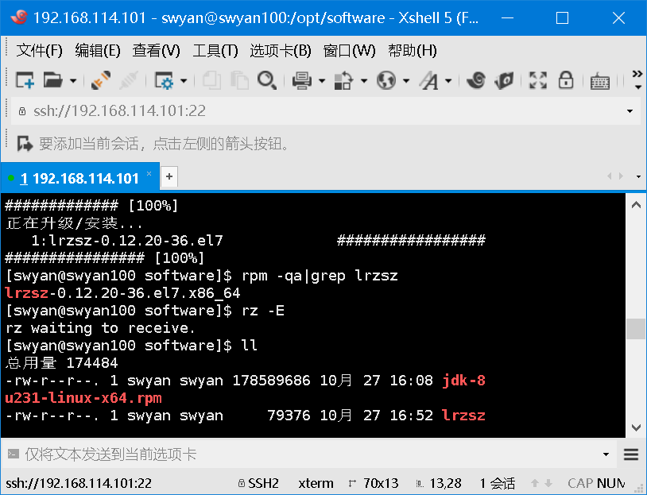

[TOC]

# rpm安装


## 1、上传JDK文件 rpm包

xshell文件上传工具需要lrzsz-0.12.20-36.el7.x86_64.rpm这个包：

安装lrzsz：rpm -ivh lrzsz-0.12.20-36.el7.x86_64.rpm

## 2、进入到要上传的位置，拖拽要上传的文件到命令行窗口



## 3、传输完成，安装JDK

```
rpm -ivh jdk-8u231-linux-x64.rpm
```


# tar安装

## 1、上传JDK文件 tar.gz包jdk-8u231-linux-x64.tar.gz

## 2、解压

```
tar -zxvf jdk-8u231-linux-x64.tar.gz -C /opt/module/
```

## 3、修改配置文件，配置环境变量

```
vi /etc/profile
```

```
##JAVA_HOME
export JAVA_HOME=/opt/module/jdk1.8.0_231
export PATH=$PATH:$JAVA_HOME/bin
```

```
source /etc/profile
```

