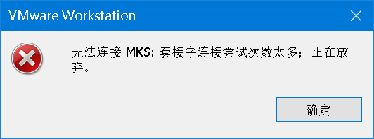

[TOC]

## 使用

- 命令行打开应用服务列表

```
services.msc
```

-  开启相关服务


- 创建虚拟机

## 克隆虚拟机

1. 修改克隆虚拟机的静态IP

    ```
     ll /etc/sysconfig/network-scripts/ifcfg-*
     
     vi /etc/sysconfig/network-scripts/ifcfg-ens33
    ```

    - > WMware默认网关
        >
        > 
        >
        > 

        

        

    ```
    BOOTPROTO=static #dhcp改为static（修改）
    ONBOOT=yes #开机启用本配置，一般在最后一行（修改）
     
    IPADDR=192.168.114.136 #静态IP（增加）
    GATEWAY=192.168.114.2 #默认网关，虚拟机安装的话，通常是2，也就是VMnet8的网关设置（增加）
    NETMASK=255.255.255.0 #子网掩码（增加）
    DNS1=192.168.114.2 #DNS 配置，虚拟机安装的话，DNS就网关就行，多个DNS网址的话再增加（增加）
    ```

    ```
    systemctl restart network
    ```

    

2. 修改主机名

    ```
    vi /etc/hostname
    reboot
    ```

3. 修改hosts文件

    ```
    vi /etc/hosts
    ```

    

4. 关闭防火墙

5. 创建swyan用户

6. 配置swyan用户具有root权限

## 遇到的问题

### 1.、服务未开启



> 解决：开启相关服务即可