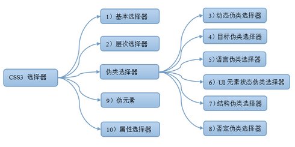

[TOC]

# CSS3


## CSS 选择器

> - CSS选择器总计有47种，可分为五类，分别为基本选择器、组合选择器、属性选择器、伪元素选择器、伪类选择器
> - CSS三大特性—— 继承、 优先级和层叠。
>     - 继承：即子类元素继承父类的样式;
>     - 优先级：是指不同类别样式的权重比较;
>     - 层叠：是说当数量相同时，通过层叠(后者覆盖前者)的样式。

```text
.选择器(47)
├─ 基础的选择器(4)
│  ├─ *（通用选择器，匹配任何元素）
│  ├─ E（标签选择器，匹配所有使用该标签的元素）
│  ├─ id（id选择器，匹配id属性等于该id的元素）
│  └─ class（class选择器，匹配所有class属性中包含该类的元素）
│  
├─ 组合选择器(5)
│  ├─ E,F（多元素选择器，同时匹配所有E元素或F元素，E和F之间用逗号分隔）
│  ├─ E F（后代元素选择器，匹配所有属于E元素后代的F元素，E和F之间用空格分隔）
│  ├─ E > F（子元素选择器，匹配所有E元素的子元素F）
│  ├─ E + F（相邻兄弟选择器，匹配E元素之后的一个同级元素F，当两个兄弟元素相同时，作用同E ~ E）
│  └─ 同级元素通用选择器（CSS 3）
│     └─ E ~ F（匹配F元素，查找某一个指定元素E后面的所有同级元素F）
│  
├─ 属性选择器（7）
│  ├─ CSS 2中的属性选择器
│  │  ├─ E[att]（匹配所有具有att属性的E元素，不考虑它的值。（注意：E在此处可以省略，比如“[cheacked]”。以下同。）
│  │  ├─ E[att=val]（匹配所有att属性等于“val”的E元素）
│  │  ├─ E[att~=val]（匹配所有att属性具有多个空格分隔的值、其中一个值等于“val”的E元素）
│  │  └─ E[att|=val]（匹配所有att属性具有多个连字号分隔（hyphen-separated）的值、其中一个值以“val”开头的E元素，主要用于lang属性，比如“en”、“en-us”、“en-gb”等等）
│  │  
│  └─ CSS 3中的属性选择器
│     ├─ E[att^=”val”]（属性att的值以”val”开头的元素）
│     ├─ E[att$=”val”]（属性att的值以”val”结尾的元素）
│     └─ E[att*=”val”]（属性att的值包含”val”字符串的元素）
│  
├─ 伪元素选择器（4）
│  ├─ E:first-line（匹配E元素的第一行）
│  ├─ E:first-letter（匹配E元素的第一个字母）
│  ├─ E:before（在E元素之前插入生成的内容）
│  └─ E:after（在E元素之后插入生成的内容）
│  
└─ 伪类选择器（27）
   ├─ 动态伪类选择器
   │  ├─ E:link（匹配所有未被点击的链接）
   │  ├─ E:visited（匹配所有已被点击的链接）
   │  ├─ E:active（匹配鼠标已经其上按下、还没有释放的E元素）
   │  ├─ E:hover（匹配鼠标悬停其上的E元素）
   │  └─ E:focus（匹配获得当前焦点的E元素）
   │  
   ├─ 与用户界面有关的伪类选择器（CSS 3）
   │  ├─ E:enabled（匹配表单中激活的元素）
   │  ├─ E:disabled（匹配表单中禁用的元素）
   │  ├─ E:checked（匹配表单中被选中的radio（单选框）或checkbox（复选框）元素）
   │  └─ E::selection（匹配用户当前选中的元素）
   │  
   ├─ 结构性伪类选择器（CSS 3）
   │  ├─ E:root（匹配文档的根元素，对于HTML文档，就是HTML元素）
   │  ├─ E:nth-child(n)（匹配其父元素的第n个子元素，第一个编号为1）
   │  ├─ E:first-child（匹配父元素的第一个子元素,等同于:nth-child(1)）
   │  ├─ E:nth-of-type(n)（与:nth-child()作用类似，但是仅匹配使用同种标签的元素）
   │  ├─ E:first-of-type（匹配父元素下使用同种标签的第一个子元素，等同于:nth-of-type(1)）
   │  │
   │  ├─ E:nth-last-child(n)（匹配其父元素的倒数第n个子元素，第一个编号为1）
   │  ├─ E:last-child（匹配父元素的最后一个子元素，等同于:nth-last-child(1)）
   │  ├─ E:nth-last-of-type(n)（与:nth-last-child() 作用类似，仅匹配使用同种标签的元素）
   │  ├─ E:last-of-type（匹配父元素下使用同种标签的最后一个子元素，等同于:nth-last-of-type(1)）
   │  ├─ E:nth-child(odd)（匹配父元素下奇数个子元素）
   │  ├─ E:nth-child(even)（匹配父元素下偶数个子元素）
   │  ├─ E:only-child（匹配父元素下仅有的一个子元素，等同于:first-child:last-child或 :nth-child(1):nth-last-child(1)）
   │  ├─ E:only-of-type（匹配父元素下使用同种标签的唯一一个子元素，等同于:first-of-type:last-of-type或 :nth-of-type(1):nth-last-of-type(1)）
   │  ├─ E:empty（匹配一个不包含任何子元素的元素，注意，文本节点也被看作子元素）
   │  └─  E:nth-child(An+B)（应用于倍数的循环）
   │
   ├─ 语言伪类选择器
   │  └─ E:lang(c)（匹配lang属性等于c的E元素）
   │
   ├─ 目标伪类选择器
   │  └─ :target（给页面中某个target元素指定样式 只有当用户点击链接并跳转到target元素后才会起作
   │
   └─ 反选伪类
      └─ E:not(s)（匹配不符合当前选择器的任何元素）

```



## CSS属性

> align-content 属性
> align-items 属性
> align-self 属性
> all 属性
> animation 属性
> animation-delay 属性
> animation-direction 属性
> animation-duration 属性
> animation-fill-mode 属性
> animation-iteration-count 属性
> animation-name 属性
> animation-play-state 属性
> animation-timing-function 属性
> appearance 属性
> backface-visibility 属性
> background 属性
> background-attachment 属性
> background-blend-mode 属性
> background-clip 属性
> background-color 属性
> background-image 属性
> background-origin 属性
> background-position 属性
> background-repeat 属性
> background-size 属性
> border 属性
> border-bottom 属性
> border-bottom-color 属性
> border-bottom-left-radius 属性
> border-bottom-right-radius 属性
> border-bottom-style 属性
> border-bottom-width 属性
> border-collapse 属性
> border-color 属性
> border-image 属性
> border-image-outset 属性
> border-image-repeat 属性
> border-image-source 属性
> border-image-width 属性
> Border-left 属性
> border-left-color 属性
> border-left-style 属性
> border-left-width 属性
> border-image-slice 属性
> border-radius 属性
> border-right 属性
> border-right-color 属性
> border-right-style 属性
> border-right-width 属性
> border-spacing 属性
> border-style 属性
> border-top 属性
> border-top-color 属性
> border-top-left-radius 属性
> border-top-right-radius 属性
> border-top-style 属性
> border-top-width 属性
> border-width 属性
> bottom 属性
> box-align 属性
> box-direction 属性
> box-flex 属性
> box-flex-group 属性
> box-lines 属性
> box-ordinal-group 属性
> box-orient 属性
> box-pack 属性
> box-shadow 属性
> box-sizing 属性
> caption-side 属性
> clear 属性
> clip 属性
> color 属性
> column-count 属性
> column-fill 属性
> column-gap 属性
> column-rule 属性
> column-rule-color 属性
> column-rule-style 属性
> column-rule-width 属性
> column-span 属性
> column-width 属性
> columns 属性
> content 属性
> counter-increment 属性
> counter-reset 属性
> cursor 属性
> direction 属性
> display 属性
> Empty-cells 属性
> filter(滤镜) 属性
> flex 属性
> flex-basis 属性
> flex-direction 属性
> flex-flow 属性
> flex-grow 属性
> flex-shrink 属性
> flex-wrap 属性
> float 属性
> font 属性
> @font-face 规则
> font-family 属性
> font-size 属性
> font-size-adjust 属性
> font-stretch 属性
> font-style 属性
> font-variant 属性
> font-weight 属性
> grid-columns 属性
> grid-rows 属性
> hanging-punctuation 属性
> height 属性
> icon 属性
> justify-content 属性
> @keyframes 规则
> left 属性
> letter-spacing 属性
> line-height 属性
> list-style 属性
> list-style-image 属性
> list-style-position 属性
> list-style-type 属性
> margin 属性
> margin-bottom 属性
> margin-left 属性
> margin-right 属性
> margin-top 属性
> max-height 属性
> max-width 属性
> @media查询
> Min-height 属性
> min-width 属性
> nav-down 属性
> nav-index 属性
> nav-left 属性
> nav-right 属性
> nav-up 属性
> opacity 属性
> order 属性
> outline 属性
> outline-color 属性
> outline-offset 属性
> outline-style 属性
> Outline-width 属性
> overflow 属性
> overflow-x 属性
> overflow-y 属性
> padding 属性
> Padding-bottom 属性
> padding-left 属性
> padding-right 属性
> padding-top 属性
> Page-break-after 属性
> page-break-before 属性
> page-break-inside 属性
> perspective 属性
> perspective-origin 属性
> position 属性
> punctuation-trim 属性
> quotes 属性
> resize 属性
> right 属性
> rotation 属性
> tab-size 属性
> table-layout 属性
> target 属性
> target-name 属性
> target-new 属性
> target-position 属性
> text-align 属性
> text-align-last 属性
> text-decoration 属性
> text-decoration-color 属性
> text-decoration-line 属性
> text-decoration-style 属性
> text-indent 属性
> text-justify 属性
> text-outline 属性
> text-overflow 属性
> text-shadow 属性
> text-transform 属性
> text-wrap 属性
> top 属性
> transform 属性
> transform-origin 属性
> transform-style 属性
> transition 属性
> transition-delay 属性
> transition-duration 属性
> transition-property 属性
> transition-timing-function 属性
> unicode-bidi 属性
> vertical-align 属性
> visibility 属性
> width 属性
> white-space 属性
> border-image-width 属性
> word-break 属性
> word-spacing 属性
> word-wrap 属性
> z-index 属性 

## CSS 布局

> 1.静态布局：传统布局，屏幕宽高变化时，盒子使用横向或者竖向的滚动条来查看被遮挡部分，也就是不管浏览器窗口的大小怎么变化就按html语义标签排列的布局来布置。
>
> 2.弹性布局：css3引入的，flex布局；优点在于其容易上手，根据flex规则很容易达到某个布局效果，然而缺点是：浏览器兼容性比较差，只能兼容到ie9及以上；
>
> 3.自适应布局：分别为不同的屏幕分辨率定义布局，在每个布局中，页面元素不随窗口大小的调整而发生变化，当窗口大小到达一定分辨率时变化一次。
>
> 4.流式布局：页面元素的宽度按照屏幕进行适配调整，元素的位置不变，大小变化，屏幕太大或者太小导致元素不能正常显示。
>
> 5.响应式布局：<meta name="viewport" content="divice-width,initial-scale=1.0,minimum-scale=1.0,maximum-scale=1.0,user-scalable=no">使用meta标签设置，页面元素宽度随窗口调整自动适配。主要属性及其含义如下：name="viewport"：   名称=视图；width=device-width 页面宽度=设备宽度(可以理解为获取你手机的屏幕宽度)；initial-scale - 初始的缩放比例  ；minimum-scale - 允许用户缩放到的最小比例   ；maximum-scale - 允许用户缩放到的最大比例  ；user-scalable - 用户是否可以手动缩放  。
>
> 6.网格布局：grid二维布局系统，随意的定义每行每列的数目和大小。也非常简单方便，兼容性较差。

### flex布局应用

> - 布局的传统解决方案，基于盒状模型，依赖 display属性 + position属性 + float属性。它对于那些特殊布局非常不方便，比如，垂直居中就不容易实现。
>
> - 我认为flex布局最大的优势就是在其的“弹性”，“弹性”主要表现在flex布局不同于盒子模型的百分比布局和CSS3支持的响应式布局，以下有几种情况是盒子模型中的这些布局所不便实现的：
>    - 1、浏览器的视口空间不足，要求视口中的特定块要按照比例进行缩放
>     - 2、应对一些布局是要以基准线(baseline)对齐的特殊布局方法
>    - 3、需要模块垂直居中
> 
>- 从应对一些特殊布局上来说，使用flex确实比盒子模型的布局更是一种更优的解决方案
> - flex布局的兼容性不是太好，至少某些低版本的安卓机上面是不能够识别改布局的，但是总体上随着浏览器对H5属性的支持程度的提升，以及一些老式的安卓手机的淘汰，目前该布局在手机上面还是有比较好的应用的，但是在使用flex布局的同时，建议还是要搭配上gulp或者是grunt等自动化的工具来进行浏览器前缀的编译，这样一方面可以节约手动的去添加浏览器的兼容性前缀，另外的一方面是可以解觉手机上面不同浏览器的差异导致的问题，一般来说flex布局就是在手机上面使用的，在PC上面由于需要考虑到IE的支持程度的问题，所以在PC上面还是不宜去使用flex。

- flex布局基本语法

```css
flex-direction决定主轴的方向（即项目的排列方向
flex-direction: row | row-reverse | column | column-reverse;
flex-wrap       默认情况下，项目都排在一条线（又称”轴线”）上。flex-wrap属性定义，如果一条轴线排不下，如何换行。
flex-wrap: nowrap | wrap | wrap-reverse;
flex-flow       flex-flow属性是flex-direction属性和flex-wrap属性的简写形式，默认值为row nowrap。
flex-flow: <flex-direction> || <flex-wrap>;

justify-content定义了项目在主轴上的对齐方式。
justify-content: flex-start | flex-end | center | space-between | space-around;
flex-start（默认值）：左对齐
flex-end：右对齐
center： 居中
space-between：两端对齐，项目之间的间隔都相等。
space-around：每个项目两侧的间隔相等。所以，项目之间的间隔比项目与边框的间隔大一倍。

align-items     align-items属性定义项目在交叉轴上如何对齐。
align-items: flex-start | flex-end | center | baseline | stretch;
flex-start：交叉轴的起点对齐。
flex-end：交叉轴的终点对齐。
center：交叉轴的中点对齐。
baseline: 项目的第一行文字的基线对齐。
stretch（默认值）：如果项目未设置高度或设为auto，将占满整个容器的高度。

align-content   align-content属性定义了多根轴线的对齐方式。如果项目只有一根轴线，该属性不起作用。
align-content: flex-start | flex-end | center | space-between | space-around | stretch;
flex-start：与交叉轴的起点对齐。
flex-end：与交叉轴的终点对齐。
center：与交叉轴的中点对齐。
space-between：与交叉轴两端对齐，轴线之间的间隔平均分布。
space-around：每根轴线两侧的间隔都相等。所以，轴线之间的间隔比轴线与边框的间隔大一倍。
stretch（默认值）：轴线占满整个交叉轴。

以下6个属性设置在项目上。
order           定义项目的排列顺序。数值越小，排列越靠前，默认为0。
order: <integer>;

flex-grow       flex-grow属性定义项目的放大比例，默认为0，即如果存在剩余空间，也不放大。
flex-grow: <number>; （ default 0）

flex-shrink     flex-shrink属性定义了项目的缩小比例，默认为1，即如果空间不足，该项目将缩小。
flex-shrink: <number>;（ default 1）

flex-basis      flex-basis属性定义了在分配多余空间之前，项目占据的主轴空间（main size）。
浏览器根据这个属性，计算主轴是否有多余空间。它的默认值为auto，即项目的本来大小。
flex-basis: <length> | auto; （ default auto ）

flex            flex属性是flex-grow, flex-shrink 和 flex-basis的简写，默认值为0 1 auto。后两个属性可选。
flex: none | [ <'flex-grow'> <'flex-shrink'>? || <'flex-basis'> ]

align-self      允许单个项目有与其他项目不一样的对齐方式，可覆盖align-items属性。默认值为auto，
表示继承父元素的align-items属性，如果没有父元素，则等同于stretch。
align-self: auto | flex-start | flex-end | center | baseline | stretch;
```


## CSS3 尺寸

> | [height](https://www.w3cschool.cn/cssref/pr-dim-height.html) | 设置元素的高度。     |
> | ------------------------------------------------------------ | -------------------- |
> | [line-height](https://www.w3cschool.cn/cssref/pr-dim-line-height.html) | 设置行高。           |
> | [max-height](https://www.w3cschool.cn/cssref/pr-dim-max-height.html) | 设置元素的最大高度。 |
> | [max-width](https://www.w3cschool.cn/cssref/pr-dim-max-width.html) | 设置元素的最大宽度。 |
> | [min-height](https://www.w3cschool.cn/cssref/pr-dim-min-height.html) | 设置元素的最小高度。 |
> | [min-width](https://www.w3cschool.cn/cssref/pr-dim-min-width.html) | 设置元素的最小宽度。 |
> | [width](https://www.w3cschool.cn/cssref/pr-dim-width.html)   | 设置元素的宽度。     |

## CSS3 边框

### border-image

```css
border-image:url(border.png) 30 30 round;
border-image: source slice width outset repeat;
```

| 值                    | 描述                                                |
| --------------------- | --------------------------------------------------- |
| *border-image-source* | 用于指定要用于绘制边框的图像的位置                  |
| *border-image-slice*  | 图像边界向内偏移                                    |
| *border-image-width*  | 图像边界的宽度                                      |
| *border-image-outset* | 用于指定在边框外部绘制 border-image-area 的量       |
| *border-image-repeat* | 这个例子演示了如何创建一个border-image 属性的按钮。 |

- **border-image-source**

```
border-image-source: none|image;
```

| 值      | 说明               |
| ------- | ------------------ |
| none    | 没有图像被使用     |
| *image* | 边框使用图像的路径 |

- **border-image-slice**

```
border-image-slice: number|%|fill;
```

| 值       | 说明                                                         |
| -------- | ------------------------------------------------------------ |
| *number* | 数字表示图像的像素（位图图像）或向量的坐标（如果图像是矢量图像） |
| *%*      | 百分比图像的大小是相对的：水平偏移图像的宽度，垂直偏移图像的高度 |
| fill     | 保留图像的中间部分                                           |

- **border-image-width**

```
border-image-width: number|%|auto;
```

| 值       | 说明                                                         |
| -------- | ------------------------------------------------------------ |
| *number* | 表示相应的border-width 的倍数                                |
| *%*      | 边界图像区域的大小：横向偏移的宽度的面积，垂直偏移的高度的面积 |
| auto     | 如果指定了，宽度是相应的image slice的内在宽度或高度          |

- **border-image-outset**

```
border-image-outset: length|number;
```

| 值       | 描述                          |
| -------- | ----------------------------- |
| *length* |                               |
| *number* | 代表相应的border-width 的倍数 |

- **border-image-repeat**

```
border-image-repeat: stretch|repeat|round|initial|inherit;
```

| 值      | 描述                                                         |
| ------- | ------------------------------------------------------------ |
| stretch | 默认值。拉伸图像来填充区域                                   |
| repeat  | 平铺（repeated）图像来填充区域。                             |
| round   | 类似 repeat 值。如果无法完整平铺所有图像，则对图像进行缩放以适应区域。 |
| space   | 类似 repeat 值。如果无法完整平铺所有图像，扩展空间会分布在图像周围 |
| initial | 将此属性设置为默认值。                                       |
| inherit | 从父元素中继承该属性。                                       |

## CSS3 圆角

## CSS3 渐变

## CSS3 文本效果

## CSS3字体

## CSS3 2D转换

## CSS3 3D转换

## CSS3 过渡

## CSS3 动画

## CSS3 多列

## CSS3 用户界面

## CSS 图片

## CSS 按钮

## CSS3 框大小

## CSS3 弹性盒子(Flex Box)

## CSS3 多媒体查询

## CSS3 多媒体查询实例

